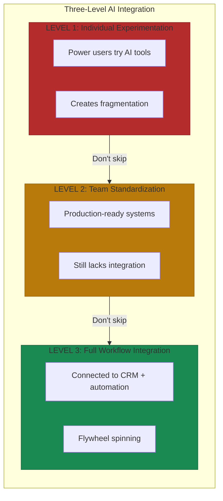

# AI-Powered GTM

The same automation-augmentation principles that transform back-office operations apply to customer-facing growth functions. But the stakes are higher. Over-automate sales and you lose customers. The companies winning deploy AI to make humans dramatically more effective at the parts of growth requiring human judgment.

## Marketing: AI at Scale

Marketing has the highest automation potential of any GTM function. AI-driven personalization delivers 20% sales revenue increases[^personalization-roi]. AI-personalized emails achieve 29% higher open rates. Yves Rocher achieved 17.5x more clicks with AI recommendations[^yves-rocher].

Lead scoring transforms demand generation. AI reduces cost per lead by 20-50%. One implementation reduced CPL by 37% in six weeks while increasing lead-to-sale conversion from 12% to 23%[^lead-scoring].

The risk: marketing AI amplifies. Good strategy becomes better. Bad strategy scales faster. This pattern breaks when companies use AI to generate more content without fixing positioning. They scaled from publishing bad content weekly to daily. SEO traffic went up, conversion rate went down.

## Sales: Augmentation Over Automation

Sales is a relationship business. AI's role: augmentation, not automation. Sales professionals save 1-5 hours weekly through automation. McKinsey reports AI boosts selling time by 15-20%[^sales-productivity].

Apollo.io's AI Research Agent: 46% more meetings booked with 42% higher booking rate[^apollo-results]. Gong delivers 15-25% win rate improvement, 20-30% faster deal cycles[^gong-metrics]. Easyship boosted forecast accuracy to 90% and win rates by 15%[^easyship].

**AI SDRs** are emerging but risky. Headlines tout 25% response rates versus 5-10% from human SDRs. But 88% of AI SDR pilots fail before production[^sdr-failure-rate]. 36% of B2B companies eliminated SDR teams in 2025—a leading indicator worth watching[^sdr-elimination].

Deal economics determine success: under $100K with sub-60 day cycles favor AI-heavy models. Over $300K with 6+ month cycles require human-centric approaches with AI support. Mid-market: hybrid[^ai-sdr-economics].

## Customer Success: Proactive Intelligence

Customer success AI shifts teams from reactive support to proactive growth. Churn prediction models achieve 88-96% accuracy[^churn-precision]. AI identifies churn risk 60-90 days before renewals. Companies implementing AI churn prediction report 5% churn reduction, translating to 25-95% profit increases[^churn-prediction].

Health scoring with AI delivers double retention rates versus rule-based methods and identifies churn risk 25-40% faster[^health-scoring].

Expansion identification creates revenue, not just protects it. AI analyzes usage patterns correlating with expansion readiness. One implementation increased expansion rates from 15% to 34%, with deal sizes up 42%[^expansion-ai].

## The Microsite Architecture

The real opportunity isn't AI in marketing OR sales OR customer success—it's AI across the entire customer journey with unified data.

HubSpot exemplifies this with their hub-and-spoke model, detailed in [Section 7](./07-hubspot-and-gong-examples.md)[^hubspot-arch]. The pattern from [the Microsite Pattern](../../part-2-building/07-the-microsite-pattern/README.md) applies: domain microsites owning capabilities but sharing context through unified data.

The common mistake: point solutions for each function stitched together with integrations. Result: data silos fragmenting the customer view. Domain separation delivers advantages—modular teams ship independently, specialized tooling fits unique workflows—but only when paired with unified data[^domain-benefits].

## The Three-Level Integration Framework

Companies that skip levels build fragile systems that collapse under scale[^hg-framework]:

**Level 1: Individual Experimentation.** Power users try AI for personal productivity. Proves value but creates fragmentation.

**Level 2: Team Standardization.** Experiments become production-ready with error handling and quality controls. Captures efficiency but lacks integration.

**Level 3: Full Workflow Integration.** AI connects with CRM, marketing automation, sales enablement. Data flows bidirectionally. The flywheel starts spinning.

"Most of the time, failures at the initial stages come from poor data foundations rather than AI tool limitations"[^hg-framework]. Clean, accessible data determines AI effectiveness.

## References

[^personalization-roi]: Amra and Elma: AI-Powered Personalization ROI Statistics. [amraandelma.com](https://www.amraandelma.com/ai-powered-personalization-roi-statistics/)

[^yves-rocher]: Amra and Elma: AI-Powered Personalization ROI Statistics. [amraandelma.com](https://www.amraandelma.com/ai-powered-personalization-roi-statistics/)

[^lead-scoring]: Agentive AI: How to Calculate and Reduce Cost Per Lead with AI. [agentiveaiq.com](https://agentiveaiq.com/blog/how-to-calculate-reduce-your-cost-per-lead-with-ai)

[^sales-productivity]: Cirrus Insight: AI in Sales. [cirrusinsight.com](https://www.cirrusinsight.com/blog/ai-in-sales)

[^apollo-results]: Apollo Magazine: Best AI-Powered Sales Solution 2025. [apollo.io](https://www.apollo.io/magazine/best-ai-powered-sales-solution-2025-martech-breakthrough-awards)

[^gong-metrics]: Apollo Insights: Best Conversation Intelligence Tools. [apollo.io](https://www.apollo.io/insights/what-are-the-best-conversation-intelligence-tools-for-analyzing-sales-or-customer-calls)

[^easyship]: Gong Case Study: Easyship. [gong.io](https://www.gong.io/customers/case-studies/easyship-boosts-forecast-accuracy-to-90-and-lifts-win-rates-by-15-using-gong)

[^ai-sdr-economics]: GrowLeads: AI SDRs vs Human Setters Economics. [growleads.io](https://growleads.io/blog/ai-sdrs-vs-human-setters-economics-shift-2025/)

[^sdr-elimination]: GrowLeads: AI SDRs vs Human Setters Economics. [growleads.io](https://growleads.io/blog/ai-sdrs-vs-human-setters-economics-shift-2025/)

[^sdr-failure-rate]: GrowLeads: AI SDR Pilot Failure Analysis. [growleads.io](https://growleads.io/blog/ai-sdrs-vs-human-setters-economics-shift-2025/)

[^churn-prediction]: DialZara: Top AI Tools for Customer Churn Prediction. [dialzara.com](https://dialzara.com/blog/top-ai-tools-for-customer-churn-prediction)

[^health-scoring]: Supportbench: How AI Calculates Customer Health Scores. [supportbench.com](https://www.supportbench.com/how-ai-calculates-customer-health-scores/)

[^expansion-ai]: GetPerspective: Expansion Upsell Guide. [getperspective.ai](https://getperspective.ai/docs/use-cases/expansion-upsell-guide)

[^churn-precision]: ZapScale: AI Churn Prediction Accuracy. [zapscale.com](https://www.zapscale.com/blog/ai-customer-churn-prediction)

[^hubspot-arch]: Huble: HubSpot Solution Architecture. [huble.com](https://huble.com/blog/hubspot-solution-architecture)

[^domain-benefits]: HG Capital: The Blueprint for AI GTM Adoption. [hgcapital.com](https://hgcapital.com/insights/the-blueprint-for-ai-gtm-adoption-a-three-level-framework-from-clay-and-hg)

[^hg-framework]: HG Capital: The Blueprint for AI GTM Adoption. [hgcapital.com](https://hgcapital.com/insights/the-blueprint-for-ai-gtm-adoption-a-three-level-framework-from-clay-and-hg)

---

[← Previous: Automation vs Augmentation](./03-automation-vs-augmentation.md) | [Chapter Overview](./README.md) | [Next: Metrics That Matter →](./05-metrics-that-matter.md)
