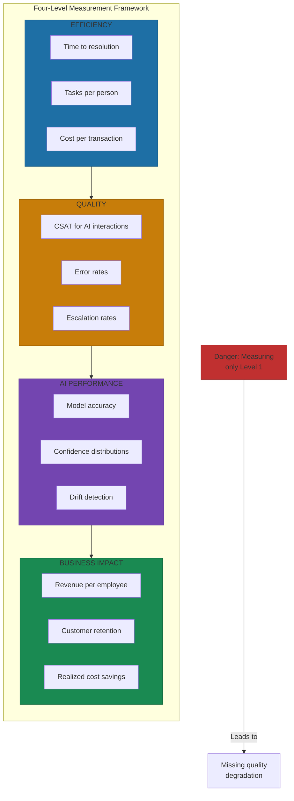
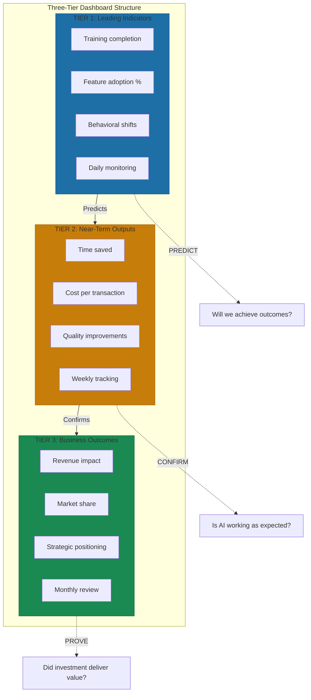

# Metrics That Matter

A company with 80 engineers using GitHub Copilot saved 2.4 hours per engineer per week. At $78/hour fully-loaded cost, that's $59,900 per month in recaptured capacity versus $1,520 in tooling costs. That's 39x ROI[^copilot-roi].

Numbers like that are why AI measurement matters—and why getting it wrong is expensive. Organizations implementing AI report 41% revenue increases and 32% reduction in customer acquisition costs[^gtm-gains]. Those numbers only materialize if you measure the right things.

## The Four-Level Measurement Framework

Track efficiency gains and you might miss quality degradation. Track AI performance without business outcomes and you're measuring technical vanity. The framework that works measures at four levels[^measurement-framework]:

**Efficiency metrics** capture speed, cost, and throughput. Time to resolution. Tasks per person. Cost per transaction. Obvious starting points, but dangerous in isolation.

**Quality metrics** ensure you're not trading customer experience for efficiency. CSAT for AI interactions should match human interactions. Error rates should decline. Escalation rates should be appropriate—not too high (AI is weak) and not too low (over-automation).

**AI performance metrics** track system health. Model accuracy should stay stable. Confidence distributions should be appropriate. Drift detection should catch degradation before it affects outcomes.

**Business impact metrics** connect to value creation. Revenue per employee. Customer retention. Time to value. Cost savings that actually materialize.

## Operations Benchmarks That Set Expectations

Benchmarks set expectations, not victory conditions. Your context matters. But here's what organizations achieve:

**Support operations** see 40-60% ticket deflection for leaders, 20-30% industry average[^support-benchmarks]. Response time improvements of 50%+ are achievable. Track CSAT alongside deflection—high deflection with declining satisfaction signals trouble.

**Finance operations** show 50-75% reduction in month-end close time, AI cutting 5-7 days versus companies not using AI[^finance-benchmarks]. Error reduction: 90-95% fewer manual errors in matching and reconciliation[^finance-errors].

**HR operations** achieve 60-70% processing time reduction on administrative tasks[^hr-benchmarks]. Performance reviews show 90% less HR time with AI coordination. Query handling: 3 days to 20 minutes in one implementation.

**IT operations** see meaningful MTTR reduction through AI-powered root-cause analysis. Ticket-to-incident ratio approaches 1:1 as AI correlates related incidents[^aiops-benchmarks].

**DevOps** consistently shows 2.4 hours saved per developer per week with AI coding assistants. That's the most consistently reported number across implementations[^devops-benchmarks].

## GTM Benchmarks That Set Expectations

GTM numbers are equally compelling, with the same context caveats.

**Marketing** sees AI personalization delivering 20% sales revenue increases. AI-personalized emails achieve 29% higher open rates. Cost per lead reduction of 20-50% with AI lead scoring[^marketing-benchmarks].

**Sales** shows 25-30% conversion rate increases with AI pipeline management. Win rate improvements of 30-50% when teams complete AI-recommended activities[^sales-benchmarks]. Forecast accuracy improves 15-25% within two quarters, moving from 60-65% baseline to 75-85%.

**Customer success** achieves 91-96% churn prediction accuracy with advanced models. AI health scoring delivers double retention rates versus rule-based methods[^cs-benchmarks]. One implementation increased expansion rates from 15% to 34%.

## The ROI Calculation Trap

AI ROI calculations fail when organizations focus on single metrics like cost savings while overlooking value dimensions that matter more. They double-count benefits. They assume linear scaling when reality compounds complexity. They project perfect implementation.

Hidden costs derail ROI: data preparation consumes far more budget than projections assume[^hidden-costs]. Integration complexity gets underestimated. Change management gets ignored. Ongoing maintenance and compliance create recurring expenses.

The methodological errors are equally dangerous[^measurement-mistakes]:

- **Benefit double-counting** across labor/efficiency, customer/revenue, and quality/cost categories
- **Unrealistic adoption assumptions** that assume 100% usage from day one
- **Linear scaling assumptions** that ignore the complexity of larger deployments
- **Perfect implementation expectations** that don't account for iteration and adjustment

The fix: comprehensive cost tracking. Track AI spend total and per-user. Calculate agent hourly rate as human-equivalent hours divided by AI spend. Include avoided costs from hiring not needed. Include hidden costs that business cases omit.

## Leading Indicators That Predict Outcomes

Sophisticated organizations track leading indicators that predict outcomes before lagging metrics reveal them.

**Adoption metrics** predict returns. Feature adoption rate. Prompts written. Active user percentage. If people aren't using AI, it won't generate value[^leading-indicators].

**Behavioral signals** predict outcomes before they materialize. AI can predict 23% drops in quarterly sales 6 weeks ahead based on micro-changes in user behavior[^predictive-signals].

**Risk metrics** catch problems early. Bias detection rates. Audit trail completeness. Failure recovery time.

## The Three-Tier Dashboard Structure

Structure your measurement as a three-tier system[^dashboard-structure]:

**Tier 1 tracks leading indicators.** Training completion. Feature adoption. Behavioral shifts. These predict outcomes.

**Tier 2 tracks near-term outputs.** Time saved. Cost per transaction. Quality improvements. These confirm AI is working.

**Tier 3 tracks business outcomes.** Revenue impact. Market share. Cost savings. These prove value.

Cadence: Daily for operational metrics. Weekly for efficiency trends. Monthly for business impact and ROI.

For established organizations: the common mistake is measuring AI activity without connecting to business outcomes. Without baselines, you can't prove ROI.

For startups: start measuring from day one. Focus on unit economics like cost per transaction rather than absolute numbers. These scale with you and prove viability to investors.

What gets measured gets managed.

## References

[^copilot-roi]: DX: AI Measurement Hub. [getdx.com](https://getdx.com/blog/ai-measurement-hub/)

[^gtm-gains]: Zigment: AI Marketing ROI Statistics 2026. [zigment.ai](https://zigment.ai/blog/artificial-intelligence-statistics-2026-marketing-roi-map)

[^measurement-framework]: AI Smart Ventures: How Do You Measure AI ROI. [aismartventures.com](https://aismartventures.com/posts/how-do-you-measure-ai-roi-a-framework-for-business-leaders/)

[^support-benchmarks]: Turabit: AI Support Whitepaper 2026. [turabit.com](https://turabit.com/wp-content/uploads/2026/01/Whitepaper-2026.pdf)

[^finance-benchmarks]: Finance Market Research: AI Cuts Month-End Close Time. [financemarketresearch.com](https://www.financemarketresearch.com/post/ai-cuts-month-end-close-time-by-more-than-7-days-according-to-study)

[^finance-errors]: AIQ Labs: How to Automate Month-End Processes. [aiqlabs.ai](https://aiqlabs.ai/blog/how-can-you-automate-month-end-processes)

[^hr-benchmarks]: Infeedo: How to Cut HR Processing Time by 70%. [infeedo.ai](https://www.infeedo.ai/blog/how-to-cut-hr-processing-time-by-70-using-smart-automation-tools)

[^aiops-benchmarks]: Fabrix: Key KPIs of AIOps Adoption. [fabrix.ai](https://fabrix.ai/blog/key-kpis-of-aiops-adoption/)

[^devops-benchmarks]: DX: AI Measurement Hub. [getdx.com](https://getdx.com/blog/ai-measurement-hub/)

[^marketing-benchmarks]: SingleGrain: How AI Marketing Agencies Measure Campaign Success. [singlegrain.com](https://www.singlegrain.com/digital-marketing-strategy/how-ai-marketing-agencies-measure-campaign-success-a-2025-guide-to-performance-metrics-that-drive-growth/)

[^sales-benchmarks]: MarketsAndMarkets: Revenue Intelligence vs Traditional Sales Forecasting. [marketsandmarkets.com](https://www.marketsandmarkets.com/AI-sales/revenue-intelligence-vs-traditional-sales-forecasting)

[^cs-benchmarks]: Supportbench: How AI Calculates Customer Health Scores. [supportbench.com](https://www.supportbench.com/how-ai-calculates-customer-health-scores/)

[^hidden-costs]: 8Allocate: How to Measure AI ROI and Avoid Costly Mistakes. [8allocate.com](https://8allocate.com/blog/how-to-measure-ai-roi-and-avoid-costly-mistakes/)

[^measurement-mistakes]: HypeStudio: AI Automation ROI Business Impact Guide. [hypestudio.org](https://hypestudio.org/ai-automation-roi-business-impact-the-complete-guide-2025/)

[^leading-indicators]: Gong: The AI Measurement Framework. [gong.io](https://www.gong.io/blog/the-ai-measurement-framework)

[^predictive-signals]: Finrep: From Lagging to Leading Indicators Using AI. [finrep.ai](https://finrep.ai/blog/from-lagging-to-leading-indicators-using-ai-to-benchmark-strategic-performance)

[^dashboard-structure]: Gong: The AI Measurement Framework. [gong.io](https://www.gong.io/blog/the-ai-measurement-framework)

---

[← Previous: AI-Powered GTM](./04-ai-powered-gtm.md) | [Chapter Overview](./README.md) | [Next: The 8 Go-to-Market Mistakes with AI →](./06-the-8-gtm-mistakes-with-ai.md)
