# The Permission Model Framework

AI autonomy isn't about capability. It's about what warrants unsupervised operation. That answer changes by context, by stakes, and by how much trust you've earned through evidence.

At Yirifi, we run three permission modes: AI does everything automatically, AI only uses approved tools, AI asks for every action. Different contexts need different trust levels. The regulatory environment is catching up—AI incidents jumped 21% from 2024 to 2025 as companies expanded autonomy without expanding controls[^bcg]. The companies avoiding those headlines aren't the ones that banned AI. They're the ones that matched permission levels to actual risk.

## The Three Modes

### Mode 1: Auto (AI Acts Autonomously)

In Auto mode, AI operates independently without human approval. Klarna's customer service assistant handled 2.3 million conversations in its first month without requiring human sign-off on individual responses. Resolution time dropped from 11 minutes to under 2 minutes[^klarna].

Auto mode works when you've got three things: low stakes, easy reversibility, and established track record. Document classification? Auto. Read-only analytics? Auto. Status checks? Auto. The pattern is operations where a mistake costs you minutes, not millions.

But here's what Klarna learned: even working autonomy has limits. By late 2024, they adjusted toward a human-hybrid balance after customer feedback about wanting access to real people[^klarna]. Auto mode requires validated boundaries, not passive acceptance.

Walmart's CTO Hari Vasudev captures the philosophy: "Our approach to agentic AI is surgical. Agents work best when deployed for highly specific tasks, to produce outputs that can then be stitched together"[^walmart]. Specificity enables autonomy. Broad mandates invite disaster.

### Mode 2: Approved-Tools (Restricted Operations)

AI has freedom within explicitly defined boundaries—a toolbox with specific instruments, nothing outside it. Salesforce's Agentforce illustrates: a banking agent can retrieve transactions and identify unauthorized charges autonomously, but issuing credits or notifying merchants requires human approval[^salesforce].

Financial services firms use clear thresholds[^risk-framework]:

| Factor | Auto-Approve | Approved-Tools | Ask-Every-Time |
|--------|--------------|----------------|----------------|
| Financial impact | Under $5,000 | $5,000-$50,000 | Over $50,000 |
| Data sensitivity | Public data only | Internal, no PII | PII or protected classes |
| Reversibility | Full rollback in 24 hours | Reversible with approval | Irreversible |

Healthcare shows an asymmetric pattern: AI can approve standard procedure authorizations autonomously but cannot deny coverage without physician review[^healthcare]. When even Anthropic—the company building Claude—requires manual approval for all tool calls by default, noting "models are currently not safe enough to blanket trust choices"[^anthropic], that's a signal worth heeding.

### Mode 3: Ask-Every-Time (Human Approval Required)

High-stakes, irreversible, or novel operations require explicit human sign-off. One European bank's AI flagged 80,000 transactions as "high risk"—only 0.3% proved genuinely suspicious[^bank]. That 99.7% false positive rate is why humans stay in the loop: AI excels at pattern detection, context requires judgment.

The cost is latency. But for financial transactions, medical diagnoses, and public communications, latency buys accountability and compliance. AI-assisted breast cancer detection achieves 91% accuracy versus 74% for unassisted radiologists—but physicians still authorize every diagnosis[^healthcare-dx].

## Choosing the Right Mode

The mode selection framework comes down to four questions:

**1. What's the blast radius if this goes wrong?**
Minimal impact operations can run in Auto. Moderate impact needs guardrails. Significant or irreversible impact requires human approval.

**2. How easily can you recover from mistakes?**
Easy rollback enables autonomy. Impossible rollback demands oversight.

**3. What's your evidence base?**
New AI systems start in Ask-Every-Time. You earn Auto mode through demonstrated reliability—not vendor claims, not theoretical capabilities, but measured performance in your environment.

**4. What do regulators expect?**
The EU AI Act classifies high-risk systems explicitly: credit decisions, healthcare diagnostics, employment screening, law enforcement. These require human oversight regardless of technical capability[^eu-ai-act].

## The Mode Progression Model

```mermaid
flowchart TB
    subgraph PROGRESS["Trust Progression Over Time"]
        direction TB
        START["🚀 New AI System"] --> ASK["Ask-Every-Time<br/><i>30+ days, build evidence</i>"]
        ASK -->|"Demonstrated reliability"| TOOLS["Approved-Tools<br/><i>Expanded boundaries</i>"]
        TOOLS -->|"Consistent performance"| AUTO["Auto<br/><i>Specific operations only</i>"]
    end

    subgraph REGRESS["On Incident: Regress One Level"]
        direction TB
        INCIDENT["⚠️ Incident Detected"] --> DOWN["Drop one permission level"]
        DOWN --> INVESTIGATE["Investigate root cause"]
        INVESTIGATE --> EARN["Re-earn through evidence"]
    end

    AUTO -.->|"Incident occurs"| INCIDENT

    style ASK fill:#c03030,stroke:#454d58
    style TOOLS fill:#c77d0a,stroke:#454d58
    style AUTO fill:#1a8a52,stroke:#454d58
    style INCIDENT fill:#c03030,stroke:#9a2020
```

Start every new AI system in Ask-Every-Time. After 30+ days without significant errors, graduate to Approved-Tools. After consistent performance, specific operations move to Auto. Skipping levels means you haven't calibrated boundaries or discovered edge cases.

When incidents happen, regress one level immediately. A 2025 Gartner survey found only 15% of IT leaders are deploying fully autonomous agents[^gartner]. The industry is still learning where autonomy is safe.

## The Documentation Imperative

The common mistake: treating permission levels as implementation details. They're not. They're governance decisions that will be scrutinized.

Document your permission model before deployment. Answer these questions in writing:
- What mode does this system run in?
- Why did you choose that mode?
- What would trigger a mode change (up or down)?
- Who approves mode changes?

You'll be asked—by auditors, by regulators, by lawyers after an incident. "We thought it seemed fine" is not a defensible answer. "Here's our documented risk assessment and the evidence that supported our decision" is.

---

## References

[^bcg]: BCG/MIT Sloan Management Review. ["What Happens When AI Stops Asking Permission." 2025](https://www.bcg.com/publications/2025/what-happens-ai-stops-asking-permission)

[^klarna]: Forbes. ["Klarna's New AI Tool Does the Work of 700 Customer Service Reps." March 2024](https://www.forbes.com/sites/quickerbettertech/2024/03/13/klarnas-new-ai-tool-does-the-work-of-700-customer-service-reps/)

[^walmart]: Artificial Intelligence News. ["Walmart AI Strategy: Agentic Future." 2024](https://www.artificialintelligence-news.com/news/walmart-ai-strategy-agentic-future/)

[^salesforce]: WotNot. ["Best Agentic AI Companies." 2024](https://wotnot.io/blog/best-agentic-ai-companies)

[^risk-framework]: Hoop.dev. ["AI Command Approval and AI Change Authorization." 2024](https://hoop.dev/blog/how-to-keep-ai-command-approval-and-ai-change-authorization-secure-and-compliant-with-database-governance-observability/)

[^healthcare]: Menlo Ventures. ["2025: The State of AI in Healthcare."](https://menlovc.com/perspective/2025-the-state-of-ai-in-healthcare/)

[^anthropic]: GitHub MCP Discussion. ["Auto Approve MCP Tool Calls." December 2024](https://github.com/orgs/modelcontextprotocol/discussions/69)

[^bank]: Fintech Strategy. ["Why AI Isn't Enough for Effective Transaction Monitoring." January 2026](https://www.fintechstrategy.com/blog/2026/01/12/ermi-why-ai-isnt-enough-for-effective-transaction-monitoring/)

[^healthcare-dx]: GlobalRPh. ["Why AI in Healthcare Is Rewriting Medical Diagnosis in 2025." 2025](https://globalrph.com/2025/02/why-artificial-intelligence-in-healthcare-is-rewriting-medical-diagnosis-in-2025/)

[^eu-ai-act]: Secure Privacy. ["AI Governance Framework Tools." 2024](https://secureprivacy.ai/blog/ai-governance-framework-tools)

[^gartner]: XCube Labs. ["10 Real-World Examples of AI Agents in 2025." 2025](https://www.xcubelabs.com/blog/10-real-world-examples-of-ai-agents-in-2025/)

---

[Chapter Overview](./README.md) | [Next: AI Governance That Works →](./02-ai-governance-that-works.md)
