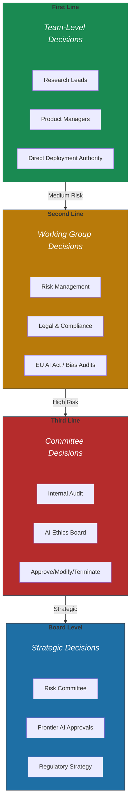
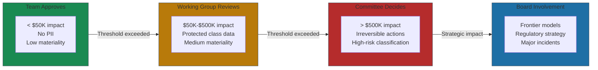

# AI Governance That Works

Most AI governance is theater. Committees that meet but don't decide. Policies that exist but aren't enforced. Approval processes that slow innovation without actually reducing risk.

The data tells the story. Teams spend 56% of their time on governance-related activities when using manual processes[^benchmark]. That's more than half your AI talent doing compliance paperwork instead of building value. Meanwhile, 74% of the Australian Taxation Office's AI models in production didn't have completed data ethics assessments[^ato]. Governance theater in one hand, governance gaps in the other.

Working AI governance has three characteristics: it has real authority, it makes timely decisions, and it enables rather than just blocks. Here's how to build it.

## The Three Lines of Defense

The model that works adapts "Three Lines of Defense" to AI:

- **First Line (Team)**: Approve low-risk experiments, internal tools, routine updates—no committee needed.
- **Second Line (Working Group)**: Risk + Legal review medium-risk deployments. Handles EU AI Act compliance, bias audits[^cipl].
- **Third Line (Committee)**: Ethics board assesses high-risk systems. Can approve, modify, or terminate[^three-lines].
- **Board Level**: Frontier AI, regulatory strategy, major incidents.

The pattern: layered authority matching decision importance to decision-maker seniority.

## Structures That Work

### IBM's AI Ethics Board

IBM established their AI Ethics Board in 2019 and refined it for five years. The structure: a Policy Advisory Committee of senior leaders who define risk tolerance and strategy, with an AI Ethics Board as the central cross-disciplinary body co-chaired by their Global AI Ethics Leader and Chief Privacy & Trust Officer[^ibm].

What makes it work:
- **Distributed accountability**: Every business unit has ethics focal points who can make routine decisions locally
- **Practical tools**: They developed an AI Risk Atlas embedded in watsonx that gives practitioners decision support without routing through the board
- **Clear escalation**: The board reviews sensitive use cases and issues guidance—but doesn't touch every deployment

### JPMorgan's Operating Committee Mandate

JPMorgan elevated AI governance to their 14-member Operating Committee in 2025, with their Chief Data and Analytics Officer at the table—one of few Fortune 1000 CDAOs at that level[^jpmorgan]. When AI innovation is an operating committee mandate, governance becomes strategy, not just risk management.

Financial services saw an 84% increase in board oversight disclosure around AI in 2024[^board-disclosure]. The sector is treating AI governance as a board-level capability, not a compliance checkbox.

## Decision Rights That Scale

The RACI matrix (Responsible, Accountable, Consulted, Informed) eliminates ambiguity about who decides what:

**For a Bank Deploying Credit Scoring AI**[^raci]:
- **Responsible**: Data science team (model training and validation)
- **Accountable**: Legal department (compliance sign-off)
- **Consulted**: IT security (risk assessment)
- **Informed**: Senior management (status updates)

The pattern: technical teams do the work, business owners sign off, specialists advise, leaders stay informed. Without this clarity, you get what one healthcare system discovered—"what appeared as simple data access tasks expanded into months of negotiation" because nobody knew who could authorize secondary use of data[^healthcare-delays].

## Escalation Triggers

Clear thresholds prevent both over-governance and under-governance. In UK financial services, 62% of AI use cases qualify as low materiality (team approval), while 16% are high materiality requiring committee review[^bank-england]. EU AI Act high-risk classifications—credit decisions, healthcare diagnostics, employment screening, law enforcement—require committee-level decisions regardless of financial impact.

Write these thresholds down before you need them. When an incident happens at 2am, nobody should be debating who has authority.

## Governance That Enables

Governance committees must have authority to approve, modify, or terminate AI projects—without it, governance becomes performative[^cipl]. Microsoft "dogfoods" AI internally before external rollout, identifying governance gaps before they cause delays[^microsoft].

The governance that works helps teams find the "yes" that manages risk. If it only blocks, it's not working. If it only approves, it's not governing.

AI capabilities evolve faster than annual review cycles. [Chapter 12: Staying Ahead](../12-staying-ahead/README.md) addresses governance that absorbs change—modular architectures where you can update permission models without renegotiating your entire framework.

## References

[^benchmark]: Aligne AI. ["The AI Governance Crisis Every Executive Must Address in 2025."](https://www.aligne.ai/blog-posts/the-ai-governance-crisis-every-executive-must-address-in-2025)

[^ato]: Australian National Audit Office. ["Governance of Artificial Intelligence: The Australian Taxation Office." 2024-2025](https://www.anao.gov.au/work/performance-audit/governance-of-artificial-intelligence-the-australian-taxation-office)

[^cipl]: Centre for Information Policy Leadership. ["Building Accountable AI Programs." February 2024](https://www.informationpolicycentre.com/uploads/5/7/1/0/57104281/cipl_building_accountable_ai_programs_23_feb_2024.pdf)

[^three-lines]: Centre for the Governance of AI. ["Three Lines of Defense Against Risks From AI." 2023](https://cdn.governance.ai/Three_Lines_of_Defense_Against_Risks_From_AI.pdf)

[^ibm]: IBM. ["Reflecting on IBM AI Ethics Board." 2024](https://www.ibm.com/think/insights/Reflecting-on-IBM-AI-Ethics-Board)

[^jpmorgan]: Forbes. ["At JPMorgan Chase, AI Innovation Is an Operating Committee Mandate." July 2025](https://www.forbes.com/sites/randybean/2025/07/27/at-jpmorganchase-ai-innovation-is-an-operating-committee-mandate/)

[^board-disclosure]: Liminal AI. ["Enterprise AI Governance Guide." 2024](https://www.liminal.ai/blog/enterprise-ai-governance-guide)

[^raci]: Efficiency AI. ["AI Governance RACI Matrix."](https://www.efficiencyai.co.uk/knowledge_card/ai-governance-raci-matrix/)

[^healthcare-delays]: Bewaji Health. ["Healthcare AI Governance: 4 Gaps That Derail Projects Before the Pilot."](https://bewajihealth.com/healthcare-ai-governance-4-gaps-that-derail-projects-before-the-pilot/)

[^bank-england]: Bank of England. ["Artificial Intelligence in UK Financial Services 2024."](https://www.bankofengland.co.uk/report/2024/artificial-intelligence-in-uk-financial-services-2024)

[^microsoft]: Diligent. ["AI Governance Business Leader Tips."](https://www.diligent.com/resources/blog/ai-governance-business-leader-tips)

---

[← Previous: The Permission Model Framework](./01-the-permission-model-framework.md) | [Chapter Overview](./README.md) | [Next: The 7 AI Risks and Their Mitigations →](./03-the-7-ai-risks-and-their-mitigations.md)
