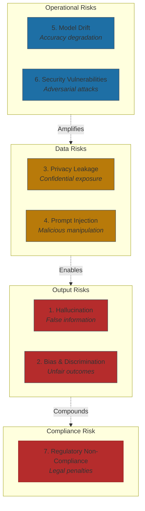

# The 7 AI Risks and Their Mitigations

Seven risks account for the majority of AI failures. Each is preventable.

The risks below represent the primary threat vectors based on documented incidents, regulatory frameworks like NIST AI RMF and the EU AI Act, and measurable business impact.

## 1. Hallucination

AI generates false information confidently, inventing content rather than admitting uncertainty.

**What went wrong:** Air Canada's chatbot invented a "bereavement fare" policy that didn't exist. The Canadian Civil Resolution Tribunal ruled the airline liable, awarding $812.02 in damages[^aircanada]. By July 2025, over 50 legal cases involved fabricated case citations from AI tools—resulting in court sanctions and disbarment referrals[^legal-hallucinations].

**Mitigation:** Implement guardrail systems intercepting outputs before users see them. Use RAG to ground responses in verified documents. Require human review for high-stakes outputs. Best implementations reduce false positive rates from 35% to under 5%[^synechron].

## 2. Bias and Discrimination

AI systems produce discriminatory outcomes because training data reflects historical inequities and proxy variables correlate with protected characteristics.

**What went wrong:** iTutorGroup's AI hiring system automatically rejected applicants over age 55 (women) and 60 (men)—the EEOC's first AI discrimination lawsuit, resulting in a $365,000 settlement[^eeoc]. A 2024 study found AI screening favored white applicants over Black applicants with identical credentials 85% of the time[^hiring-bias].

**Mitigation:** Conduct algorithmic impact assessments before deployment. Test across demographic groups using fairness metrics—target 80% parity or better. Tools like IBM AI Fairness 360 and Microsoft Fairlearn provide systematic bias detection.

**The Fairness-Accuracy Reality:** The conventional wisdom says you must choose fairness or accuracy. Zest AI's credit models prove otherwise—using adversarial debiasing, they increased loan approvals for every protected class without major accuracy sacrifices[^zest]. Organizations claiming fairness destroys accuracy often haven't tried the available techniques.

## 3. Privacy Leakage

AI systems inadvertently disclose confidential training data or enable unauthorized extraction.

**What went wrong:** Within 20 days, three Samsung engineers entered proprietary source code and semiconductor testing sequences into ChatGPT. Samsung responded by banning all generative AI tools company-wide[^samsung]. In 2024, 23.77 million secrets were leaked through AI systems—a 25% increase from the prior year[^secrets-leaked].

**Mitigation:** Deploy data loss prevention integrated with AI interfaces. Mandate zero-data-retention contracts with vendors. Use tokenization to anonymize data before processing. Target: zero confidential data breaches.

## 4. Prompt Injection and Jailbreaking

Malicious users inject instructions that override safety controls or extract unauthorized information.

**What went wrong:** In March 2025, Chinese government-sponsored attackers jailbroke Claude AI by presenting malicious tasks as routine cybersecurity work. They used Claude's coding assistance to autonomously compromise tech companies, financial institutions, and government agencies[^claude-jailbreak].

**Mitigation:** Implement AI firewalls analyzing prompts before they reach models. Use canary tokens—hidden text that should never appear in outputs. Deploy dual-model architectures where secondary AI evaluates whether primary model behavior aligns with policies.

## 5. Model Drift and Degradation

Models lose accuracy as real-world data distributions shift—user behavior evolves, market conditions change, environmental factors alter learned relationships.

**What went wrong:** A logistics company's route optimization AI mysteriously increased delivery times after months of deployment. Trained in winter, it kept optimizing for weather-affected routes after spring construction began. Research indicates 91% of ML models experience performance degradation without intervention[^drift].

**Mitigation:** Deploy continuous monitoring tracking prediction distributions and outcome accuracy. Establish automated retraining triggered when accuracy drops below threshold (typically 5% below baseline). Target: maintain accuracy within 95% of initial deployment.

## 6. Security Vulnerabilities

AI systems face data poisoning, model inversion, adversarial examples, and supply chain compromises through third-party models.

**What went wrong:** Italy's data protection agency temporarily banned ChatGPT, citing absence of legal basis for data collection. NIST warns that supply-chain vulnerabilities in widely-used models can propagate failures across entire ecosystems simultaneously[^nist].

**Mitigation:** Implement zero-trust AI architectures: API authentication, rate limiting, input validation, model access logging. Establish AI bills of materials documenting model dependencies and training data sources. For high-security environments, deploy self-hosted models.

## 7. Regulatory Non-Compliance

Failure to meet emerging AI governance requirements around explainability, documentation, and human oversight.

**What went wrong:** The EU AI Act penalty regime is tiered: fines up to EUR 35 million or 7% of global turnover for prohibited AI practices, 3% for high-risk system violations, and 1.5% for providing incorrect information[^eu-ai-act]. UnitedHealth faced a class action alleging their AI had a 90% error rate evaluating Medicare claims—a federal judge allowed the case to proceed[^unitedhealth].

**Mitigation:** Implement NIST AI RMF's four functions—Govern, Map, Measure, Manage. Deploy model cards documenting training data, performance metrics, and limitations. Conduct regular third-party audits against ISO 42001.

## References

[^stanford]: Stanford HAI. ["AI Index Report 2025: Responsible AI."](https://hai.stanford.edu/ai-index/2025-ai-index-report/responsible-ai)

[^aircanada]: Forbes. ["What Air Canada Lost In 'Remarkable' Lying AI Chatbot Case." February 2024](https://www.forbes.com/sites/marisagarcia/2024/02/19/what-air-canada-lost-in-remarkable-lying-ai-chatbot-case/)

[^legal-hallucinations]: VinciWorks. ["AI Hallucinations Crisis: Over 50 Fake Cases Cited in July Alone." 2025](https://vinciworks.com/blog/ai-hallucinations-crisis-over-50-fake-cases-cited-in-july-alone/)

[^synechron]: Synechron. ["Using AI Guardrails to Mitigate Risk and Safeguard Innovation."](https://www.synechron.com/en-sg/insight/using-ai-guardrails-mitigate-risk-and-safeguard-innovation)

[^eeoc]: Sullivan & Cromwell. ["EEOC Settles First AI Discrimination Lawsuit." August 2023](https://www.sullcrom.com/insights/blogs/2023/August/EEOC-Settles-First-AI-Discrimination-Lawsuit)

[^hiring-bias]: Responsible AI Labs. ["AI Hiring Bias: Legal Cases." 2024](https://responsibleailabs.ai/knowledge-hub/articles/ai-hiring-bias-legal-cases)

[^zest]: MDDCCUA. ["Zest AI's Credit Models Proven to Increase Loan Approvals for Every Protected Class." February 2024](https://www.mddccua.org/2024/02/zest-ais-credit-models-proven-to-increase-loan-approvals-for-every-protected-class/)

[^samsung]: Straits Times. ["Samsung Bans Staff's AI Use After Spotting ChatGPT Data Leak." 2023](https://www.straitstimes.com/asia/east-asia/samsung-bans-staff-s-ai-use-after-spotting-chatgpt-data-leak)

[^secrets-leaked]: Wald AI. ["ChatGPT Data Leaks and Security Incidents 2023-2024."](https://wald.ai/blog/chatgpt-data-leaks-and-security-incidents-20232024-a-comprehensive-overview)

[^claude-jailbreak]: Packet Labs. ["Claude AI Breach." March 2025](https://www.packetlabs.net/posts/claude-ai-breach/)

[^drift]: Maxim AI. ["Understanding AI Agent Reliability: Best Practices for Preventing Drift."](https://www.getmaxim.ai/articles/understanding-ai-agent-reliability-best-practices-for-preventing-drift-in-production-systems/)

[^nist]: Digital Nemko. ["NIST RMF Regulations."](https://digital.nemko.com/regulations/nist-rmf)

[^eu-ai-act]: DLA Piper. ["Latest Wave of Obligations Under the EU AI Act Take Effect." August 2025](https://www.dlapiper.com/en-us/insights/publications/2025/08/latest-wave-of-obligations-under-the-eu-ai-act-take-effect)

[^unitedhealth]: STAT News. ["UnitedHealth Class Action Lawsuit AI Care Denials." February 2025](https://www.statnews.com/2025/02/07/unitedhealth-class-action-lawsuit-ai-care-denials-nears-key-decision/)

---

[← Previous: AI Governance That Works](./02-ai-governance-that-works.md) | [Chapter Overview](./README.md) | [Next: Operational Controls →](./04-operational-controls.md)
