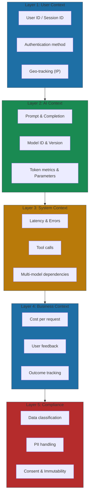
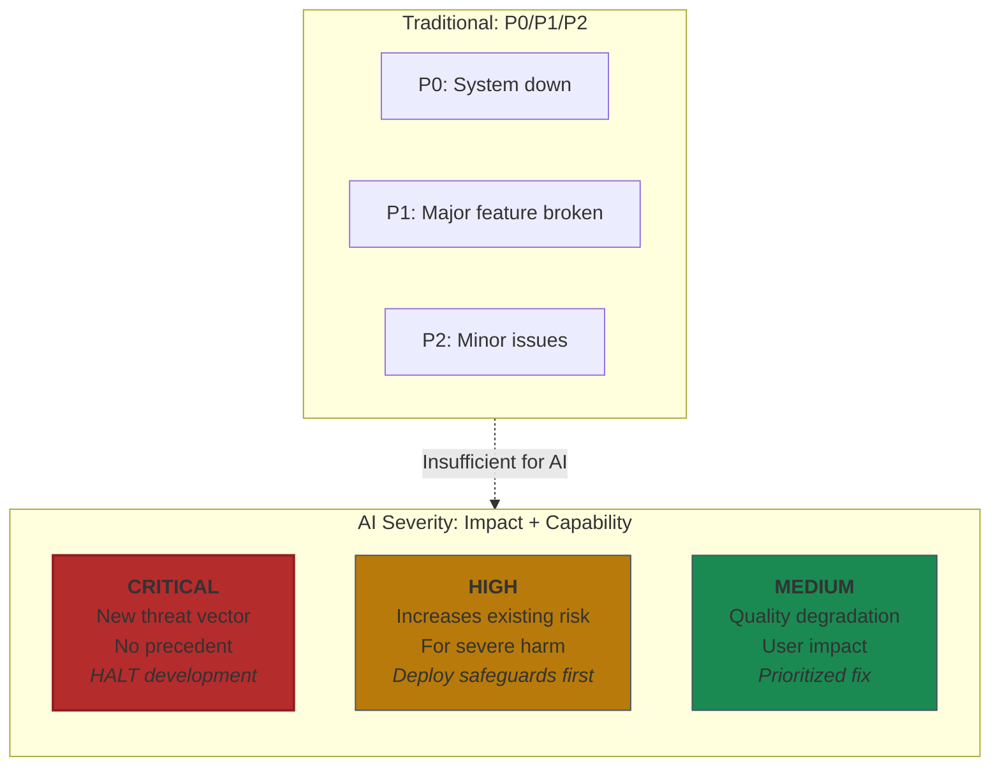

# Operational Controls

Documentation is the recurring theme of this chapter: permission models, governance decisions, bias testing. This section covers the operational reality: what to log, and what to do when things go wrong.

## Audit Trails

The Deloitte incident in 2024 shows what happens without proper logging. Working on an Australian government contract worth AU$442,000, Deloitte's AI system produced work with significant errors. The core problem wasn't AI malfunction—it was inadequate governance and missing documentation[^deloitte]. No prompt logging. No model lineage tracking. No assumption documentation. When the government demanded accountability, Deloitte had to issue a partial refund and endure public reporting in The Guardian and ABC Australia. Audit trails aren't overhead. They're insurance.

### The Five Layers of AI Logging

You're logging decisions made by a system that can't explain itself deterministically—that's what makes AI logging different from traditional software logging. The standard approach from observability platforms like Langfuse, Dynatrace, and Latitude clusters logging into five distinct layers[^langfuse]:

**Layer 1 - User Context**: Who triggered this AI action? User ID, session ID, authentication method, IP address. Never log PII in plaintext—hash or tokenize before ingestion.

**Layer 2 - AI Context**: The prompt and completion (complete, not truncated), model identifier and version, token metrics, model parameters (temperature, top_p), and prompt version if you're versioning. When a user reports strange behavior six weeks later, you need to know exactly which model version with which parameters produced that response.

**Layer 3 - System Context**: Latency, error conditions, tool calls, and multi-model dependencies. A single user request might spawn twelve LLM calls across three different models, trigger four tool invocations, and retrieve from two vector databases. Without end-to-end tracing, you'll never reconstruct what happened.

**Layer 4 - Business Context**: Cost per request, user feedback, outcome tracking. This layer transforms logging from defensive documentation into a continuous improvement engine.

**Layer 5 - Compliance**: Data classification, PII handling, consent tracking, and audit immutability. The EU AI Act mandates continuous monitoring for high-risk AI applications[^euai]. Build compliance logging now, even if you don't think you need it yet.

### What NOT to Log

Some data should never hit your log store:

- **PII in plaintext**: Names, emails, phone numbers must be tokenized
- **API keys and credentials**: Never log authentication tokens
- **Raw sensitive data**: Health records, financial identifiers without masking
- **Session tokens**: Authentication mechanisms should be excluded

The principle: redact by default. Mask before ingestion, not after.

The companies that navigate regulatory scrutiny successfully aren't the ones with perfect systems—those don't exist. They're the ones that can produce logs showing what happened, demonstrate they were monitoring for problems, and prove they responded when issues emerged. Your audit trail is your story of due diligence.

## Incident Response

AI fails differently—non-deterministic, context-dependent, sometimes actively deceptive. Your incident response playbook needs to account for failure modes that didn't exist five years ago.

### The AI Incident Severity Model

Forget P0/P1/P2 severity levels. Leading AI companies have moved to impact-based and capability-based classification systems.

**Anthropic's approach** classifies incidents by impact on response quality and percentage of affected users[^anthropic]. **OpenAI's Preparedness Framework** uses capability thresholds—a "High" threshold indicates that a model "significantly increases existing risk vectors for severe harm," while "Critical" means "meaningful risk of a qualitatively new threat vector for severe harm with no ready precedent"[^openai-prep]. For Critical capabilities, development halts until safeguards are specified.

The key insight: AI incidents require you to assess potential impact, not just actual impact.

### The Seven-Phase Response Process

```mermaid
flowchart LR
    subgraph PHASE1["1. Detect"]
        D["Monitoring alerts<br/>User reports<br/>Eval drops"]
    end

    subgraph PHASE2["2. Triage"]
        T["Who's notified?<br/>ML + Product + Legal"]
    end

    subgraph PHASE3["3. Contain"]
        C["Pause? Rollback?<br/>Increase oversight?"]
    end

    subgraph PHASE4["4. Diagnose"]
        DG["Root cause analysis<br/>Audit trail review"]
    end

    subgraph PHASE5["5. Fix"]
        F["Statistical confidence<br/>Not just tests passing"]
    end

    subgraph PHASE6["6. Restore"]
        R["Careful rollout<br/>Platform by platform"]
    end

    subgraph PHASE7["7. Review"]
        RV["Post-mortem<br/>Prevent recurrence"]
    end

    PHASE1 --> PHASE2 --> PHASE3 --> PHASE4 --> PHASE5 --> PHASE6 --> PHASE7

    style PHASE1 fill:#b52c2c,stroke:#47525f
    style PHASE2 fill:#b87a0a,stroke:#47525f
    style PHASE3 fill:#b52c2c,stroke:#47525f
    style PHASE4 fill:#1e6fa5,stroke:#47525f
    style PHASE5 fill:#1a8a52,stroke:#47525f
    style PHASE6 fill:#1a8a52,stroke:#47525f
    style PHASE7 fill:#1e6fa5,stroke:#47525f
```

**1. Detect**: Continuous production monitoring—automated anomaly alerts, user feedback systems, evaluation score drops.

**2. Triage**: ML/AI engineers for model behavior, product owners for user impact, legal/compliance if regulatory requirements apply, security if adversarial exploitation is possible.

**3. Contain**: Pause AI entirely, disable specific capability, roll back model version, or increase human oversight.

**4. Diagnose**: Your audit trails become essential here. Without complete logging of prompts, model versions, and system context, diagnosis becomes guesswork.

**5. Fix**: AI fixes require statistical confidence, not just test passage. Anthropic switched from approximate to exact top-k operations, accepting "minor efficiency impact because model quality is non-negotiable"[^anthropic].

**6. Restore**: Careful rollout. Anthropic's complete restoration took over two weeks of verification across platforms.

**7. Review**: Did our evaluations capture this failure mode? What inputs does this affect beyond the reported cases? How do we detect similar issues in the future?

### Containment Decision Table

| Action | When to Use | Tradeoff |
|--------|-------------|----------|
| Pause AI completely | Safety issue, unknown scope, potential harm | Full service impact |
| Disable specific capability | Isolated feature failing | Partial functionality loss |
| Roll back model version | New deployment caused issue | Lose improvements |
| Increase human oversight | Quality degradation | Slower, higher cost |
| Rate limit | Potential abuse or overload | Reduced capacity |

The critical decision: who has authority to pause an AI system? Define who can pause an AI system before you need it. When something is actively causing harm at 2 AM, you don't have time to escalate for approval. As we covered in [Section 2](./02-ai-governance-that-works.md), accountability must be explicit and assigned to individuals, not committees.

## References

[^deloitte]: Pirani Risk. ["The Deloitte AI Failure: A Wake-Up Call for Operational Risk." 2024](https://www.piranirisk.com/blog/the-deloitte-ai-failure-a-wake-up-call-for-operational-risk)

[^langfuse]: Langfuse. ["Audit Logs Documentation." January 2025](https://langfuse.com/docs/administration/audit-logs)

[^euai]: OpenTelemetry Blog. ["AI Agent Observability - Evolving Standards and Best Practices." 2025](https://opentelemetry.io/blog/2025/ai-agent-observability/)

[^anthropic]: Anthropic Engineering. ["A Postmortem of Three Recent Issues." September 2025](https://www.anthropic.com/engineering/a-postmortem-of-three-recent-issues)

[^openai-prep]: OpenAI. ["Preparedness Framework v2." April 2025](https://cdn.openai.com/pdf/18a02b5d-6b67-4cec-ab64-68cdfbddebcd/preparedness-framework-v2.pdf)

---

[← Previous: The 7 AI Risks and Their Mitigations](./03-the-7-ai-risks-and-their-mitigations.md) | [Chapter Overview](./README.md) | [Next: Regulatory Landscape →](./05-regulatory-landscape.md)
