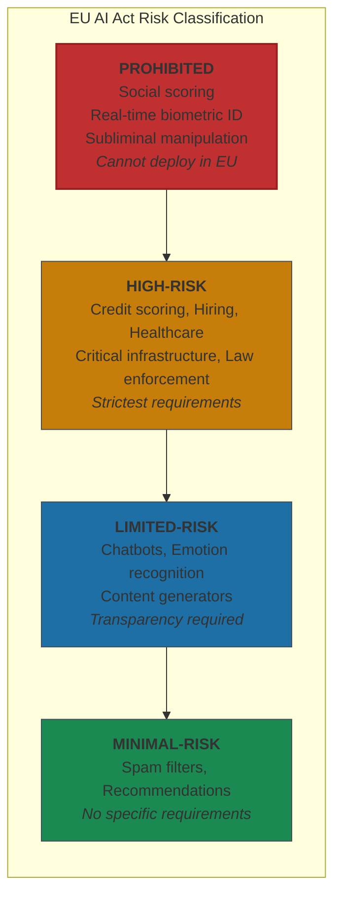
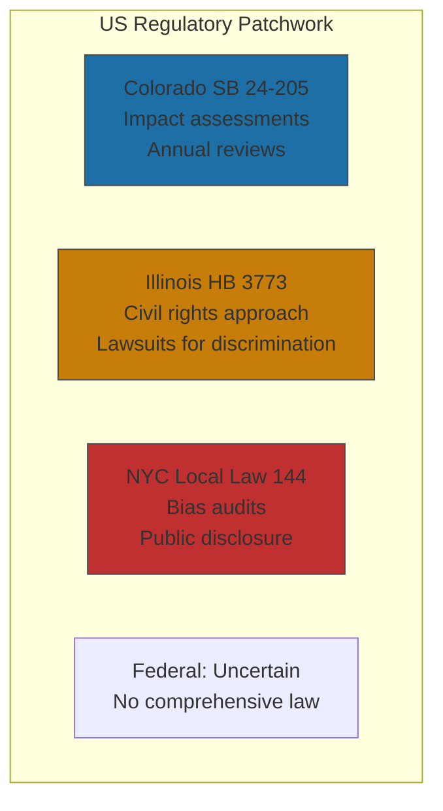

# Regulatory Landscape

AI regulation is a moving target. Any specific guidance in this section will have a shelf life. What won't change is the direction of travel. Regulation is coming everywhere, it's converging on similar principles, and the companies that prepare early will spend less and compete better than those who wait.

The EU AI Act is fully in effect as of August 2026. Colorado's AI law launched in June 2026. New York City has been enforcing bias audits for hiring AI since 2023. Illinois made algorithmic discrimination an actionable civil rights violation as of January 2026[^state-laws]. If you're operating internationally or across US states, you're already subject to multiple overlapping frameworks.

Early preparation compounds. Late scrambling costs more than compliance itself.

## The EU AI Act: The Global Standard

The EU AI Act is the most comprehensive AI regulation in the world. Any company serving EU customers or processing EU resident data must comply. But more than that: it's becoming the template other jurisdictions follow. Brazil's AI Bill adopts a similar risk-based model. Building to EU AI Act standards gives you a compliance buffer for regulations that don't exist yet.

### The Risk Pyramid

**Prohibited practices**: Social scoring, real-time biometric identification in public spaces, subliminal manipulation. If your system falls here, you can't deploy it in the EU.

**High-risk systems**: Biometric identification, critical infrastructure, education admissions, employment decisions, essential services (credit, insurance), law enforcement, border control. The pattern: anywhere AI makes consequential decisions about people's lives.

**Limited-risk systems**: Chatbots and content generators must disclose they're AI—transparency only.

**Minimal-risk systems**: Spam filters and recommendation engines face no specific requirements.

### Timeline Reality Check

Companies need 32-56 weeks for full compliance implementation—documentation, governance setup, testing, notified body assessment, and remediation cycles[^eu-timeline]. Starting now leaves margin. Starting later doesn't.

**Key dates:**
- February 2, 2025: Prohibited practices banned (passed)
- August 2, 2025: GPAI model obligations effective (passed)
- August 2, 2026: High-risk system compliance required (upcoming)
- August 2, 2030: Public sector compliance deadline

Penalties are tiered: 7% of global turnover for prohibited practices, 3% for high-risk system violations, and 1.5% for providing incorrect information to regulators[^eu-penalties]. For a $1 billion company with high-risk AI, that's a $30 million maximum fine—or $70 million for prohibited practices.

## The US Patchwork

While Europe has one comprehensive law, the US has a patchwork of state regulations, federal proposals, and sector-specific guidance.

### State AI Laws at a Glance

| State | Law | Key Requirement | Penalty |
|-------|-----|-----------------|---------|
| Colorado | SB 24-205 | Impact assessments, annual reviews for algorithmic discrimination | $20K/violation |
| Illinois | HB 3773 | Civil rights approach—employees can sue for AI discrimination | Standard damages |
| NYC | Local Law 144 | Annual bias audits, public disclosure, candidate notification | $375-$1,500/day |

Colorado includes a rebuttable presumption of "reasonable care" if you comply with its procedures—a valuable safe harbor[^colorado]. Illinois takes a simpler approach: no impact assessments required, but disparate impact is sufficient to prove discrimination—you don't need intent[^illinois]. NYC's law has been enforced since 2023, with a year of non-compliance potentially costing over $500,000[^nyc].

Compliance costs typically represent 5-10% of total AI implementation budgets[^costs]. Healthcare adds 20-25% for HIPAA; financial services adds 15-20% for SOC 2.

## The Preparation Playbook

Companies that start compliance preparation eighteen months before a deadline still feel rushed. Those who start at twelve months scramble. Regardless of which jurisdictions apply to your business:

**Document everything now**. Inventory all AI systems, their purposes, their training data sources, their decision-making scope. You'll need this for any compliance framework.

**Classify by risk level**. Use the EU AI Act categories as your baseline. Map each system to prohibited, high-risk, limited-risk, or minimal-risk.

**Build audit capability**. The audit trails from [Section 4](./04-operational-controls.md) aren't optional—they're the foundation of regulatory compliance everywhere.

**Establish human oversight mechanisms**. Every high-risk system needs a human who can override it. Define who, under what circumstances, with what authority.

**Engage legal counsel with AI expertise**. This is specialized work. General corporate counsel may not have the regulatory knowledge required.

The regulatory landscape will keep shifting. What won't change: the organizations that invested early in documentation, governance, and transparent practices will adapt faster and cheaper than those scrambling to retrofit compliance onto systems built without it.

---

## References

[^state-laws]: Future of Privacy Forum. ["The State of State AI Legislative Approaches to AI in 2025."](https://fpf.org/blog/the-state-of-state-ai-legislative-approaches-to-ai-in-2025/)

[^eu-timeline]: Modulos AI. ["EU AI Act High-Risk Compliance Deadline 2026."](https://www.modulos.ai/blog/eu-ai-act-high-risk-compliance-deadline-2026/)

[^eu-penalties]: Artificial. [Intelligence Act official text](https://artificialintelligenceact.eu/article/6/)

[^colorado]: Colorado General Assembly. ["SB 24-205."](https://leg.colorado.gov/bills/sb24-205)

[^illinois]: Ogletree Deakins. ["Illinois Steps Up AI Regulation in Employment."](https://ogletree.com/insights-resources/blog-posts/illinois-steps-up-ai-regulation-in-employment-key-takeaways-for-employers/)

[^nyc]: New York State Comptroller. ["Enforcement of Local Law 144: Automated Employment Decision Tools." December 2025](https://www.osc.ny.gov/state-agencies/audits/2025/12/02/enforcement-local-law-144-automated-employment-decision-tools)

[^costs]: USM Systems. ["AI Software Cost: Complete 2025 Guide."](https://usmsystems.com/ai-software-cost/)

---

[← Previous: Operational Controls](./04-operational-controls.md) | [Chapter Overview](./README.md)
