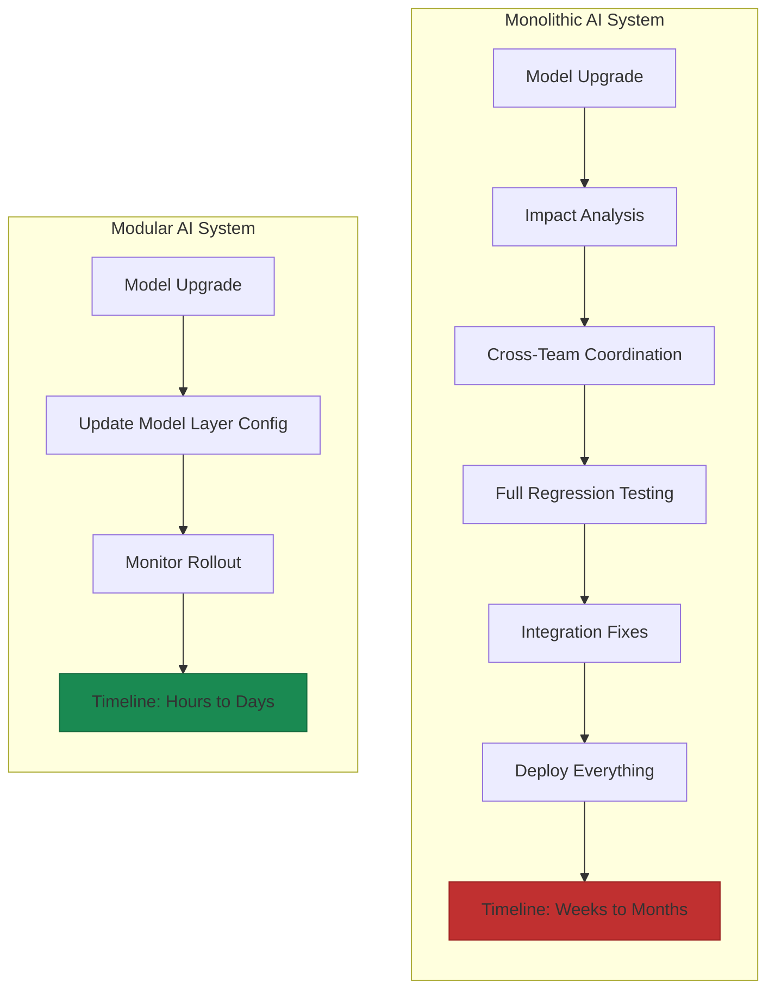
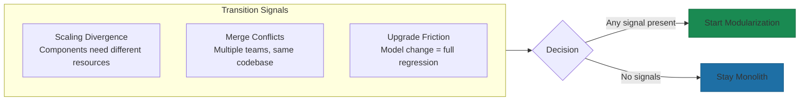

# Why Modularity Matters

The Netflix number from the chapter opening—4,000+ daily deploys across 200+ microservices—isn't just impressive[^netflix]. It's diagnostic. The gap between that and enterprise companies lucky to ship quarterly model updates isn't about engineering talent. It's about architecture. When your AI system is modular, a model upgrade means changing one component. When it's monolithic, that same upgrade triggers a cascade of regression testing and coordination that stretches weeks into months.

Foundation models advance in months, not years. Reasoning capabilities that didn't exist in January ship to production by June. If your architecture can't absorb these changes without rewrites, you're not just falling behind—you're compounding technical debt with every release cycle you miss.

## The Pace Problem

Traditional enterprise software operated on predictable cycles. You'd evaluate new technology annually, plan migrations over 18 months, and execute over another year. That timeline assumed the underlying technology would remain stable long enough to justify the investment.

AI doesn't work that way. When Intercom's engineering team needed to evaluate GPT-4.1 after its release, they had results within 48 hours and a rollout plan immediately after[^intercom]. Their modular architecture made this possible. A monolithic system would have required weeks of impact analysis before anyone could even begin testing.

The mismatch is stark. Your budget cycles are annual. Your planning horizons are quarterly. But AI capabilities shift in weeks. Something has to give—and it shouldn't be your ability to adopt improvements that your competitors are already shipping.

## What Modularity Actually Means for AI

Modularity isn't just about microservices or containers. For AI systems specifically, it means three things:

**Swappable models.** Your model serving layer should abstract the underlying provider. When you need to switch from one foundation model to another—whether for performance, cost, or capability reasons—that change should be a configuration update, not a codebase rewrite. Jasper's model-agnostic AI engine routes different content types to optimal models without touching application logic[^jasper]. The business layer doesn't know or care which model answered.

**Independent capability evolution.** Each domain should own its AI timeline. When your marketing team wants to add content generation, that shouldn't require changes to your sales team's lead scoring system. This was our approach at Yirifi from day one, as established in the chapter opening—each service as its own module, adding new modules as AI evolves without rewiring.

**Isolated blast radius.** When something breaks—and in AI systems, things break in surprising ways—the failure should be contained. A hallucinating model in customer support shouldn't cascade into your financial forecasting. Modular boundaries create firebreaks.

## Uber's Velocity Gains

Uber's migration to domain-oriented microservice architecture tells the story in concrete terms. Feature integration time dropped from 3 days to 3 hours[^uber]. Training speed improved 1.5-4x. They went from weekly releases to 100,000+ deployments per week across thousands of services.

But here's what matters more than the raw speed: they can now add AI capabilities without rewiring existing systems. When they needed to migrate all GPU-based ML projects to a new infrastructure stack, they did it in early 2024 without disrupting the services that depended on those models[^uber].

Compare that to the alternative. Companies with tightly coupled systems face a brutal choice every time the AI landscape shifts: accept the opportunity cost of not upgrading, or accept the project risk of a major rewrite. Neither option is good.

## When Monoliths Make Sense (And When They Stop)

Modularity isn't free, and it isn't always right.

For teams under 15 engineers building their first AI product, a well-structured monolith often makes more sense[^monolith-guidance]. The overhead of distributed systems—service discovery, network latency, distributed debugging—can slow you down when you should be iterating on product-market fit. Early-stage AI startups benefit from faster debugging when the entire system runs in one deployable unit.

The transition point comes when component scaling needs diverge. If your model inference suddenly needs 10x more resources than your data pipeline, that's your signal. If merge conflicts multiply because multiple teams touch the same codebase weekly, that's your signal. If you can't upgrade a model without a full regression test of everything, that's definitely your signal.

Interestingly, 2025 data shows enterprises actually consolidating microservices back into modular monoliths in some cases—not because modularity failed, but because they over-architected too early[^consolidation]. The lesson isn't "monoliths good, microservices bad." It's "architecture should match organizational complexity and scaling needs." That's a bet most AI systems lose when they commit to either extreme too early.

## The Real Cost of Rigidity

When Intercom expanded their Fin AI Agent from chat to email support, they added a new component that handled email-specific challenges—multiple questions per message, spam filtering, signature processing—without rebuilding their core system[^intercom]. Within the first month, they processed over a million emails, with AI providing answers to 81% of conversations and fully resolving 56%[^intercom-email].

That's what modularity enables: adding capability without rewriting.

Without modularity, that same expansion would have required either a months-long rewrite or a parallel system that duplicated logic and created consistency problems. Every missed model upgrade, every delayed capability addition, compounds into competitive disadvantage that becomes harder to close.

One customer using Intercom's modular system reported 45% fewer support inquiries despite doubling their user base—saving 493 tickets and 123 hours in just 58 days[^intercom-rb2b].

## The Architecture Decision You're Making

Whether you realize it or not, every architectural choice you make today is a bet on your ability to evolve tomorrow.

Monolithic AI systems bet that the current approach will remain optimal long enough to justify limited flexibility. Given the pace of AI evolution, most organizations lose that bet.

Modular architecture bets that you don't know exactly what AI capabilities you'll need 18 months from now—but you can design systems that will absorb them when they arrive. That's a bet worth making.

The companies pulling ahead aren't the ones with the best current AI implementation. They're the ones whose architecture welcomes the next breakthrough instead of resisting it.

---

## References

[^netflix]: Netflix Engineering. [LinkedIn Analysis of Netflix DevOps](https://www.linkedin.com/posts/muhammad-mudassir-3661b5207_devops-engineeringexcellence-automation-activity-7369487748413558785-3mTN)

[^intercom]: Vertu Lifestyle. [Why Developers Are Switching from GPT-4 to Claude for Production Applications](https://vertu.com/lifestyle/why-developers-are-switching-from-gpt-4-to-claude-for-production-applications/)

[^jasper]: Skywork AI. [Unlocking AI Potential: A Deep Dive into Jasper AI](https://skywork.ai/skypage/en/Unlocking-AI-Potential-A-Deep-Dive-into-Jasper-AI-for-Every-Creator/1972567710140919808)

[^uber]: Neuroject. [AI Designed Architecture](https://neuroject.com/ai-designed-architecture/)

[^monolith-guidance]: BitCot. [Monolithic vs Microservices Architecture](https://www.bitcot.com/monolithic-vs-microservices-architecture/)

[^consolidation]: Debugg AI. [Modular Monolith vs Microservices 2025](https://debugg.ai/resources/modular-monolith-vs-microservices-2025-consolidation-and-tooling-playbook)

[^intercom-email]: Sebastian Raschka Magazine. [The Big LLM Architecture Comparison](https://magazine.sebastianraschka.com/p/the-big-llm-architecture-comparison)

[^intercom-rb2b]: Sebastian Raschka Magazine. [The Big LLM Architecture Comparison](https://magazine.sebastianraschka.com/p/the-big-llm-architecture-comparison)

---

[Chapter Overview](./README.md) | [Next: Building for Evolution →](./02-building-for-evolution.md)
