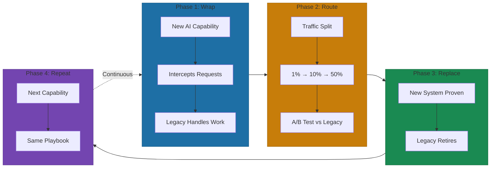
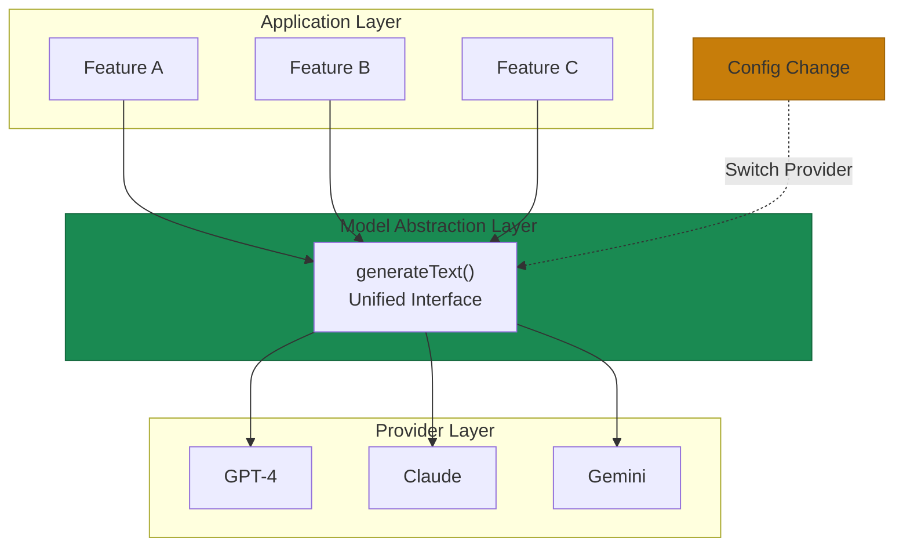
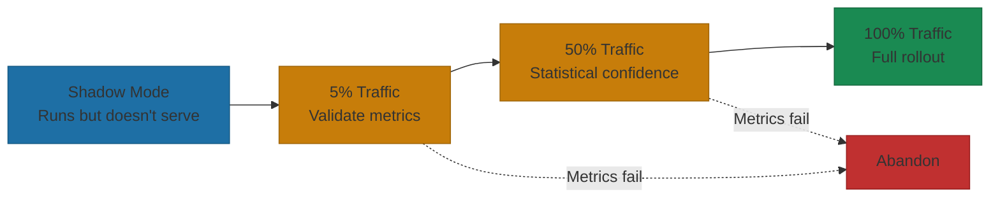

# Building for Evolution

Stripe's 13-year backwards compatibility record isn't magic[^stripe-compat]. It's architecture. All internal code runs on the latest version. Transformation modules walk responses "back in time" to whatever version each customer expects. A hundred breaking changes absorbed. Zero forced migrations.

That's building for evolution: systems that absorb change. The companies that capture AI improvements fastest aren't rewriting code—they're updating configuration.

## The Strangler Fig Pattern

The strangler fig tree grows around its host, gradually replacing it while both coexist. For AI modernization:

**Phase 1: Wrap.** New AI capability intercepts requests. Legacy still handles work. Risk: minimal.

**Phase 2: Route.** Traffic shifts gradually—1%, then 10%, then 50%. A/B test against legacy. Risk: controlled.

**Phase 3: Replace.** Legacy retires when new system proves stable. Risk at cutover: minimal.

**Phase 4: Repeat.** Next capability follows the same playbook.

Salesforce used this approach to integrate Bedrock Custom Model Import while maintaining existing SageMaker endpoints[^salesforce]—30% faster deployments, 40% cost savings, full backward compatibility. Big-bang rewrites carry catastrophic risk. That's a bet most AI systems lose.

## Model Abstraction: The Foundation

Without abstraction: SDK calls scattered, vendor lock-in, zero leverage.

With one: changing models means updating a routing configuration. Your application code doesn't know whether it's talking to GPT-4, Claude, or Gemini.

The Vercel AI SDK demonstrates this pattern. A single `generateText` call works identically regardless of which provider backs it[^vercel]. Switching providers means changing a model string parameter—no rewriting application code.

AWS didn't force SageMaker customers to migrate when they launched Bedrock. Models from SageMaker JumpStart can register with Bedrock through a simple UI workflow while maintaining existing infrastructure[^aws]. The pattern: abstraction gives you options—performance, pricing, and capabilities without rewrites.

## The 4 Patterns That Enable Evolution

### 1. Interface Contracts

Each module exposes a well-defined API surface. Clear inputs, clear outputs, machine-readable specs. Design for agents first—if an AI agent can use your interface, humans can too. Stripe's date-based versions like `2024-05-24` with automatic pinning exemplify this[^stripe-compat].

Skip this and changes cascade. One team's model upgrade breaks three others.

### 2. Feature Flags for AI

Feature flags decouple deployment from release. For AI: gradual rollouts (1% to 10% to 100%)[^flags], targeting by user segment, kill switches for incidents, A/B tests with statistical rigor.

Microsoft Azure implements shadow mode: new models process requests but don't serve responses, logging predictions for offline comparison[^azure]. Skip this and every deployment is a bet-the-company moment.

### 3. Versioned APIs with Graceful Deprecation

Anthropic sets the standard: migrating from Claude Sonnet 3.5 to 4.0 requires updating one model ID[^anthropic]. Zero breaking changes. OpenAI's stated policy provides 6-12 month deprecation windows with email notifications[^openai].

What happens in practice: OpenAI's function calling changes in October 2024 broke production systems with minimal warning[^openai-break]. Models returned function responses as regular messages. The gap between stated policy and operational reality is why abstraction layers matter.

### 4. Shadow Testing and Gradual Rollouts

Microsoft's pattern: shadow mode to 5% traffic to 50% to 100%, with validation metrics at each gate[^azure]. Define success criteria before starting—shadow mode doubles inference costs, so you need clear thresholds that tell you when to promote and when to abandon.

Skip this and you launch blind. First feedback comes from angry customers, not dashboards.

## The Yirifi Principle

"The architecture that works today is designed to absorb the capabilities of tomorrow."

Every component should answer one question: what happens when the underlying AI improves? Configuration change and rollout monitoring? That's evolution-ready. Major rewrite required? That's a design flaw you'll pay for repeatedly.

## References

[^stripe-compat]: Stripe API Docs. [Versioning](https://docs.stripe.com/api/versioning)

[^salesforce]: AWS Machine Learning Blog. [How Amazon Bedrock Custom Model Import Streamlined LLM Deployment for Salesforce](https://aws.amazon.com/blogs/machine-learning/how-amazon-bedrock-custom-model-import-streamlined-llm-deployment-for-salesforce/)

[^vercel]: MintMCP Blog. [Connect Multiple AI Models](https://www.mintmcp.com/blog/connect-multiple-ai-models)

[^aws]: AWS Documentation. [JumpStart Foundation Models Registration](https://docs.aws.amazon.com/sagemaker/latest/dg/jumpstart-foundation-models-use-studio-updated-register-bedrock.html)

[^flags]: Azati Blog. [AI-Powered Progressive Delivery Feature Flags](https://azati.ai/blog/ai-powered-progressive-delivery-feature-flags-2026/)

[^azure]: Microsoft Tech Community. [Optimizing ML Models in Production Using A/B Testing](https://techcommunity.microsoft.com/blog/startupsatmicrosoftblog/optimizing-ml-models-in-production-in-the-cloud-or-at-the-edge-using-ab-testing/4042751)

[^anthropic]: Anthropic. [Claude Model Versioning](https://docs.anthropic.com/en/docs/about-claude/models)

[^openai]: OpenAI Platform. [Model Deprecations](https://platform.openai.com/docs/deprecations)

[^openai-break]: OpenAI Community. [Issues with the New Default Version of GPT-4o October 2024](https://community.openai.com/t/issues-with-the-new-default-version-of-gpt-4o-october-2024/966657)

---

[← Previous: Why Modularity Matters](./01-why-modularity-matters.md) | [Chapter Overview](./README.md) | [Next: Monitoring Emerging Technologies →](./03-monitoring-emerging-tech.md)
