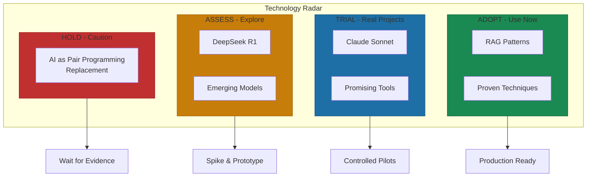
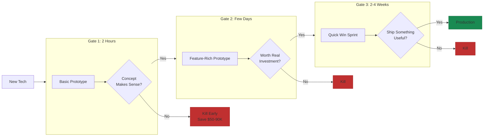

# Monitoring Emerging Technologies

Linus Torvalds, the creator of Linux, said something that every AI leader should internalize: "I think AI is really interesting... And, at the same time, I hate the hype cycle so much that I really don't want to go there... It is currently 90% marketing and 10% reality"[^torvalds].

He's not wrong. The challenge isn't keeping up—it's distinguishing signal from noise. That requires discipline, not enthusiasm.

## The Technology Radar Approach

Thoughtworks has published their Technology Radar biannually since 2010, and their April 2025 edition featured 48 AI-related items—nearly half of all tracked technologies[^thoughtworks]. Their framework offers a template that any AI-first company can adapt.

**The Four Rings:**

**Adopt:** Proven in production. RAG landed here as a foundational technique.

**Trial:** Worth serious exploration on real projects. Claude Sonnet showed strong results for coding[^thoughtworks-radar].

**Assess:** Explore through spikes. DeepSeek R1 landed here despite enormous hype—technical innovation, not headlines.

**Hold:** Risky or unproven. "AI as pair programming replacement" sits here—human collaboration remains essential[^thoughtworks-radar].

The power comes from forced rigor. You can't track everything. You have to choose.

## What to Actually Watch

**Watch closely: Domain-specific improvements.** A new model that dramatically improves legal reasoning, code generation, or medical comprehension? Respond in weeks, not quarters.

**Watch closely: 10x cost reductions.** When inference costs drop by an order of magnitude, economically impossible use cases become viable.

**Watch with interest: New modalities.** Text-to-vision, audio, video. Build modular systems that can add these when they mature.

**Note but don't chase: Incremental improvements.** 10% better on benchmarks rarely justifies migration. Wait for step-function changes.

**Ignore: Demos without production evidence.** If it only works on stage, it doesn't work. Require proof points from peers.

## The Spike and Prototype Framework

Vercel's v0 team iterates on prompts daily, with automated evaluations on every GitHub pull request[^vercel]. Three evaluation layers: code-based grading for objective criteria, human grading from domain experts, LLM-based grading for complex judgments at scale.

They maintain 100% pass rate on safety evaluations. When other evals fail, they add prompts to the evaluation set rather than blocking deployment[^vercel]. Rapid experimentation within rigorous guardrails.

## Time-Boxed Exploration

Even well-intentioned exploration fails at scale—88% of AI pilots never reach production[^pilot-failures]. The response isn't to stop experimenting—it's to structure experiments properly.

Janea Systems uses a staged approach[^janea]:

**2 hours:** Basic prototype. Does this concept make sense?

**Few days:** Feature-rich prototype. Is this worth real investment?

**2-4 weeks:** Quick win sprint. Can we ship something useful?

Each gate saves $50,000-$90,000 versus traditional development that commits early and discovers problems late[^janea-cost].

## Knowing When to Kill

Anthropic's Claude Explains blog experiment acquired 24 websites linking to posts in one month[^anthropic-kill]. They killed it anyway.

Why? Lack of transparency about AI-generated copy created reputational risk. The risk of confident-but-wrong content outweighed scale benefits for a company whose credibility depends on AI accuracy.

That's the hardest decision: killing something that works on metrics because it fails on judgment. Define kill criteria before you start. Write them down. Follow them.

## Build vs. Buy Shifts

Menlo VC's 2025 report[^menlo]: enterprises went from 47% build/53% buy in 2024 to 76% buy in 2025. Application layers buy commoditized capabilities while exploration concentrates at infrastructure.

Your evaluation needs a clear filter:

**Does this differentiate us?** If yes, build. If table stakes, buy.

**Do we have unique data?** If yes, building captures value others can't replicate.

**What's the cost of waiting?** High switching costs or competitor momentum favor early adoption.

## The Evaluation Cadence

**Weekly:** Engineering leads scan provider release notes. 15 minutes.

**Monthly:** Technical leadership reviews flagged items against priorities. Move items between radar rings. 90 minutes.

**Quarterly:** Executive review of radar against roadmap. Which Adopt items aren't deployed? Which Hold items keep appearing in competitor announcements? Half-day.

**On demand:** When something big drops, convene immediately. The framework should already exist.

Document failures as rigorously as successes.

## The Strategic Filter

Every evaluation should answer four questions:

1. **Does this solve a problem we have today?** Clear pain point, not theoretical need.
2. **Does it enable something we couldn't do before?** New market or capability, not incremental improvement.
3. **What's the integration cost?** Low fits modular architecture. High requires rewrite.
4. **What's the switching cost if we wait?** High means competitors gain lead.

High scores on 1 and 2 with low on 3 deserve immediate action. Everything else can wait.

## References

[^torvalds]: ISACA. [Is AI Hype an Enterprise Risk? How to Manage Shiny Object Syndrome](https://www.isaca.org/resources/news-and-trends/newsletters/atisaca/2024/volume-24/is-ai-hype-an-enterprise-risk-how-to-manage-shiny-object-syndrome)

[^thoughtworks]: Thoughtworks. [AI Technology Radar Vol. 32](https://www.thoughtworks.com/en-sg/insights/blog/machine-learning-and-ai/ai-technology-radar-vol-32)

[^thoughtworks-radar]: LTI Mindtree. [Manufacturing AI Trends Radar 2025](https://www.ltimindtree.com/mfg-ai-trends-radar-2025/)

[^vercel]: WorkOS Blog. [Why Most Enterprise AI Projects Fail: Patterns That Work](https://workos.com/blog/why-most-enterprise-ai-projects-fail-patterns-that-work)

[^pilot-failures]: LinkedIn. [Why AI Projects Fail: Lessons from New Product Development](https://www.linkedin.com/pulse/why-ai-projects-fail-lessons-from-new-product-dr-robert-g-cooper-yrfoe)

[^janea]: Janea Systems. [How AI Rapid Prototyping De-Risks Investment](https://www.janeasystems.com/blog/how-AI-rapid-prototyping-de-risks-investment)

[^janea-cost]: Xenoss. [AI Year in Review](https://xenoss.io/blog/ai-year-in-review)

[^anthropic-kill]: McKinsey. [The Top Trends in Tech](https://www.mckinsey.com/capabilities/tech-and-ai/our-insights/the-top-trends-in-tech)

[^menlo]: Menlo Ventures. [2025: The State of Generative AI in the Enterprise](https://menlovc.com/perspective/2025-the-state-of-generative-ai-in-the-enterprise/)

---

[← Previous: Building for Evolution](./02-building-for-evolution.md) | [Chapter Overview](./README.md) | [Next: The 10 Principles of AI-First Companies →](./04-the-ten-principles.md)
