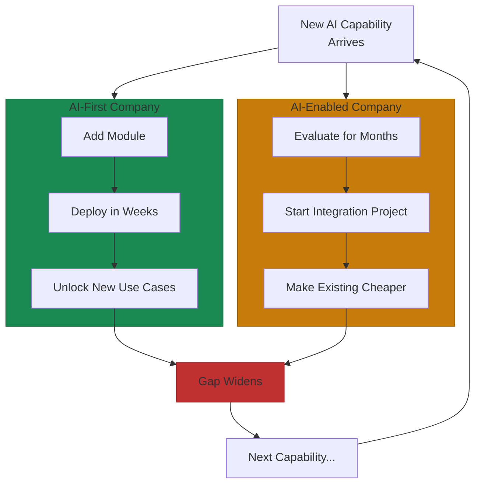
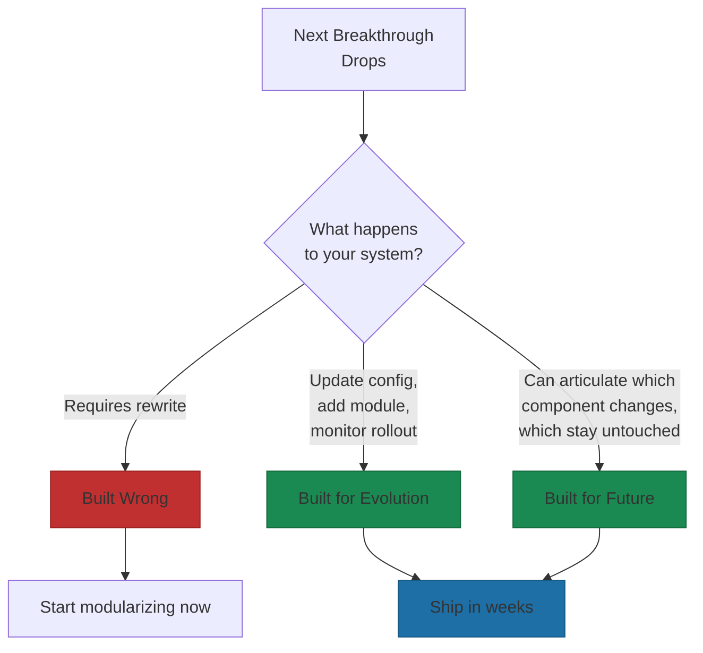

# What's Next

Specific predictions age poorly. Build architecture that doesn't care which predictions prove correct.

But you can prepare without predicting. Architecture decisions today determine whether you absorb changes or fight them.

## What's Coming (With High Confidence)

Some developments are certain enough to plan around:

**Agentic AI goes mainstream.** Gartner predicts 40% of enterprise applications will embed agentic AI by 2026, up from less than 5% today[^gartner]. Not chatbots. Agents that interpret intent, coordinate workflows, use tools autonomously, and persist until outcomes are achieved. Your infrastructure either supports autonomous agents with proper identity, authorization, and audit trails, or it doesn't.

**Context windows keep expanding.** Claude 3.5 Sonnet hit 200K tokens, with Claude Opus 4 supporting even larger contexts. Gemini 1.5 Pro supports 1-2 million[^context]. Entire codebases in single context. Dozens of contracts synthesized without losing references[^mcneece]. Complements RAG, doesn't replace it. Your architecture should handle both.

**Costs continue falling.** Inference costs decreased 10x annually 2022-2025. High-end models saw 900x reduction at GPT-4o level[^costs]. Always-on agentic systems without budget constraints. Every cost reduction unlocks new applications.

**Multimodal becomes default.** GPT-4o, Gemini 1.5 Pro, and Claude 3.5 Sonnet handle text, images, video, and audio[^multimodal]. The challenge is whether your abstraction layers accommodate them.

**Reasoning bifurcates from conversational.** Fast models for real-time interaction, slower reasoning models for complex analysis[^bifurcation]. IBM predicts "smaller reasoning models that are multimodal and easier to tune"[^ibm]. Your routing layer must match task complexity to model capability.

## What Won't Change

These echo the principles from the previous section—because constants are what survive.

**Human judgment for high-stakes decisions.** Accountability requires human agency. Complex decisions need oversight.

**Data quality as foundation.** Data quality remains foundational regardless of model generation.

**Modular architecture value.** Rigidity is costly. Modularity absorbs capabilities that don't exist yet.

**Ethics and governance requirements.** Societal expectations increase, not decrease.

**Learning speed as premium.** Hire for adaptability. Invest in reskilling.

These constants are your strategic anchors.

## The "We Didn't See This Coming" Pattern

The 2023-2025 period offers lessons about handling unexpected shifts.

OpenAI launched "Operator" as a standalone agent interface in January 2025. It failed within six months. Users found switching to dedicated agent interfaces too high-friction. By July 2025, OpenAI deprecated it, integrating capabilities directly into ChatGPT[^operator].

The lesson: agentic is a feature, not a product. Companies that built agent capabilities as pluggable features within existing workflows adapted instantly. Those building standalone agent products faced complete rewrites.

LangChain faced similar dynamics. Multiple companies reported abandoning it despite initial adoption. The teams that survived were those who kept framework usage isolated to specific modules rather than threading it throughout codebases. When LangChain's abstractions became limiting, they ripped out specific components without system-wide rewrites[^langchain].

As we discussed in the principles section, RAG adoption surged while fine-tuning stagnated—a direct result of architectural decisions[^rag]. RAG systems leverage better base models without retraining. Fine-tuned systems face costly retraining cycles. The architectural choice that seemed optional became the winning bet.

## Preparing Without Predicting

Systems researchers offer the brutal assessment: "The models will keep getting better. The real question is whether we will build the systems to use them reliably"[^systems].

Architectural decisions from 2023-2024 that prioritized modularity, provider optionality, and systems fundamentals over model-specific optimizations determined which companies thrived through capability shifts versus which faced continuous rewrites.

The preparation strategies that work:

**Model abstraction layers** let you swap providers without application changes. When the next breakthrough comes from an unexpected source, you're ready.

**Modular boundaries** let components evolve independently. When agent orchestration patterns change, you update one module instead of everything.

**RAG over fine-tuning** for most applications. When the next foundation model drops, your knowledge retrieval keeps working.

**Distributed systems thinking** applied to AI. Fault tolerance for hallucinations. Resource scheduling for token optimization. Agent coordination treated like distributed consensus.

## The Gap Widens

As we established at the start of this book, every AI improvement benefits AI-first companies more than AI-enabled ones.

New capability: AI-first adds a module, deploys in weeks. AI-enabled evaluates for months.

Cost reduction: AI-first unlocks new use cases. AI-enabled makes existing use cases cheaper.

Early adopters pull further ahead with each advancement. Companies that become AI-first now will define their industries.

## The Yirifi Test

Return to where we started: "Each service is its own module. When AI capabilities evolve—and they will, faster than any of us expect—we add a new module. No rewiring required."

That's the test for your architecture. What happens when the next breakthrough drops?

If your answer involves a rewrite, you've built wrong.

If your answer is "we update configuration, add a new module, and monitor the rollout," you've built for evolution.

If you can articulate exactly which component changes and which components remain untouched, you've built for the future.

The tools will change. The architecture that absorbs them doesn't have to.

---

## Start Now

The perfect moment doesn't exist. The second-best time is today.

Build to add. Let the future be addition.

## References

[^gartner]: GEC Newswire. [Gartner: 40% of Enterprise Apps to Use AI Agents by 2026](https://gecnewswire.com/gartner-40-of-enterprise-apps-to-use-ai-agents-by-2026/)

[^context]: InfoQ. [Claude Sonnet 4 Announcement](https://www.infoq.com/news/2025/08/claude-sonnet-4/)

[^mcneece]: McNeece. [GPT-5 vs Gemini 2.5 vs Claude Opus 4 vs Grok 4](https://www.mcneece.com/2025/07/gpt-5-vs-gemini-2-5-vs-claude-opus-4-vs-grok-4-which-next-gen-ai-will-rule-the-rest-of-2025/)

[^costs]: LinkedIn. [AI Inference Cost Trends](https://www.linkedin.com/posts/aginn_ai-inference-is-getting-cheaper-but-where-activity-7368983633577037826-DYXo)

[^multimodal]: Simple AI. [OpenAI vs Google vs Anthropic](https://simple.ai/p/openai-vs-google-vs-anthropic-this-week-in-ai)

[^bifurcation]: LinkedIn. [The Great Bifurcation: A 2025 Retrospective](https://www.linkedin.com/pulse/great-bifurcation-2025-retrospective-artificial-rapha%C3%ABl-mansuy-ujyrc)

[^ibm]: IBM. [AI Tech Trends and Predictions for 2026](https://www.ibm.com/think/news/ai-tech-trends-predictions-2026)

[^operator]: LinkedIn. [The Great Bifurcation: A 2025 Retrospective](https://www.linkedin.com/pulse/great-bifurcation-2025-retrospective-artificial-rapha%C3%ABl-mansuy-ujyrc)

[^langchain]: Hacker News. [LangChain Discussion](https://news.ycombinator.com/item?id=40739982)

[^rag]: Menlo Ventures. [2024: The State of Generative AI in the Enterprise](https://menlovc.com/2024-the-state-of-generative-ai-in-the-enterprise/)

[^systems]: Nine Two Three. [AI in Engineering](https://www.ninetwothree.co/blog/ai-in-engineering)

---

[← Previous: Amazon and Tesla: Modular Evolution in Action](./05-amazon-and-tesla-examples.md) | [Chapter Overview](./README.md)
