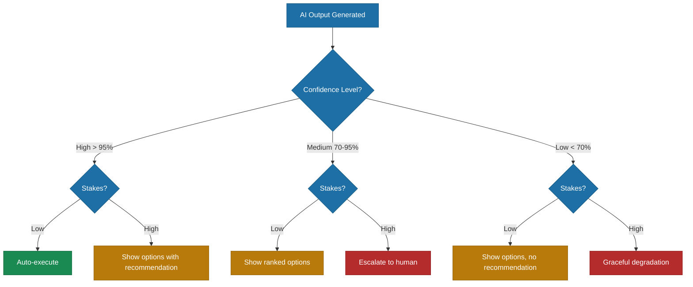

# Probabilistic AI

> Uncertainty is a feature, not a bug -- and designing for it is what separates AI-first products from liabilities.

*From [Chapter 2: The AI-First Mindset](../book/part-1-foundations/02-the-ai-first-mindset/README.md)*

## Overview

Traditional software is deterministic. Same input, same output, every time. AI is fundamentally different -- same input might produce different outputs, and even consistent outputs have confidence levels attached. This isn't a failure to engineer around. It's a fundamental characteristic you must design *into* your product.

This is the biggest mindset shift for leaders coming from traditional software. Building products, teams, and operations around AI requires accepting and designing for uncertainty rather than expecting deterministic behavior. The goal isn't to eliminate uncertainty from AI systems -- that's impossible. The goal is to build organizations, products, and processes that thrive despite uncertainty by surfacing confidence, enabling human oversight, and designing for graceful failure.

Design around uncertainty, and you build trust. Pretend certainty you don't have, and you build liability.

## The Framework

### How Leading Companies Design for Uncertainty

**GitHub Copilot** filters completions before showing them to developers, displaying only tokens with high predicted likelihood of being accepted -- leading to faster task completion. The system doesn't present everything it generates; it curates based on confidence.

**Harvey AI** uses "citation-first output" -- every response is grounded in source documents. Their BigLaw Bench shows 74% answer quality, and they're transparent about that gap from perfection. Rather than hiding uncertainty, Harvey makes it visible and lets the source material do the trust-building.

**Grammarly** shows multiple suggestions instead of one "right answer," targeting 95% user-generated accuracy. When showing 10 suggestions: 98% accuracy, 44% activation rate. By presenting options rather than declarations, they turn uncertainty into user choice.

### Five Implications of Probabilistic Outputs

> **Companion framework** - extends the book's discussion of probabilistic AI with a practical checklist.

**1. Product Design** -- You can't promise 100% accuracy. Products must include graceful degradation, confidence indicators, and fallback paths. The best AI products make uncertainty visible rather than hiding it behind false precision.

**2. Testing** -- Traditional unit tests expect deterministic results. AI outputs require statistical validation, evaluation benchmarks, and regression testing against known examples rather than exact match assertions.

**3. User Experience** -- Users need to understand confidence levels and have the ability to override AI decisions. Surface confidence scores when appropriate. Build interfaces that invite correction rather than demanding acceptance.

**4. Operations** -- AI systems drift over time. You can't "set and forget." Monitoring for model degradation, concept drift, and changing input distributions is a continuous operational requirement.

**5. Liability** -- When the AI is wrong, who is responsible? The Air Canada chatbot incident proved that companies are liable for what their AI agents say, regardless of whether the AI acted outside its training. Design for accountability.

### Managing Uncertainty in Practice

- **Surface confidence scores** to users when appropriate -- not raw probabilities, but meaningful indicators of reliability
- **Build human-in-the-loop workflows** for low-confidence decisions -- escalate rather than guess
- **Set thresholds** for automated vs. escalated actions -- Safe actions proceed automatically, Supervised actions require approval, Forbidden actions stay off-limits
- **Monitor for degradation** -- track accuracy, confidence distributions, and user override rates over time
- **Design for graceful failure** -- when the AI doesn't know, it should say so rather than fabricate an answer

### The Permission Spectrum

Not all AI decisions carry the same stakes. The best AI products calibrate autonomy to context:

- **Low stakes, high autonomy:** Suggesting a calendar time, auto-completing code, recommending content
- **Medium stakes, supervised:** Executing changes within defined bounds, sending communications on behalf of users
- **High stakes, human required:** Financial transactions, medical decisions, irreversible actions

Cursor implements explicit PermissionOptions -- allowlists and denylists for what the AI can modify, plus "YOLO mode" for developers who want maximum speed. Replit offers "Max Autonomy" mode with 200 minutes of continuous AI operation versus standard mode with frequent checkpoints. Same products, different autonomy levels based on user context.

## How to Use This

Audit every AI-powered feature in your product against the five implications: Is product design accounting for uncertainty? Is testing statistical rather than deterministic? Does UX surface confidence and allow overrides? Are operations monitoring for drift? Is liability addressed? Then calibrate autonomy using the permission spectrum -- match the level of AI independence to the stakes of each decision.

## Related Frameworks

- [7 Mental Models of AI-First](02-seven-mental-models-of-ai-first.md) -- Probabilistic Thinking is Mental Model #2, and the Permission Spectrum is Mental Model #4
- [7 Failure Modes of Agents](10-seven-failure-modes-of-agents.md) -- What happens when probabilistic systems fail, especially Hallucinated Actions (Mode 1)
- [AI Governance Framework](18-ai-governance-framework.md) -- The governance structures for managing AI uncertainty at organizational scale
- [Human-AI Collaboration](05-human-ai-collaboration.md) -- How humans and AI work together when outputs are uncertain
- [8 Patterns for AI Coding](09-eight-patterns-for-ai-coding.md) -- Pattern 8 (Review Ruthlessly) addresses the practical reality of uncertain AI output

## Deep Dive

Read the full chapter: [Chapter 2: The AI-First Mindset](../book/part-1-foundations/02-the-ai-first-mindset/README.md)
