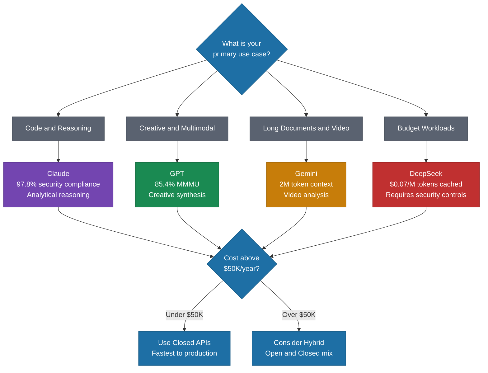

# Foundation Models Landscape

> A practical guide to evaluating foundation models by production performance, pricing reality, and the open vs. closed decision---not benchmark hype.

*From [Chapter 3: The AI Landscape](../book/part-1-foundations/03-the-ai-landscape/README.md)*

## Overview

The "best" model doesn't exist. What exists is the best model for your specific use case, budget, and constraints. And that answer changes every few months. The AI model ecosystem has no single winner---instead, there is specialized excellence across providers.

Benchmarks are marketing tools masquerading as objective measures. The LMSYS Chatbot Arena shows that Elo differences of less than 50 points are "basically a toss-up," yet minor 2-point changes generate disproportionate attention. Top models like Gemini, GPT-4, and Claude are often statistically tied despite ranking differences that dominate headlines. What matters is production performance---and there, the differences are stark.

Understanding these distinctions isn't academic. It is the difference between a competitive AI product and one bleeding money on the wrong infrastructure. The capability gap between open and closed models is narrowing fast, but frontier capabilities still favor closed models for mission-critical tasks.

## The Framework

### Model Strengths and Weaknesses

| Model | Primary Strength | Key Weakness | Best For |
|-------|-----------------|--------------|----------|
| **Claude** | Code (97.8% security compliance) | Can be overly cautious | Analytical reasoning, code generation |
| **GPT** | Multimodal (85.4% MMMU) | "Chaotic people-pleaser" behavior | Creative synthesis, vision tasks |
| **Gemini** | Video (87.6%), 2M token context | Repetitive patterns | Long documents, video analysis |
| **DeepSeek** | Cost efficiency ($0.07/M tokens with cache) | 100% jailbreak success rate in testing | Budget workloads (with security controls) |

**Failure modes matter as much as successes:**
- GPT can confidently share dubious information.
- Gemini gets trapped in repetitive patterns, convinced that minor adjustments will fix underlying issues.
- Claude can be overly cautious, potentially limiting creative outputs.

**Latency differences trump marginal capability improvements** for real-time use cases: Mistral Large leads time-to-first-token at 0.30 seconds, while ChatGPT o1 averages 60.6 seconds---200x slower.

**Context window caveats:** Gemini advertises 2 million tokens, but the "lost in the middle" phenomenon means performance degrades when relevant information sits in the middle of long contexts. RAG-based approaches with smaller models often outperform brute-force reliance on massive context windows.

### The Pricing Reality

Cost differences aren't marginal. They are existential.

- **Premium tier:** Claude Opus runs $15.00 input / $75.00 output per million tokens.
- **Mid tier:** GPT-5.1 and Gemini 3 Pro cost approximately $6,500/month for production workloads---64% cheaper than Claude while maintaining competitive quality.
- **Budget tier:** DeepSeek input costs as low as $0.07 per million tokens with cache hits. DeepSeek trained their R1 model on 512 H800 chips for roughly $294,000---a fraction of the hundreds of millions invested in GPT-4.

**Practical impact:** A startup running 1 billion tokens per year through a typical API pays around $4,000 annually. Self-hosting DeepSeek at scale can reduce that to negligible per-query costs, though you need to factor in $150,000+ annual overhead for engineering talent and operations.

### The Open vs. Closed Decision

**Closed models** (GPT, Claude, Gemini via API) offer:
- Fastest time to production
- Continuous capability improvements without your effort
- No infrastructure management
- Higher ceiling on frontier capabilities

**Open-weight models** (Llama, Mistral, DeepSeek self-hosted) offer:
- Full data control---nothing leaves your infrastructure
- Fine-tuning for domain-specific performance
- Predictable costs at scale
- Regulatory compliance in strict jurisdictions

**Cost break-even thresholds:**
- Under $50K/year: Stick with APIs.
- $50K-$500K/year: Hybrid becomes optimal.
- Above $500K/year: Self-hosting typically achieves positive ROI.

**Hybrid strategies in practice:** European banks run Llama for risk engines deployed on-premises to meet regulatory requirements while using closed models for general insights. Healthcare organizations use open-source for PII workloads and closed-source for general interaction. Shopify runs 40-60 million LLaVA inferences per day using fine-tuned open models---at that scale, API costs would be prohibitive.

### The DeepSeek Disruption

DeepSeek rewrote assumptions about what is possible. Their V3 model achieved comparable performance to frontier models while being trained for roughly $6M versus the estimated $100M+ for GPT-4. They introduced "Fine-Grained Sparse Attention" delivering 50% efficiency improvements.

But security testing revealed alarming vulnerabilities: Cisco found a 100% attack success rate---DeepSeek-R1 failed to block any harmful prompts. It generates insecure code at four times the rate of competitors, and stores user interactions in China, raising GDPR and CCPA concerns.

The lesson isn't "avoid DeepSeek." Self-hosting in customer-controlled cloud environments can capture the cost benefits while mitigating regulatory risks. But you need sophisticated security controls before deployment.

### Strategic Recommendations

**For Startups:** Start with closed APIs. Ship fast, iterate based on user feedback, then optimize costs once you have predictable workloads. Over 45% of AI startups use OpenAI APIs for public endpoints while employing fine-tuned open models for specialized backend functions. Don't over-engineer your model architecture before you have product-market fit.

**For Enterprises:** Plan for multi-model from day one. 37% of enterprises already support hybrid approaches, recognizing that no single model meets all requirements. Build routing infrastructure early---it is easier to add models than to refactor single-provider dependencies later.

## How to Use This

Use this framework to map your specific requirements (use case, latency, compliance, cost, explainability) against model capabilities before committing to any provider. Treat model selection as an ongoing optimization rather than a one-time decision---re-evaluate quarterly as the landscape shifts. Build abstraction layers that allow you to swap models without rewriting your application.

## Related Frameworks

- [6 Questions Before Choosing a Model](07-six-questions-before-choosing-a-model.md) --- the decision framework for applying this landscape knowledge
- [Build vs. Buy Calculus](04-build-vs-buy-calculus.md) --- related infrastructure decisions
- [AI-First vs. AI-Enabled](01-ai-first-vs-ai-enabled.md) --- how model strategy differs between the two approaches
- [5 Infrastructure Mistakes](08-five-infrastructure-mistakes.md) --- what goes wrong after model selection

## Deep Dive

Read the full chapter: [Chapter 3: The AI Landscape](../book/part-1-foundations/03-the-ai-landscape/README.md)
