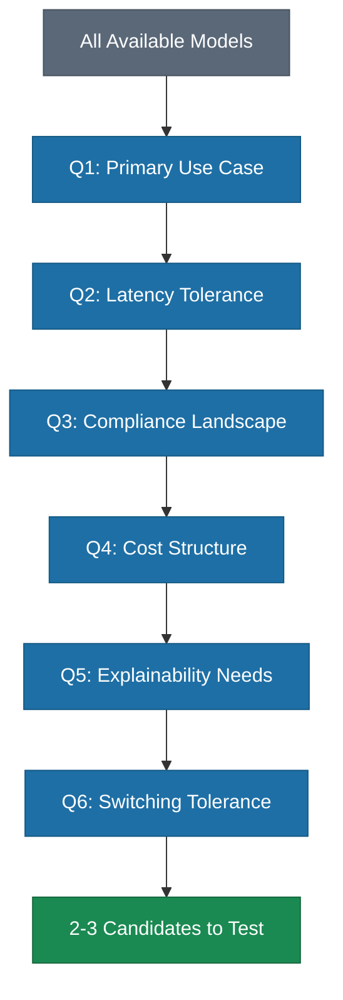

# The 6 Questions Before Choosing Any Model

> A sequential decision framework that eliminates model options through business constraints, not benchmark hype.

*From [Chapter 3: The AI Landscape](../book/part-1-foundations/03-the-ai-landscape/README.md)*

## Overview

Most teams approach model selection backwards: they read the benchmarks, watch the demos, get excited about the latest frontier release, and then try to figure out where to apply it. The model becomes the answer before the question is even asked.

The teams that move fastest use a simple framework: six questions that cut through the noise and narrow realistic choices considerably. Each question eliminates options. By the time you reach question six, the decision has largely made itself.

These questions should be answered in sequence and written down before evaluating a single model. The teams that struggle treat model selection as a technology decision. The teams that succeed treat it as a business decision with technology implications.

## The Framework

### 1. What's Your Primary Use Case?

Not "what could AI do for us?"---that question has infinite answers. The real question: what specific job are you hiring AI to do?

Different jobs demand different capabilities:
- **Simple classification or extraction** doesn't need a frontier model. GPT-3.5 handles FAQ responses and basic categorization at a fraction of the cost.
- **Multi-step reasoning or complex code generation** requires frontier territory.
- Harvey discovered through hard experience that Gemini 2.5 Pro excels at drafting but struggles with trial preparation---it has difficulty reasoning through complex evidentiary rules like hearsay.

**The practical test:** Can you describe the job in one sentence? If not, you aren't ready to evaluate models.

### 2. What's Your Latency Tolerance?

Latency isn't just a technical metric. It is a business constraint that determines which solutions are viable.

- **Sub-second:** Real-time products (voice, fraud detection). Stripe's fraud detection requires sub-300ms response times---any model that can't hit that threshold is automatically disqualified.
- **1-3 seconds:** Chatbots and search.
- **3-10 seconds:** Internal tools.
- **Minutes or more:** Batch processing. Cost per query matters more than speed.

### 3. What's Your Compliance Landscape?

For regulated industries, this question should actually be first. Compliance requirements eliminate entire categories of models before other considerations matter.

- **Healthcare:** HIPAA-compliant environments and Business Associate Agreements. The FDA authorized over 1,000 AI-enabled medical devices between 2015-2024, each requiring specific compliance documentation.
- **Financial services:** Regulators want explainability---they need to understand how the AI reached conclusions.
- **Government:** FedRAMP authorization required. Google's Gemini achieved the first FedRAMP High authorization for generative AI in productivity suites in March 2025. Claude earned multi-cloud FedRAMP High approvals that same year.

Get this wrong, and you face regulatory penalties, not just technical debt.

### 4. What's Your Cost Structure?

The cost per million tokens varies by over 200x between premium and budget tiers. At a thousand queries per day, the difference between models is rounding error. At a million queries per day, it is the difference between a sustainable business and bankruptcy.

Three pricing models to evaluate:
- **Per-query pricing:** Works for low or unpredictable volume. Pay for what you use.
- **Committed capacity:** Provides 40-80% discounts at the highest tiers. OpenAI enterprise customers report up to 80% off list prices. But you commit to volume you might not hit.
- **Self-hosted models:** High upfront costs but near-zero marginal costs. Dell Enterprise Strategy Group found self-hosting can be 4x more cost-effective for sustained, heavy usage.

### 5. How Important Is Explainability?

Some use cases require knowing not just what the AI concluded, but why.

- Financial services regulators want audit trails.
- Healthcare requires documentation for risk analysis.
- Legal teams need to cite sources.

When an AI recommendation leads to a bad outcome, can you trace back the reasoning and explain it to an auditor, a patient, or a judge? If explainability matters, it needs to be a filter, not an afterthought. Some models are better at this than others. Some architectures make it nearly impossible.

### 6. What's Your Switching Tolerance?

If you choose wrong, how painful is it to change?

Switching costs go beyond technical migration:
- **Interface lock-in:** Workflow configurations and prompt libraries embedded in platforms.
- **Organizational friction:** Retraining users, rebuilding trust, managing disruption.

42% of AI initiatives are now abandoned before reaching production---up from 17% the year before---and vendor lock-in is a primary driver. Establish migration triggers in advance: what price increase justifies switching? What security incident? Pre-define your exit criteria so you aren't making emotional decisions under pressure.

### Putting It Together

Six questions. Write down your answers before you evaluate a single model.

One more thing: these answers change. The model that was right six months ago might not be right today. Build in regular re-evaluation---quarterly at minimum---and don't let inertia keep you locked into a suboptimal choice. The landscape is moving fast. Your selection process needs to move with it.

## How to Use This

Before any model evaluation, gather your technical and business stakeholders and answer all six questions in sequence. Document the answers. Use them as elimination criteria---not as a scoring rubric. Each question should remove options from consideration, so that by the end, your realistic choices are narrowed to two or three candidates that you can then test against your actual workloads.

## Related Frameworks

- [Foundation Models Landscape](06-foundation-models.md) --- understanding the models you are choosing between
- [Build vs. Buy Calculus](04-build-vs-buy-calculus.md) --- related decision framework for infrastructure
- [5 Infrastructure Mistakes](08-five-infrastructure-mistakes.md) --- what goes wrong after you choose
- [AI Governance Framework](18-ai-governance-framework.md) --- governance considerations that affect model selection

## Deep Dive

Read the full chapter: [Chapter 3: The AI Landscape](../book/part-1-foundations/03-the-ai-landscape/README.md)
