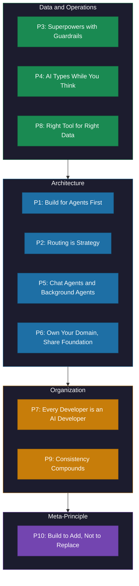

# The 10 Principles of AI-First Companies

> Ten enduring principles that outlast any specific model, framework, or tool.

*From [Chapter 12: Staying Ahead](../book/part-4-sustaining/12-staying-ahead/README.md)*

## Overview

Throughout the book, we cover infrastructure, agents, data strategy, team structures, operations, ethics, and architecture. But principles are what remain when the specific technologies fade. GPT-4 will become a footnote. Claude will evolve beyond recognition. The frameworks you're using today will be deprecated.

These ten principles should outlast any specific model. Companies that followed them navigated multiple technology shifts from 2023-2025 without architectural rewrites -- GPT-3.5 to GPT-4 to Claude 3 to Gemini, RAG architectures to agentic workflows, closed-source to hybrid deployments. Each transition was operational, not existential. Companies that chased specific model features faced repeated refactoring cycles. Every breakthrough meant starting over.

The tools will change. These principles won't. Build accordingly.

## The Framework

### Principle 1: Build for Agents, Humans Will Thank You

Every interface you design should work for AI agents first. If an agent can use your API, humans definitely can. But the reverse isn't true.

In practice: machine-readable specifications, well-defined inputs and outputs, no hidden state assumptions. The test: can an AI agent you've never seen use your interface today? If the answer requires custom integration work, you've designed for yesterday.

### Principle 2: Routing is Strategy, One Provider is a Bet

Sixty percent of enterprises now use multiple models and route prompts to the most performant option. This isn't indecision. It's architecture.

Single-provider lock-in seemed efficient when GPT-4 was the only game in town. Then Claude launched with superior reasoning. Gemini arrived with better multimodal. Costs shifted. Capabilities diverged. Companies with model abstraction layers updated configuration files. Companies without them started multi-month migration projects.

Your model provider today won't be your model provider forever. Abstract early, switch painlessly.

### Principle 3: Give AI Superpowers with Guardrails, Not a Blank Check

Tiered access enables safe autonomy. Without tiers, you're choosing between two bad options: give AI too little capability and miss the value, or give too much and accept uncontrolled risk.

The framework:
- **Safe actions** (read data, generate drafts) need only human review
- **Supervised actions** (execute changes within bounds) require approval
- **Forbidden actions** stay off-limits regardless of capability

Define your forbidden zone before you need it. The companies that moved fastest with AI didn't skip governance -- they built governance that enabled speed.

### Principle 4: AI Types While You Think

AI contribution: speed, scale, consistency. Human contribution: judgment, strategy, context. Combined: faster and better output than either alone.

Human review remains crucial for ensuring solutions align with broader system requirements. This holds true even for the most capable models. The pattern survives every capability improvement.

Your institutional knowledge is your moat. AI accelerates work. Human judgment decides what work matters.

### Principle 5: Chat Agents Handle Questions, Background Agents Handle Grunt Work

Two interaction models. Both necessary.

- **Chat agents** for engagement: customer support, knowledge queries, guided workflows. Real-time, conversational, human-in-the-loop.
- **Background agents** for automation: data processing, report generation, monitoring, cleanup. Autonomous, scheduled, event-driven.

The mistake is building one and calling it done. Customer-facing chat without backend automation leaves operational efficiency on the table. Background automation without interactive interfaces leaves user experience behind.

### Principle 6: Own Your Domain, Share Your Foundation

Platform teams own shared infrastructure: authentication, logging, model routing, observability. Domain teams own business logic: their specific AI applications, their domain data, their workflow automation.

This maps to organizational reality. Corporate provides infrastructure. Business units own applications. Apply the same pattern to AI. Shared infrastructure and domain autonomy aren't contradictory -- they're complementary.

### Principle 7: Every Developer is Now an AI Developer

AI fluency is baseline, not specialty.

The old model: specialized AI/ML team builds everything AI, other developers stay in their lane. The new reality: every developer works with AI daily. AI tools are how code gets written, reviewed, deployed.

For established organizations, this means reskilling investment that pays compound returns. For startups, this means hiring for learning velocity over current credentials. The teams that invest in broad AI fluency now will outpace those still running specialized silos in two years.

### Principle 8: The Right Tool for the Right Data

Don't force one storage pattern to serve all needs. AI applications require diverse data access patterns.

- Transactions go in relational databases
- Documents go in document stores
- Sessions live in caching layers
- Embeddings live in vector databases

Each optimized for its access pattern. Each serving AI systems appropriately. RAG adoption jumped from 31% to 51% in one year while fine-tuning stayed at 9%. RAG systems could immediately leverage better base models without retraining. The architectural choice that seemed optional became the winning bet.

### Principle 9: Consistency Compounds

The same AI patterns across functions beat department-specific implementations. Every time.

When your marketing AI uses different architecture than your sales AI, you're maintaining two systems. When your operations automation can't talk to your customer-facing agents, you're building integration debt. When each team reinvents model routing, you're paying the abstraction tax multiple times.

Cross-functional consistency is an enterprise advantage. Coherent product is a startup advantage. Either way, consistency compounds.

### Principle 10: Build to Add, Not to Replace

This is the meta-principle. If your architecture follows principles 1-9, you can add new capabilities without rebuilding.

The test: what happens when the next GPT-5 drops? If your answer involves a rewrite, you've built wrong. If your answer is "we update configuration and monitor the rollout," you've built for evolution.

New capability should equal new module. Continuous addition, not major releases. Architecture that absorbs change rather than resisting it. Leadership belongs to architectures that welcome breakthroughs, not fight them.

## How to Use This

Use these ten principles as a strategic audit tool. When evaluating any AI initiative, architecture decision, or technology investment, check it against these principles. The principles are ordered intentionally -- 1 through 9 are specific and actionable, while Principle 10 serves as the meta-test for whether your architecture can evolve. Revisit them quarterly as the AI landscape shifts to ensure your organization stays principle-driven rather than tool-driven.

## Related Frameworks

- [7 Mental Models of AI-First](7-mental-models-of-ai-first.md) -- The mental models from which many of these principles derive
- [AI-First vs AI-Enabled](ai-first-vs-ai-enabled.md) -- The foundational distinction that Principle 1 builds upon
- [Build vs Buy Calculus](build-vs-buy-calculus.md) -- The decision framework behind Principles 2 and 6
- [7 Failure Modes of Agents](7-failure-modes-of-agents.md) -- The failure patterns that Principles 3 and 5 address
- [Human-AI Collaboration](human-ai-collaboration.md) -- The collaboration model behind Principle 4
- [AI Governance Framework](ai-governance-framework.md) -- The governance structures that enable Principle 3

## Deep Dive

Read the full chapter: [Chapter 12: Staying Ahead](../book/part-4-sustaining/12-staying-ahead/README.md)
