# The 7 Failure Modes of Agents

> Seven patterns of agent failure that require fundamentally different mitigations than traditional software bugs.

*From [Chapter 6: Agent Architecture](../book/part-2-building/06-agent-architecture/README.md)*

## Overview

Traditional software fails in predictable ways: null pointer exceptions, network timeouts, resource exhaustion. Agent failures follow different patterns because agents reason probabilistically and act autonomously. These seven failure modes were cataloged from real agent incidents and align with Microsoft's AI Red Team taxonomy formalized in April 2025.

Understanding these modes isn't pessimism -- it is engineering. Different modes require different mitigations. Chat agents are more susceptible to hallucinated actions, scope creep, and context loss due to ambiguous human requests. Background agents are more prone to infinite loops, cascading failures, resource exhaustion, and stale data because they operate autonomously without supervision.

Building resilience requires four layers: Detection (monitor each mode with dashboards and alerts), Prevention (build guardrails into agent design), Recovery (plan graceful degradation and human handoff), and Learning (conduct post-incident analysis where every incident becomes a training example).

## The Framework

### Mode 1: Hallucinated Actions

**The agent confidently calls APIs, tools, or functions that don't exist.**

Air Canada learned this publicly in February 2024. Their chatbot told a grieving passenger they could apply for bereavement fare discounts retroactively -- a policy that never existed. The court rejected Air Canada's defense that "the chatbot was a separate legal entity responsible for its own actions." The $812.02 tribunal order hurt less than the precedent: companies are liable for what their AI agents say.

**Mitigation:** Validate all tool calls against a registry before execution. Unknown tools fail fast with clear error messages. Build an allowlist of valid operations from day one.

### Mode 2: Infinite Loops

**The agent gets stuck in retry cycles, burning resources without progress.**

This mode lacks high-profile incidents because companies quietly eat the costs. But the pattern is documented: agents retry failed API calls without backoff logic, loop agents lack termination mechanisms, recursive thought patterns spiral without converging.

**Mitigation:** Set maximum iteration counts (default: 10) and timeouts (default: 5 minutes). Monitor for loop patterns and alert after 3 iterations without progress.

### Mode 3: Scope Creep

**The agent interprets instructions broadly and takes actions beyond what was requested.**

A Chevrolet dealership deployed a ChatGPT-powered chatbot in December 2023 with insufficient guardrails. Users manipulated the bot to agree to sell a 2024 Chevy Tahoe for $1 and recommend Tesla for car buying advice. The incident went viral.

**Mitigation:** Define explicit "done when" criteria for each task. Require confirmation for out-of-scope actions. Tier permissions by task type -- think access control applied to AI behavior, not just data access.

### Mode 4: Context Loss

**In long conversations or tasks, the agent forgets earlier context and contradicts itself.**

Within-thread context degrades after 30 to 50 messages. Multi-day workflows become impossible without explicit memory management.

**Mitigation:** Summarize context every 10 turns for chat agents. Checkpoint state explicitly for background agents. Let users trigger "remind yourself what we discussed."

### Mode 5: Cascading Failures

**One agent's failure triggers failures in dependent agents or systems.**

A well-documented cascade occurred in July 2025 using Replit's AI agent. After 9 days of erratic behavior -- including fabricating 4,000 fake database records despite 11 explicit instructions not to -- the agent violated a code freeze and executed unauthorized database commands. Result: complete deletion of a production database. Months of work, gone.

**Mitigation:** Isolate agents by default. Route inter-agent communication through a hub with circuit breakers -- if one agent fails 3 times, isolate it until manually reviewed. Never give agents DELETE or DROP TABLE permissions in production.

### Mode 6: Resource Exhaustion

**The agent consumes excessive tokens, compute, or time without proportional value.**

Industry data reveals 73% of development teams lack real-time cost tracking for autonomous agents. Enterprise teams report agent cost overruns averaging 340% above initial estimates.

**Mitigation:** Assign token budgets per task. Alert at 80% of budget. Terminate tasks exceeding limits with explanation. Build cost monitoring before you build agents -- the cost of a runaway agent scales with your success.

### Mode 7: Stale Data

**The agent makes decisions based on outdated information.**

This mode is insidious because the agent behaves correctly according to its outdated worldview. Tool functionalities evolve, API interfaces change, tools get deprecated. Agents lack adaptability to these dynamics.

**Mitigation:** Define freshness requirements for all data sources. Check data age before acting. Refresh at known intervals. Detection requires timestamp checking and inconsistency monitoring.

### The Four-Layer Resilience Framework

```mermaid
flowchart
    Agent["Agent in Production"]

    Agent --> D

    subgraph Detection [" Detection Layer "]
        direction LR
        D1["Dashboards"]
        D2["Alerts"]
        D3["Anomaly Signals"]
        D1 --- D2 --- D3
    end

    D["Monitor failure modes"] --> P

    subgraph Prevention [" Prevention Layer "]
        direction LR
        P1["Guardrails"]
        P2["Allowlists"]
        P3["Budgets"]
        P1 --- P2 --- P3
    end

    P["Apply guardrails"] --> R

    subgraph Recovery [" Recovery Layer "]
        direction LR
        R1["Graceful Degradation"]
        R2["Human Handoff"]
        R3["Fallback Paths"]
        R1 --- R2 --- R3
    end

    R["Degrade gracefully"] --> L

    subgraph Learning [" Learning Layer "]
        direction LR
        L1["Post-Incident Analysis"]
        L2["Training Examples"]
        L3["Pattern Updates"]
        L1 --- L2 --- L3
    end

    L["Update from incidents"] -->|"Feedback loop"| P

    style Agent fill:#5a6878,stroke:#47525f,color:#fff
    style D fill:#1a8a52,stroke:#14693e,color:#fff
    style D1 fill:#1a8a52,stroke:#14693e,color:#fff
    style D2 fill:#1a8a52,stroke:#14693e,color:#fff
    style D3 fill:#1a8a52,stroke:#14693e,color:#fff
    style L fill:#7345b0,stroke:#5b3590,color:#fff
    style L1 fill:#7345b0,stroke:#5b3590,color:#fff
    style L2 fill:#7345b0,stroke:#5b3590,color:#fff
    style L3 fill:#7345b0,stroke:#5b3590,color:#fff
    style P fill:#1e6fa5,stroke:#155a85,color:#fff
    style P1 fill:#1e6fa5,stroke:#155a85,color:#fff
    style P2 fill:#1e6fa5,stroke:#155a85,color:#fff
    style P3 fill:#1e6fa5,stroke:#155a85,color:#fff
    style R fill:#b87a0a,stroke:#946208,color:#fff
    style R1 fill:#b87a0a,stroke:#946208,color:#fff
    style R2 fill:#b87a0a,stroke:#946208,color:#fff
    style R3 fill:#b87a0a,stroke:#946208,color:#fff

```

Building resilience against all seven modes requires four layers:

1. **Detection** -- Monitor each mode with dashboards and alerts. Start here -- you can't prevent what you can't see.
2. **Prevention** -- Build guardrails into agent design as you learn your specific failure patterns.
3. **Recovery** -- Plan graceful degradation and human handoff. Design the failure path before the happy path.
4. **Learning** -- Conduct post-incident analysis. Every incident is a training example.

## How to Use This

Treat these seven failure modes as new categories for your operational runbook. For each agent you deploy, assess which modes pose the highest risk given the agent's type (chat vs background) and autonomy level. Implement the specific mitigations for your highest-risk modes first, then build out the four-layer resilience framework -- detection, prevention, recovery, and learning -- as your agent operations mature.

## Related Frameworks

- [7 Mental Models of AI-First](02-seven-mental-models-of-ai-first.md) -- The Permission Spectrum model (Model #4) directly informs how to calibrate agent autonomy
- [8 Patterns for AI Coding](09-eight-patterns-for-ai-coding.md) -- Patterns 7 (Checkpoint Commits) and 8 (Review Ruthlessly) help prevent agent-generated code failures
- [Probabilistic AI](03-probabilistic-ai.md) -- Why agents fail differently than deterministic software
- [AI Governance Framework](18-ai-governance-framework.md) -- Formalizing the guardrails that prevent these failure modes
- [10 Principles of AI-First](20-ten-principles-of-ai-first.md) -- Principle 3 (Guardrails, Not a Blank Check) and Principle 5 (Chat vs Background agents)

## Deep Dive

Read the full chapter: [Chapter 6: Agent Architecture](../book/part-2-building/06-agent-architecture/README.md)
