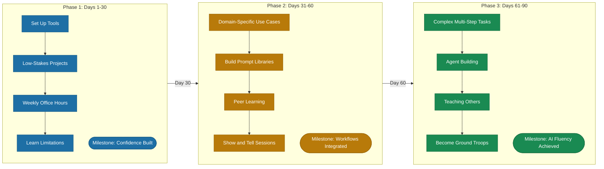

# The 90-Day AI Fluency Program

> A structured three-phase program that takes teams from AI novice to AI fluent through scaffolded progression from observation to application to mastery.

*From [Chapter 8: Teams for AI-First Companies](../book/part-3-operating/08-teams-for-ai-first-companies/README.md)*

## Overview

Most upskilling programs treat AI fluency like a training checkbox. Attend the workshop, get the certificate, back to your old ways by week two. The companies seeing real transformation understand something different: AI fluency develops through scaffolded progression from observation to application to mastery, and it takes about 90 days of structured practice before new behaviors become habit.

This isn't theory. Microsoft's internal programs achieved 85% training completion rates (versus 60% before AI-driven approaches). BCG deployed their proprietary AI tool to consultants and reduced interview processing from two weeks to 2-3 days. But both found that success required structure, not just access. Conservative scenarios deliver 300%+ ROI over three years.

The warning sign that makes this framework urgent: training investment decreased 8 percentage points in 2025 despite a 130% increase in AI spending. Organizations recognize AI depends on people but invest less in developing them. The 90-Day AI Fluency Program provides the structured approach that closes this gap.

## The Framework

### Phase 1: Days 1-30 -- Foundation

The first month is about reducing friction to zero and building confidence.

#### Set Up the Tools
Get everyone into the same environment. ChatGPT or Claude for general tasks. Microsoft Copilot for productivity suite integration. Your internal AI platform if you have one. The goal is to ensure nobody can say "I couldn't find the login."

BCG deployed 1,200 "ground troops" -- employees providing day-to-day training and adoption support. You don't need 1,200. You need enough people that questions get answered within hours, not days.

#### Low-Stakes First Projects
Start with tasks where failure costs nothing:
- Email drafting and summarization
- Meeting notes transcription
- Document summarization
- Basic research and information gathering
- Brainstorming and ideation

These aren't impressive use cases. That is the point. You are building muscle memory without performance pressure. When someone successfully summarizes their first long document in 30 seconds instead of 15 minutes, something clicks.

#### Weekly Office Hours
Dedicated time where people can ask "dumb questions" without judgment. The psychological safety matters more than the content. BCG found that 23% performance drops occurred when AI was applied beyond its capabilities -- meaning people need space to learn what doesn't work without consequences.

#### Understanding Limitations
This is where most programs fail. They teach what AI can do. They skip what AI can't do. Make limitations explicit early:
- AI hallucinates
- AI can't access information you haven't provided
- AI doesn't understand your specific business context without training
- Better to learn these boundaries in week two than discover them during a client presentation in month six

### Phase 2: Days 31-60 -- Integration

The second month is about embedding AI into daily workflows -- not as a separate activity, but as part of how work gets done.

#### Domain-Specific Use Cases
Now you get specific to what each team actually does:
- **Finance:** Data analysis and forecasting
- **Customer service:** Chatbot simulations
- **Marketing:** Content creation and brand messaging
- **Operations:** Process optimization

CMA CGM, the global shipping company, structured their training around "creating possible use cases as part of learning." Employees didn't learn AI in the abstract -- they learned it by building solutions to their actual problems.

#### Building Personal Prompt Libraries
The real productivity gains come from reusable prompts:
- Save what works, share across teams
- When someone figures out a prompt that generates quality first drafts of status reports, that knowledge should spread in days, not months

Accenture trained all 700,000 employees in agentic AI, with their marketing department seeing 25% external brand value improvement and nearly one-third reduction in manual tasks. That doesn't happen from generic training. It happens when people build tools specific to their work.

#### Peer Learning Formats
- **Show-and-tell sessions** where people demo what they have built
- **AI hackathons** where teams solve problems together
- **Communities of Practice** for ongoing knowledge sharing
- **Digital badges and recognition systems** to gamify progress

The University of New Mexico found that aligning with Microsoft's "11 by 11 tipping point" -- 11 minutes of time savings over 11 weeks -- creates lasting adoption habits. Small wins compound.

### Phase 3: Days 61-90 -- Mastery

The third month is about complexity, autonomy, and multiplication.

#### Complex Multi-Step Tasks
Now people tackle workflows that require judgment:
- Multi-step analysis
- Building agent pipelines
- Work that requires understanding when to apply AI and when to override it

The speed gain only matters if quality holds -- and that requires human judgment at key decision points. This phase develops that judgment.

#### Agent Building and Automation
- **For technical teams:** Agent construction begins
- **For non-technical teams:** Learn to specify requirements clearly enough that technical teams can build what they need

One company achieved a 40% increase in task fulfillment time and 75% boost in employee engagement using AI-tracked personalized training.

#### Teaching Others
The final test of fluency: can you teach it? People who have completed the program become the next cohort's ground troops. This isn't just knowledge transfer -- it is how you scale without proportionally scaling training investment.

### Measuring What Matters

The trap: measuring completion rates instead of outcomes. Track four categories:

#### Adoption Metrics
- Tool usage rates before and after
- Feature adoption timelines
- Daily active users at 3-month, 6-month, and 12-month intervals
- Among AI ROI Leaders, weekly AI usage increased to 82% in 2025, up 10 percentage points year-over-year

#### Productivity Metrics
- Output per person: tickets closed, features shipped, documents produced
- Time savings: cycle time reduction, review time improvement
- Developers using GitHub Copilot complete tasks 55% faster with a completion rate of 78% versus 70% for non-users
- AWS research found AI skills boost productivity by at least 39% across organizations surveyed

**Caution:** A METR study of early-2025 AI tools found that when developers used AI assistance, they took 19% longer to complete issues -- contradicting developer beliefs about speed gains. Always measure actual outcomes, not perceived benefits.

#### Quality Metrics
- Bug rates before and after
- Review cycle improvements
- Code quality or output quality measures
- Teams using AI-powered code review alongside coding tools saw quality improvements in 81% of cases

#### Retention and Satisfaction
- AI-trained employees are up to 25% more likely to stay, reducing costly turnover
- Employee satisfaction surveys
- Training ROI calculations

### The Break-Even Timeline

- **3-5 months:** Focused deployments reducing training and support load
- **6-9 months:** Multi-team rollouts across HR, finance, or operations
- **9-12 months:** Highly customized environments with heavy IT dependency
- Conservative scenarios deliver 300%+ ROI over three years, with break-even around 7 months

## How to Use This

Begin by selecting a pilot cohort of 20-50 people across different functions and run them through the full 90-day program. Assign "ground troops" -- AI-fluent champions -- at a ratio of roughly 1 per 15-20 participants. Establish your measurement baselines before day one. After the pilot, use your graduates as the ground troops for the next cohort, creating a self-sustaining multiplication effect. Review and adapt the domain-specific use cases each cycle based on what actually drove adoption versus what looked good on paper.

## Related Frameworks

- [Human-AI Collaboration](05-human-ai-collaboration.md) -- The collaboration patterns your teams will learn to apply during Phase 3
- [Automation vs Augmentation](15-automation-vs-augmentation.md) -- Understanding where AI augments versus replaces informs which use cases to prioritize in training
- [7 Mental Models of AI-First](02-seven-mental-models-of-ai-first.md) -- The foundational thinking that fluency training embeds
- [8 Patterns for AI Coding](09-eight-patterns-for-ai-coding.md) -- Specific patterns for technical teams during the Mastery phase
- [AI-First vs AI-Enabled](01-ai-first-vs-ai-enabled.md) -- The strategic distinction that motivates fluency investment

## Deep Dive

Read the full chapter: [Chapter 8: Teams for AI-First Companies](../book/part-3-operating/08-teams-for-ai-first-companies/README.md)
