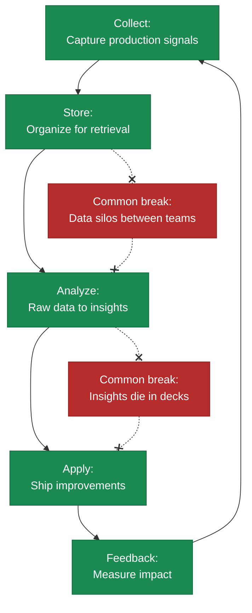

# Building Data Flywheels

> A self-reinforcing system where product usage generates data that improves AI capabilities, which attracts more users, who generate more data---the primary mechanism for building sustainable competitive advantages in AI-first companies.

*From [Chapter 9: Data Strategy](../book/part-3-operating/09-data-strategy/README.md)*

## Overview

The difference between a feedback loop and a flywheel is simple: feedback loops require human intervention at each cycle. Flywheels are self-reinforcing. Each improvement automatically creates conditions for the next. Most companies have feedback loops. Very few have flywheels.

Eighty percent of enterprise AI projects fail. Not because the models are bad, but because they can't escape the cold start paradox: you need quality data to build an accurate model, but you need an accurate model to attract users who generate quality data. The companies that break through solve this with architecture, not algorithms.

Once spinning, a true flywheel is nearly impossible for competitors to replicate because the moat grows with every user interaction. But weakness in any one component creates drag that slows the entire system---and flywheels can spin backward just as easily as forward.

## The Framework

### The 5 Components

| Component | What It Does | What Breaks Without It |
|-----------|-------------|------------------------|
| **Collection** | Captures signals from production systems and user interactions | You train on static data that doesn't reflect real usage. Tesla's 2M+ vehicles capture "Autopilot Snapshot" clips of edge cases automatically. |
| **Storage** | Keeps data accessible across teams with organization for rapid retrieval | Siloed data means different teams train on different snapshots, creating model drift. |
| **Analysis** | Transforms raw data into actionable insights | Data accumulates but you don't learn from it. Spotify runs 520 experiments on mobile home screen alone each year. |
| **Application** | Translates insights into product improvements | Insights die in slide decks. Netflix handles 4,000+ daily deployments with automated canary rollouts. |
| **Feedback** | Connects application back to collection | You ship improvements but don't know if they worked. Does better output generate more data? |

**The velocity gap is stark.** Netflix deploys in under 15 minutes. Traditional enterprises take 8 to 90 days. Some Fortune 100 banks average nine months from proof-of-concept to production. Duolingo rewrote their Session Generator to reduce processing from 750 milliseconds to 14 milliseconds---the difference between real-time personalization and waiting for the next session.

The bottleneck is rarely collection. Most organizations have mature data collection. The break usually happens between storage and analysis (data in silos) or between analysis and application (insights die in slide decks).

### The Network Learning Effect

A true flywheel has network learning: each user's data improves the product for all users, not just themselves.

| Pattern | Definition | Moat Strength |
|---------|------------|---------------|
| **Individual Learning** | Your data improves your experience | Low: personalization is table stakes |
| **Network Learning** | Your data improves everyone's experience | High: creates compounding advantage |

**The test:** If you deleted one user's data, would other users notice?

- **Duolingo: Yes.** Every mistake feeds into Birdbrain, their AI that estimates probability of correct answers. When multiple learners struggle with Spanish preterite versus imperfect, Birdbrain updates difficulty estimates in real-time for all current and future learners. Result: 59% DAU growth (21M to 34M users), 80%+ organic acquisition, effectively zero customer acquisition costs.
- **A typical note-taking app: No.** Your notes help you. That is a product, not a flywheel.

### What Compounds vs. What Plateaus

**Spotify: True Compounding.** 1.4 trillion events daily from 678 million users. Multi-task training shows the model learns transferable structures---improvements in podcast recommendations enhance music discovery. Users engaging with AI recommendations show 40% higher retention and spend 140 minutes daily versus 99 minutes for non-AI users.

**Klarna: Initial Success, Then Plateau.** Their AI assistant handled 2.3 million conversations in month one, equivalent to 700 full-time agents. Resolution time dropped from 11 minutes to under 2 minutes. By Q1 2025, AI handled 80%+ of routine inquiries, contributing $40 million in profit improvement. But then Klarna began rebalancing toward human agents. The AI excelled at routine queries but couldn't compound into complex emotional scenarios. They optimized, but they didn't compound.

### Cold Start Strategies That Work

**Expert seeding over data hoarding.** Harvey started with zero proprietary legal data in mid-2022 and became one of the fastest-growing legal AI companies. They hired lawyers from major firms to define step-by-step workflows. The key insight: process data for complex legal work doesn't exist online.

**Target complexity, not volume.** Harvey pursued elite law firms first (Allen & Overy with 3,500 attorneys). Complex work generates more valuable training data---international mergers create edge cases that simple contract review never encounters.

**Build the loop before you have data.** Design the flywheel architecture before you have meaningful data. Internal users provide continuous usage data without sales cycles. Ship Tuesday, measure Thursday, iterate Friday.

**Evidence it works:** Perplexity demonstrates what happens when network effects hit critical mass: 312M queries in May 2024, 780M by May 2025, 1.4B by June 2025. DAU/MAU ratio of 53% far exceeds benchmarks. Each query improves answer accuracy for future queries.

### When Flywheels Spin Backward

Not all loops are virtuous:

- **Model Collapse:** AI trained on AI-generated content degrades over time. Research in Nature shows models exhibit "narrower range of output over time" when trained recursively on their own outputs. Each generation drifts from reality, like making a copy of a copy.
- **Data Without Curation:** Tesla's FSD demonstrates a feedback loop that failed to become self-reinforcing. Despite massive fleet data collection, FSD "hasn't improved all year" based on 2025 data. Data collection without proper curation creates noise, not signal.
- **Wrong Incentives:** When you optimize for the wrong metric, the flywheel spins in the wrong direction. Engagement at the cost of user value creates short-term gains and long-term churn.

Before you write a line of code, map the loop on paper. If you can't complete it on paper, you won't complete it in production.

## How to Use This

Map your current data flow against the five components. Identify where the breaks are---typically between storage and analysis or between analysis and application. Then determine whether you have individual learning or network learning. If individual, redesign your data architecture so that each user's interactions improve the product for all users. Start with the cold start strategies if you are pre-product-market-fit.

## Related Frameworks

- [Data Moats](13-data-moats.md) --- the defensibility that a working flywheel creates
- [6 Data Strategy Mistakes](14-six-data-strategy-mistakes.md) --- mistakes that stall your flywheel
- [8 GTM Mistakes with AI](16-eight-gtm-mistakes-with-ai.md) --- GTM failures that prevent data generation
- [AI-First vs. AI-Enabled](01-ai-first-vs-ai-enabled.md) --- why AI-first companies need flywheels and AI-enabled companies don't

## Deep Dive

Read the full chapter: [Chapter 9: Data Strategy](../book/part-3-operating/09-data-strategy/README.md)
