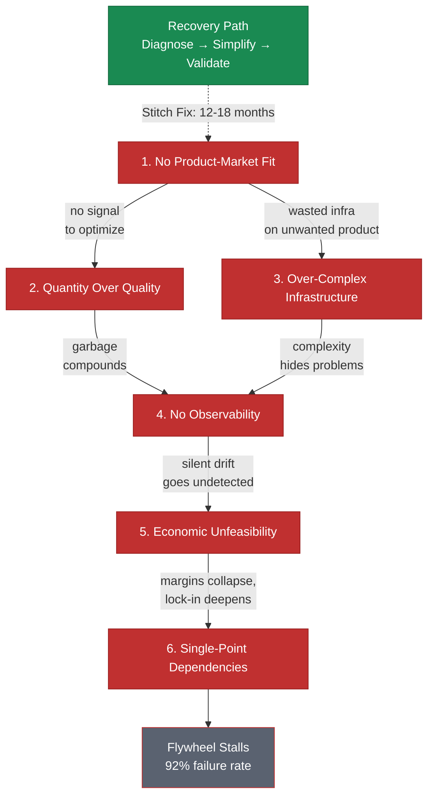

# The 6 Data Strategy Mistakes That Stall Flywheels

> Six fundamental errors that kill data flywheels repeatedly---responsible for a 92% AI startup failure rate within 18 months.

*From [Chapter 9: Data Strategy](../book/part-3-operating/09-data-strategy/README.md)*

## Overview

AI startups face a 92% failure rate within 18 months, with 42% of companies abandoning most AI initiatives in 2025---nearly double the failure rate of traditional IT projects. The MIT NANDA study is even more sobering: 95% of enterprise AI pilots fail to reach production with measurable value.

The culprit isn't lack of innovation. It is fundamental errors in building data flywheels. These six mistakes kill flywheels repeatedly, and each one is avoidable if you know what to look for. The companies that survive are the ones that diagnose these patterns early and correct course before the flywheel stalls permanently.

## The Framework

### Mistake 1: Building the Flywheel Before Product-Market Fit

This is the most expensive mistake because it wastes months of infrastructure investment on a product nobody wants.

- 43% of AI startups fail specifically because they build products nobody wanted.
- Approximately 50% of AI wrapper companies pivot to different use cases within their first year.
- 60-70% of AI wrappers generate zero revenue despite extensive data collection infrastructure.

**How to avoid it:** Validate that customers actually want your solution before investing in data infrastructure. The breakeven MRR for typical AI wrappers runs between $15,000 and $30,000. Approach that threshold with manual processes before automating.

### Mistake 2: Optimizing for Data Quantity Over Quality

More data sounds better. It usually isn't.

- Data accuracy in the U.S. has declined from 63.5% in 2021 to just 26.6% in 2024.
- 48% of respondents identify data management as their most significant obstacle.
- Garbage compounds. Each flywheel cycle makes garbage worse because the model learns from increasingly corrupted signals.

**When to stop collecting:** When model performance degrades despite adding more training examples. When your team spends more time cleaning than training.

### Mistake 3: Starting with Overly Complex Infrastructure

Teams spend days to weeks configuring infrastructure for each new workload, wasting enormous time setting up systems rather than validating product hypotheses.

- Data dependency hell accounts for 67% of failures, and infrastructure cost explosion runs 10x higher than equivalent SaaS.
- 42% of companies abandoned most AI initiatives in 2025, up from 17% in 2024.

**Right level of complexity:** Focus on workload management rather than building custom infrastructure at early stages. Add complexity only when simple solutions create measurable bottlenecks. If you can't name the specific bottleneck each infrastructure component solves, you have resume-driven architecture---tech chosen for career optics rather than business need.

### Mistake 4: Ignoring Data Quality and Observability

AI systems experience silent failures through data drift, concept drift, and prior probability shifts that traditional monitoring doesn't catch. Without comprehensive data monitoring, teams miss when input data distributions change or when relationships between inputs and outputs evolve.

**Essential metrics to track:**
- **Data drift detection:** Shifts in input distributions.
- **Schema changes:** Missing columns, altered formats.
- **Quality issues:** Duplicates, outliers, missing values.
- **Model performance across segments over time.**

You can't fix what you can't see.

### Mistake 5: Economic Unfeasibility

The average AI wrapper operates at 25-60% gross margins, dramatically lower than traditional SaaS at 70-90%. Wrapper companies typically spend 20-40% of revenue on inference and fine-tuning costs. GitHub Copilot reportedly lost over $20 per user per month at the $10/month price point.

**Calculating viability:**
- If margins fall below 40%, failure risk is high.
- OpenAI improved compute margins from approximately 35% in early 2024 to around 70% by October 2025. But that represents frontier model performance.
- The harsh reality: 60-70% of AI wrappers generate zero revenue, and only 3-5% surpass $10,000 monthly.
- The flywheel doesn't matter if spinning it costs more than the value it creates.

### Mistake 6: Platform Risk and Single-Point Dependencies

On June 4, 2024, ChatGPT, Claude, and Perplexity all failed simultaneously. Companies with no fallback strategies faced complete operational paralysis. Ghost Autonomy raised $238.8 million, including $5 million from OpenAI, then shut down partly due to investor skepticism about relying on third-party LLMs for safety-critical applications.

**How to avoid it:** Build multi-provider strategies with fallback options before reaching production scale. Design systems that can switch between providers or degrade gracefully. The moat you think you are building on top of a single provider is actually a trap.

### Recovery Is Possible

Stitch Fix experienced client declines but recovered by diagnosing that pure AI wasn't sufficient. They implemented a hybrid AI-human model where machine learning generates recommendations at scale but human stylists add nuance. The result: 40% increase in average order value, 40% increase in repeat purchases, 30% reduction in return rates. Time to recovery: 12-18 months.

The flywheel works when the foundations are solid. Most people skip the foundations.

## How to Use This

Before investing in data infrastructure, audit your current position against all six mistakes. Start with Mistake 1 (product-market fit) and work sequentially---there is no point optimizing data quality or economics if nobody wants the product. For each mistake, identify whether you are currently exhibiting the pattern and apply the corresponding avoidance strategy before proceeding.

## Related Frameworks

- [Data Flywheel](12-data-flywheel.md) --- the flywheel these mistakes stall
- [Data Moats](13-data-moats.md) --- defensibility that depends on a working flywheel
- [5 Infrastructure Mistakes](08-five-infrastructure-mistakes.md) --- related failure patterns in the infrastructure layer
- [6 Questions Before Choosing a Model](07-six-questions-before-choosing-a-model.md) --- upstream decisions that affect data strategy

## Deep Dive

Read the full chapter: [Chapter 9: Data Strategy](../book/part-3-operating/09-data-strategy/README.md)
