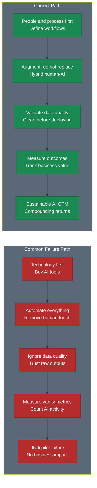

# The 8 Go-to-Market Mistakes with AI

> Eight implementation failures that account for why 95% of AI pilots fail and 88% of companies fail at AI implementation---every one rooted in putting technology before people, processes, and data.

*From [Chapter 10: AI-Augmented Operations and GTM](../book/part-3-operating/10-ai-augmented-operations-and-gtm/README.md)*

## Overview

Zillow shut down its Zillow Offers business in 2021 after AI-powered property valuation models failed spectacularly. The company wrote down over $500 million, announced $304 million in Q3 losses alone, and reduced its workforce by 25%. Two-thirds of purchased homes were valued below purchase price. The root cause: models relied on data more than 30 days old to make near real-time decisions in a rapidly shifting market.

MIT reports 95% of generative AI pilots at companies are failing. McKinsey says 88% of companies fail with AI implementation. The tools aren't failing. The implementation approaches are fundamentally flawed. Companies make every one of these mistakes---sometimes all eight at once.

Every mistake stems from the same error: treating AI as a solution to implement rather than a capability to integrate. Technology before people, processes, data quality, and integration architecture. Avoid these eight, and you are in the 5% that succeed.

## The Framework

### Mistake 1: Over-Automating Relationships

70% of customers expect personalized marketing experiences. 76% feel frustrated when those efforts miss the mark. 77% of B2B buyers say they won't engage with brands that don't deliver personalized experiences. The automation paradox: companies automate at scale, but automation consistently fails to deliver genuine personalization beyond inserting first names.

- AI-driven outreach leads to "ghost leads" that never respond.
- Raw 1,000-contact AI lists commonly dwindle to 600 viable leads after removing invalid emails and duplicates---a 40% ghost rate.

**The fix:** A hybrid approach where AI drafts initial messages but humans add genuine personalization. Reference company-specific news. Acknowledge specific challenges.

### Mistake 2: Ignoring Data Quality

80-88% of AI projects fail due to poor data quality. German companies lose an average of 4.3 million euros annually from data quality problems. AI amplifies existing data problems by a factor of 10 to 100.

- A mid-sized B2B technology company deployed AI-powered lead scoring that recommended outreach to contacts who had changed roles, suggested products to companies that recently purchased competing solutions, and missed obvious buying signals.
- The system had no visibility into organizational changes, competitive intelligence, or real-time signals happening outside the CRM.

**The fix:** Real-time data validation, Data Protection Impact Assessments before deployment, and manual review checkpoints. 44% of organizations now manually review all AI-generated lead lists for junk.

### Mistake 3: Tool Proliferation Without Integration

Zapier's 2025 enterprise survey revealed severe consequences from AI tool sprawl:

- Only 35% of enterprise leaders say AI tools go through proper approval channels.
- 28% of enterprises now use more than 10 different AI apps.
- 70% haven't moved beyond basic integration for AI tools.
- 22% of enterprises manually transfer data between siloed AI tools.

Three in four enterprises (76%) have experienced at least one negative outcome from disconnected AI: 36% cite increased security and privacy risks, 34% face major employee training challenges, 30% waste money on redundant AI software, 29% lose employee time to manual data transfers.

### Mistake 4: Chasing Volume Over Quality

The ghost lead problem persists because data vendors sell the same leads to multiple clients. Prospects become the tenth company they are contacted by and go dark.

- AI scrapes large quantities but judges context poorly, finding contacts who technically fit criteria but aren't actual buyer personas.
- Leads include people who have left companies, contributing to lower response rates and damaged sender reputation through high bounce rates.
- High email bounce rates from invalid leads get domains flagged as spam.

**The fix:** Hybrid verification where SDRs run emails through verifiers and cross-check titles on LinkedIn. Ask: has AI increased touchpoints without improving conversion?

### Mistake 5: Measuring Vanity Metrics

Organizations consistently measure AI activity rather than business outcomes: number of AI models deployed, AI-driven website sessions, social shares on AI content, model accuracy alone, volume of data processed. None of these connect to business value.

- 47% of brands shifted away from surface-level stats in 2024.
- You can make developers 20% faster, but if work sits in backlogs and review queues, customers see no difference.

**The fix:** Audit your dashboard and remove vanity metrics. Focus on flow efficiency: how fast work moves from idea to customer impact.

### Mistake 6: Underinvesting in Change Management

70% of GTM teams miss ROI targets on AI sales tools, with transformation fatigue and change resistance as the primary killers.

Root causes that compound:
- 34% of enterprise leaders cite training employees on AI as a major challenge due to tool sprawl.
- 27% of organizations say leaders don't fully back AI projects, causing initiatives to lose steam.
- 19% of organizations identify company culture as directly blocking AI adoption.
- Many workers fear AI might take their jobs and resist changing workflows.

**The fix:** Skills development at the heart of AI strategy before technology arrives. Demonstrate value before full rollout. Consolidate rather than add tools.

### Mistake 7: Building Disconnected Systems

Technical integration issues account for 40-60% of all sales intelligence failures.

Common HubSpot-Salesforce sync problems create immediate roadblocks: contacts not syncing despite administrator access, MQL-qualified leads remaining trapped in one system, marketing teams lacking insight beyond MQL stage, Salesforce data not syncing back to HubSpot leaving marketing misaligned with actual pipeline status.

When leads remain isolated in one platform, opportunities languish. Missing historical context when leads transfer to sales provides no information about the buyer journey.

**The fix:** Build unified GTM data layers before deploying AI tools. Prioritize native integrations over point solutions. Ensure bidirectional data flow.

### Mistake 8: Violating Privacy and Trust

Major GDPR enforcement actions demonstrate the stakes:
- **Clearview AI:** 30.5 million euro fine for creating a facial recognition database using 30+ billion images collected without consent.
- **LinkedIn:** 310 million euro fine for conducting behavioral profiling for targeted advertising without users' consent.
- **OpenAI:** 15 million euro fine for opaque data processing and lack of age verification.

The violations cluster around: unlawful processing without valid legal basis, lack of transparency, and no mechanisms for data subject rights. The complexity of AI systems doesn't justify non-compliance.

## How to Use This

Audit your current GTM AI initiatives against all eight mistakes. Most organizations will find they are committing at least three or four simultaneously. Prioritize fixes based on which mistakes are causing the most measurable damage right now. The common thread is putting technology before people and processes---so your fixes should start with people and process changes, not more technology.

## Related Frameworks

- [Automation vs. Augmentation](15-automation-vs-augmentation.md) --- the spectrum between Mistake 1 and effective AI integration
- [Human-AI Collaboration](05-human-ai-collaboration.md) --- the collaboration model that avoids over-automation
- [6 Data Strategy Mistakes](14-six-data-strategy-mistakes.md) --- related failure patterns in the data layer
- [Data Flywheel](12-data-flywheel.md) --- the feedback loop that good GTM creates
- [7 AI Risks and Mitigations](19-seven-ai-risks-and-mitigations.md) --- risk framework relevant to Mistake 8

## Deep Dive

Read the full chapter: [Chapter 10: AI-Augmented Operations and GTM](../book/part-3-operating/10-ai-augmented-operations-and-gtm/README.md)
