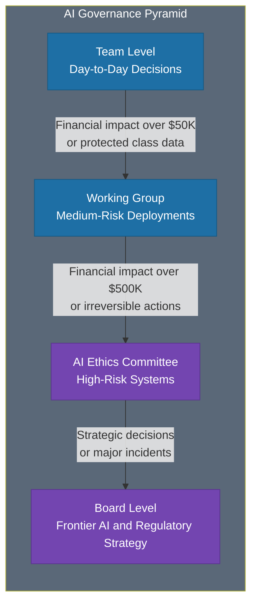

# AI Governance Framework

> A practical governance structure using the Three Lines of Defense model to give AI governance real authority, timely decisions, and the ability to enable rather than just block.

*From [Chapter 11: Ethics, Governance, and Risk](../book/part-4-sustaining/11-ethics-governance-and-risk/README.md)*

## Overview

Most AI governance is theater. Committees that meet but don't decide. Policies that exist but aren't enforced. Approval processes that slow innovation without actually reducing risk. Teams spend 56% of their time on governance-related activities when using manual processes -- more than half your AI talent doing compliance paperwork instead of building value. Meanwhile, 74% of the Australian Taxation Office's AI models in production didn't have completed data ethics assessments. Governance theater in one hand, governance gaps in the other.

Working AI governance has three characteristics: it has real authority, it makes timely decisions, and it enables rather than just blocks. The framework presented here adapts the established "Three Lines of Defense" model to AI, providing layered authority that matches decision importance to decision-maker seniority. It ensures that low-risk experiments don't get trapped in committee review while high-stakes deployments receive the scrutiny they require.

The organizations getting this right -- IBM with their AI Ethics Board, JPMorgan with their Operating Committee mandate -- treat AI governance as a strategic capability, not a compliance checkbox. Financial services saw an 84% increase in board oversight disclosure around AI in 2024. The sector is treating governance as a board-level function, and the rest of industry is following.

## The Framework

### The Three Lines of Defense

#### First Line: Team-Level Decisions
Research leads and product managers approve low-risk experiments, internal tools, and routine updates -- no committee needed. This is where most day-to-day AI decisions happen, and pushing them to committee review creates bottlenecks that kill innovation.

#### Second Line: Working Group Decisions
Risk Management and Legal review medium-risk deployments. This line handles EU AI Act compliance, bias audits, and deployments involving moderate financial impact or internal data. The working group provides specialist oversight without the formality of a full committee.

#### Third Line: Committee Decisions
The AI Ethics Board assesses high-risk systems. This body has the authority to approve, modify, or terminate AI projects. Without this authority, governance becomes performative. The committee reviews sensitive use cases and issues guidance -- but doesn't touch every deployment.

#### Board Level: Strategic Decisions
Frontier AI, regulatory strategy, and major incidents escalate to the board. When AI innovation is an operating committee mandate, governance becomes strategy, not just risk management.

### Structures That Work: Real Examples

#### IBM's AI Ethics Board
Established in 2019 and refined over five years:
- **Policy Advisory Committee** of senior leaders defines risk tolerance and strategy
- **AI Ethics Board** serves as the central cross-disciplinary body, co-chaired by their Global AI Ethics Leader and Chief Privacy & Trust Officer
- **Distributed accountability:** Every business unit has ethics focal points who make routine decisions locally
- **Practical tools:** An AI Risk Atlas embedded in watsonx gives practitioners decision support without routing through the board
- **Clear escalation:** The board reviews sensitive use cases and issues guidance but doesn't touch every deployment

#### JPMorgan's Operating Committee Mandate
JPMorgan elevated AI governance to their 14-member Operating Committee in 2025, with their Chief Data and Analytics Officer at the table -- one of few Fortune 1000 CDAOs at that level. When AI innovation is an operating committee mandate, governance becomes strategy, not just risk management.

### Decision Rights That Scale

The RACI matrix (Responsible, Accountable, Consulted, Informed) eliminates ambiguity about who decides what.

**Example: Bank Deploying Credit Scoring AI**
- **Responsible:** Data science team (model training and validation)
- **Accountable:** Legal department (compliance sign-off)
- **Consulted:** IT security (risk assessment)
- **Informed:** Senior management (status updates)

The pattern: technical teams do the work, business owners sign off, specialists advise, leaders stay informed. Without this clarity, you get what one healthcare system discovered -- "what appeared as simple data access tasks expanded into months of negotiation" because nobody knew who could authorize secondary use of data.

### Escalation Triggers

Clear thresholds prevent both over-governance and under-governance:

| Level | Financial Impact | Data Involved | Materiality |
|-------|-----------------|---------------|-------------|
| **Team Approves** | Under $50K | No PII | Low |
| **Working Group Reviews** | $50K-$500K | Protected class data | Medium |
| **Committee Decides** | Over $500K | Irreversible actions | High-risk classification |
| **Board Involvement** | Strategic | Frontier models | Major incidents |

In UK financial services, 62% of AI use cases qualify as low materiality (team approval), while 16% are high materiality requiring committee review. EU AI Act high-risk classifications -- credit decisions, healthcare diagnostics, employment screening, law enforcement -- require committee-level decisions regardless of financial impact.

Write these thresholds down before you need them. When an incident happens at 2am, nobody should be debating who has authority.

### Governance That Enables

The governance that works helps teams find the "yes" that manages risk:
- Governance committees must have authority to approve, modify, or terminate AI projects -- without it, governance becomes performative
- Microsoft "dogfoods" AI internally before external rollout, identifying governance gaps before they cause delays
- If governance only blocks, it isn't working. If it only approves, it isn't governing.
- AI capabilities evolve faster than annual review cycles -- build modular governance where you can update permission models without renegotiating your entire framework

## How to Use This

Start by mapping your current AI systems to the four governance levels. Establish clear escalation thresholds based on financial impact, data sensitivity, and regulatory classification. Define RACI matrices for your most common AI deployment scenarios. Assign ethics focal points in each business unit for first-line decisions, and create a cross-functional working group for second-line review. For the committee level, ensure the body has genuine authority to approve, modify, or terminate -- then schedule regular reviews so governance keeps pace with capability evolution.

## Related Frameworks

- [Permission Model Framework](17-permission-model-framework.md) -- The operational permission levels that governance structures oversee
- [7 AI Risks and Mitigations](19-seven-ai-risks-and-mitigations.md) -- The specific risks that governance frameworks must address
- [Human-AI Collaboration](05-human-ai-collaboration.md) -- How governance applies to human-AI teaming decisions
- [10 Principles of AI-First](20-ten-principles-of-ai-first.md) -- The strategic principles that governance should enable, not hinder
- [Automation vs Augmentation](15-automation-vs-augmentation.md) -- Task-level decisions that governance thresholds inform

## Deep Dive

Read the full chapter: [Chapter 11: Ethics, Governance, and Risk](../book/part-4-sustaining/11-ethics-governance-and-risk/README.md)
