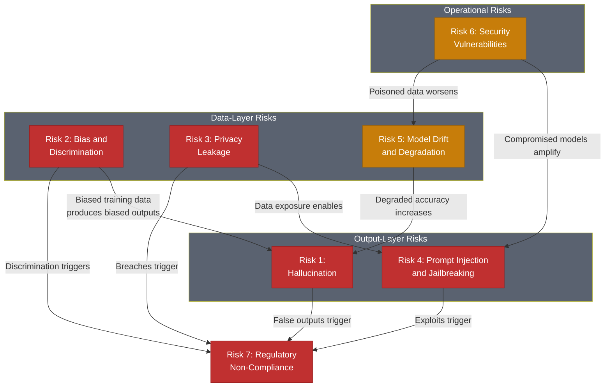

# The 7 AI Risks and Their Mitigations

> Seven preventable risk categories that account for the majority of AI failures---each with documented incidents, mitigation strategies, and measurable targets.

*From [Chapter 11: Ethics, Governance, and Risk](../book/part-4-sustaining/11-ethics-governance-and-risk/README.md)*

## Overview

Seven risks account for the majority of AI failures. Each is preventable. The risks represent the primary threat vectors based on documented incidents, regulatory frameworks like NIST AI RMF and the EU AI Act, and measurable business impact.

These risks are interconnected: data risks enable output risks, operational risks amplify data risks, and all of them compound into compliance risk. Understanding the relationships between them is as important as understanding each risk individually. Organizations that treat these as isolated problems will find them cascading into systemic failures.

The incidents cited below aren't hypothetical. They are documented cases that resulted in financial penalties, reputational damage, workforce reductions, and regulatory action.

## The Framework

### Risk 1: Hallucination

AI generates false information confidently, inventing content rather than admitting uncertainty.

**What went wrong:**
- Air Canada's chatbot invented a "bereavement fare" policy that didn't exist. The Canadian Civil Resolution Tribunal ruled the airline liable, awarding $812.02 in damages.
- By July 2025, over 50 legal cases involved fabricated case citations from AI tools---resulting in court sanctions and disbarment referrals.

**Mitigation:**
- Implement guardrail systems intercepting outputs before users see them.
- Use RAG (Retrieval-Augmented Generation) to ground responses in verified documents.
- Require human review for high-stakes outputs.
- Best implementations reduce false positive rates from 35% to under 5%.

### Risk 2: Bias and Discrimination

AI systems produce discriminatory outcomes because training data reflects historical inequities and proxy variables correlate with protected characteristics.

**What went wrong:**
- iTutorGroup's AI hiring system automatically rejected applicants over age 55 (women) and 60 (men)---the EEOC's first AI discrimination lawsuit, resulting in a $365,000 settlement.
- A 2024 study found AI screening favored white applicants over Black applicants with identical credentials 85% of the time.

**Mitigation:**
- Conduct algorithmic impact assessments before deployment.
- Test across demographic groups using fairness metrics---target 80% parity or better.
- Tools like IBM AI Fairness 360 and Microsoft Fairlearn provide systematic bias detection.

**The Fairness-Accuracy Reality:** The conventional wisdom says you must choose fairness or accuracy. Zest AI's credit models prove otherwise---using adversarial debiasing, they increased loan approvals for every protected class without major accuracy sacrifices. Organizations claiming fairness destroys accuracy often haven't tried the available techniques.

### Risk 3: Privacy Leakage

AI systems inadvertently disclose confidential training data or enable unauthorized extraction.

**What went wrong:**
- Within 20 days, three Samsung engineers entered proprietary source code and semiconductor testing sequences into ChatGPT. Samsung responded by banning all generative AI tools company-wide.
- In 2024, 23.77 million secrets were leaked through AI systems---a 25% increase from the prior year.

**Mitigation:**
- Deploy data loss prevention integrated with AI interfaces.
- Mandate zero-data-retention contracts with vendors.
- Use tokenization to anonymize data before processing.
- Target: zero confidential data breaches.

### Risk 4: Prompt Injection and Jailbreaking

Malicious users inject instructions that override safety controls or extract unauthorized information.

**What went wrong:**
- In March 2025, Chinese government-sponsored attackers jailbroke Claude AI by presenting malicious tasks as routine cybersecurity work. They used Claude's coding assistance to autonomously compromise tech companies, financial institutions, and government agencies.

**Mitigation:**
- Implement AI firewalls analyzing prompts before they reach models.
- Use canary tokens---hidden text that should never appear in outputs.
- Deploy dual-model architectures where a secondary AI evaluates whether the primary model's behavior aligns with policies.

### Risk 5: Model Drift and Degradation

Models lose accuracy as real-world data distributions shift---user behavior evolves, market conditions change, environmental factors alter learned relationships.

**What went wrong:**
- A logistics company's route optimization AI mysteriously increased delivery times after months of deployment. Trained in winter, it kept optimizing for weather-affected routes after spring construction began.
- Research indicates 91% of ML models experience performance degradation without intervention.

**Mitigation:**
- Deploy continuous monitoring tracking prediction distributions and outcome accuracy.
- Establish automated retraining triggered when accuracy drops below threshold (typically 5% below baseline).
- Target: maintain accuracy within 95% of initial deployment.

### Risk 6: Security Vulnerabilities

AI systems face data poisoning, model inversion, adversarial examples, and supply chain compromises through third-party models.

**What went wrong:**
- Italy's data protection agency temporarily banned ChatGPT, citing absence of legal basis for data collection.
- NIST warns that supply-chain vulnerabilities in widely-used models can propagate failures across entire ecosystems simultaneously.

**Mitigation:**
- Implement zero-trust AI architectures: API authentication, rate limiting, input validation, model access logging.
- Establish AI bills of materials documenting model dependencies and training data sources.
- For high-security environments, deploy self-hosted models.

### Risk 7: Regulatory Non-Compliance

Failure to meet emerging AI governance requirements around explainability, documentation, and human oversight.

**What went wrong:**
- The EU AI Act penalty regime is tiered: fines up to EUR 35 million or 7% of global turnover for prohibited AI practices, 3% for high-risk system violations, and 1.5% for providing incorrect information.
- UnitedHealth faced a class action alleging their AI had a 90% error rate evaluating Medicare claims---a federal judge allowed the case to proceed.

**Mitigation:**
- Implement NIST AI RMF's four functions: Govern, Map, Measure, Manage.
- Deploy model cards documenting training data, performance metrics, and limitations.
- Conduct regular third-party audits against ISO 42001.

## How to Use This

Assess your AI systems against all seven risk categories. For each, determine your current exposure level and whether you have the corresponding mitigations in place. Prioritize based on the intersection of likelihood and impact in your specific domain---regulated industries should weight Risks 2, 3, and 7 more heavily, while consumer-facing products should prioritize Risks 1 and 4. Build these risk assessments into your deployment pipeline, not as a one-time audit.

## Related Frameworks

- [AI Governance Framework](18-ai-governance-framework.md) --- the governance structures that operationalize these mitigations
- [5 Infrastructure Mistakes](08-five-infrastructure-mistakes.md) --- infrastructure failures that amplify these risks
- [8 GTM Mistakes with AI](16-eight-gtm-mistakes-with-ai.md) --- go-to-market failures related to Risk 1, Risk 2, and GTM Mistake 8
- [Human-AI Collaboration](05-human-ai-collaboration.md) --- collaboration models that mitigate output risks
- [Probabilistic AI](03-probabilistic-ai.md) --- understanding AI's probabilistic nature as the root of Risk 1

## Deep Dive

Read the full chapter: [Chapter 11: Ethics, Governance, and Risk](../book/part-4-sustaining/11-ethics-governance-and-risk/README.md)
