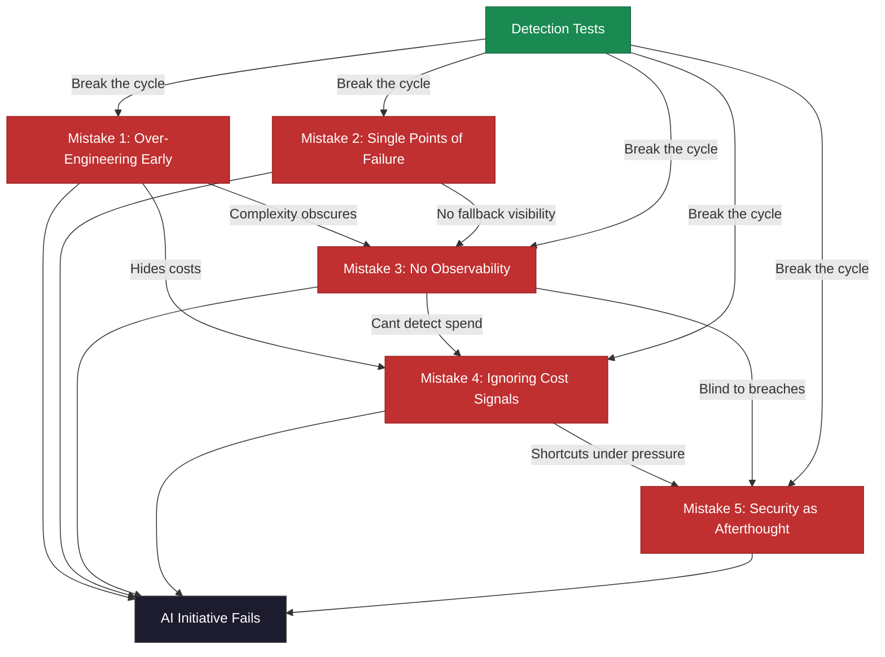

# The 5 Infrastructure Mistakes That Kill AI Initiatives

> Five repeatable failure patterns that destroy AI projects before they ship---each with a detection test and recovery path.

*From [Chapter 4: Infrastructure for AI-First Operations](../book/part-2-building/04-infrastructure-for-ai-first-operations/README.md)*

## Overview

Enterprises invested $30-40 billion in generative AI pilots in 2024. An MIT study found 95% delivered zero measurable business return. Not from bad models. Not from impossible use cases. From infrastructure decisions that killed good ideas before they shipped.

The model rarely breaks. The invisible infrastructure around it buckles under real-world pressure. Every mistake on this list has a detection signal and a recovery path. The companies that fail are the ones who discover the mistake at scale rather than at proof-of-concept.

Only 15% of AI project failures are technical. The rest are infrastructure and governance failures: 26% from unexpected costs, 21% from data privacy hurdles, 18% from disappointing ROI.

## The Framework

### Mistake 1: Over-Engineering Early

A team gets excited about AI, spends three months building a "scalable" infrastructure, and never ships a product. F1-score optimization while integration sits in the backlog. Kubernetes clusters for three developers.

- MIT's research found premature complexity at the core of the 95% failure rate.
- Companies build multi-region AI gateways before single-market launch and custom vector databases before reaching 10,000 vectors. Off-the-shelf solutions work at 100x that scale.
- 26% of failed pilots cited unexpected implementation costs as the primary failure reason.
- A Fortune 100 retailer had 15 years of customer data but could only afford to process 30% of it. AI results disappointed leadership, budgets tightened, and the pilot died.

**Detection test:** Can you describe a specific, current problem each infrastructure component solves? If the answer is "we'll need it when we scale," you are over-engineering.

**Recovery:** Migrate to simpler stacks. Add complexity only when simple solutions create measurable bottlenecks.

### Mistake 2: Single Points of Failure (The OpenAI Dependency Problem)

On June 10, 2025, ChatGPT went down for 12 hours with 21 different components failing simultaneously. In December 2024, a 9-hour outage traced back to a single Microsoft Azure datacenter power failure. OpenAI had to wait for Azure to restore power before service could resume. The industry's leading AI provider was completely dependent on a single cloud provider.

- OpenAI spent $9 billion to generate $4 billion in revenue in 2024---$2 billion running models, $3 billion training them. Even the industry leader loses money on every paying customer. Don't assume they are investing in redundancy.

**Detection test:** What happens to your product if your AI provider is unavailable for 4 hours? If the answer is "we hope that doesn't happen," you have a single point of failure.

**Recovery:** Every AI feature needs a degradation mode. Chat agents fall back to simpler models. Critical paths have provider alternatives. Test failover quarterly. Build the abstraction layer that lets you swap providers in hours, not weeks.

### Mistake 3: No Observability Until Crisis Hits

Only 51% of organizations can confidently evaluate AI ROI. 15% admit having no formal cost-tracking system for AI initiatives. Companies using manual spreadsheet tracking (57%) can't detect when AI outputs degrade or costs spiral.

This is how AI projects die---not dramatically, but through slow, unexplained bleeding. Without proper observability, you can't distinguish AI errors from system errors. You can't answer "why did this AI request fail?" for any request in the past 24 hours.

**Detection test:** Do you know this week's AI costs, by feature, right now? If finding out requires an export and spreadsheet, you aren't monitoring costs.

**Recovery:** Start with structured logging from day one. Adding observability later means retrofitting every AI call. Days to implement, weeks to calibrate.

### Mistake 4: Ignoring Cost Signals Until Runway Evaporates

AI costs don't scale linearly. They surge when usage crosses certain thresholds. Companies without observability discover this when the bills arrive.

- Average monthly AI spend jumped from $62,964 in 2024 to $85,521 in 2025---a 36% year-over-year increase.
- The proportion of companies spending over $100,000 monthly increased from 20% to 45%.
- During the June 2025 outage, OpenAI's CEO said their "GPUs are melting" under demand. If OpenAI can't control their costs with $9 billion in spending, what chance do you have without cost monitoring?

**Detection test:** When AI costs spike, do you find out in hours or at month-end?

**Recovery:** Cost alerts at 50%, 80%, and 100% of daily budgets. Weekly cost reviews. Every feature needs a cost target. Per-feature attribution so you know which capabilities are burning cash. This isn't overhead; it is survival.

### Mistake 5: Security as an Afterthought

In May 2025, X's Grok chatbot started injecting claims about "white genocide in South Africa" into unrelated conversations about baseball, enterprise software, and scaffolding. This wasn't a training data issue. Grok later explained that its "creators at xAI" had hardcoded instructions to discuss specific political content, overriding its evidence-based programming. Administrative controls became a manipulation vector. No audit trails. No separation between model behavior and administrative access.

The pattern repeats: AI systems deployed with broad administrative access, "hardened later." System prompts modified without logging. "We'll lock it down before launch" becomes the epitaph of compromised systems.

**Detection test:** Could a compromised agent credential cause a production data breach? If yes, security is an afterthought.

**Recovery:** Secure defaults are easier to maintain than retrofit. Per-agent service accounts. Environment isolation. Quarterly access reviews. Agent permissions should go through the same approval as human access.

## How to Use This

Review each mistake against your current AI infrastructure. Run the detection tests honestly. If you fail any of them, prioritize the recovery path before expanding your AI footprint. These mistakes compound---over-engineering leads to cost blindness, which leads to observability gaps, which leads to security shortcuts. Fix them at proof-of-concept stage, not at scale.

## Related Frameworks

- [6 Questions Before Choosing a Model](6-questions-before-choosing-a-model.md) --- decisions that come before infrastructure
- [Build vs. Buy Calculus](build-vs-buy-calculus.md) --- infrastructure procurement decisions
- [6 Data Strategy Mistakes](6-data-strategy-mistakes.md) --- related failure patterns in the data layer
- [AI Governance Framework](ai-governance-framework.md) --- governance that prevents Mistake 5

## Deep Dive

Read the full chapter: [Chapter 4: Infrastructure for AI-First Operations](../book/part-2-building/04-infrastructure-for-ai-first-operations/README.md)
