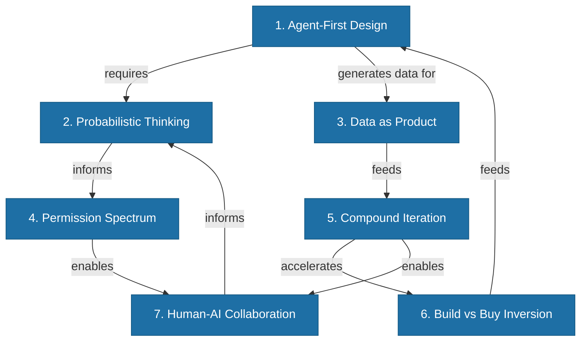

# The 7 Mental Models of AI-First Thinking

> Seven frameworks for making decisions when traditional software rules no longer apply.

*From [Chapter 2: The AI-First Mindset](../book/part-1-foundations/02-the-ai-first-mindset/README.md)*

## Overview

Thinking in capabilities gets you halfway to an AI-first mindset. But capability thinking alone won't tell you how to handle an AI that's 90% confident about something wrong, or when to let an agent act autonomously versus requiring human approval.

AI-first founders operate with a different set of mental models -- frameworks for making decisions when the old rules don't apply. These seven models compound: agent-first design assumes probabilistic thinking, data-as-product depends on compound iteration, and the permission spectrum enables human-AI collaboration. Get one right and you have an advantage. Get all seven right and you have a *different* way of building that competitors can't replicate.

## The Framework

### 1. Agent-First Design

**Build for AI consumers first. Humans benefit automatically.**

APIs used to serve human-controlled applications. Now they serve AI agents that reason, plan, and act. Anthropic's Model Context Protocol (MCP) automatically connects, retrieves tools, reasons about what to use, and executes -- all without human intervention. The API design assumes an AI is calling it first.

The logic holds: design for agents, and humans benefit automatically. The reverse isn't true. APIs designed for human-operated interfaces often lack the structured responses and explicit error handling that agents require.

The market reflects this shift: 82% of organizations have adopted API-first strategies, with AI agent spending projected to reach $50B by 2030.

### 2. Probabilistic Thinking

**Uncertainty is a feature, not a bug.**

Traditional software is deterministic. Same input, same output, every time. AI is different -- same input might produce different outputs, and even consistent outputs have confidence levels attached. This isn't a failure to engineer around. It's a fundamental characteristic you must design *into* your product.

- **GitHub Copilot** filters completions before showing them to developers, displaying only tokens with high predicted likelihood of being accepted -- leading to faster task completion.
- **Harvey AI** uses "citation-first output" -- every response is grounded in source documents. Their BigLaw Bench shows 74% answer quality, and they're transparent about that gap from perfection.
- **Grammarly** shows multiple suggestions instead of one "right answer," targeting 95% user-generated accuracy. When showing 10 suggestions: 98% accuracy, 44% activation rate.

Design around uncertainty, and you build trust. Pretend certainty you don't have, and you build liability.

### 3. Data as Product

**Every interaction is a training signal.**

AI-first companies treat usage data as a product, not a byproduct -- structuring products so using them naturally generates training signal. This creates data flywheels: better products attract more users, more users generate more data, more data enables better products.

### 4. Permission Spectrum

**Context determines autonomy.**

Not all AI decisions carry the same stakes. Suggesting a calendar time? Low stakes, high autonomy. Executing a financial transaction? High stakes, human approval required. The best AI products calibrate autonomy to context.

- **Cursor** implements explicit PermissionOptions -- allowlists and denylists for what the AI can modify, plus "YOLO mode" for developers who want maximum speed.
- **Replit** offers "Max Autonomy" mode with 200 minutes of continuous AI operation versus standard mode with frequent checkpoints.

Same products, different autonomy levels based on user context.

### 5. Compound Iteration

**AI enables faster learning loops.**

Traditional product development moves in discrete sprints. AI products can iterate continuously, often in hours instead of weeks.

- **Vercel's v0** iterates on prompts "almost daily" using automated evaluations -- each edge case becomes a test case that prevents regression.
- **Canva's Magic Studio** demonstrates the multiplication effect: their AI design tools serve 220+ million monthly users, with features like Magic Write seeing 8 billion uses since launch.

This compounds like interest. A team that iterates twice as fast learns twice as fast. Over a year, they're not 2x ahead -- they're exponentially ahead.

### 6. Build vs Buy Inversion

**With AI, building is often faster than buying.**

Foundation models mean you can sometimes build faster than you can evaluate, procure, integrate, and customize vendor solutions. The old calculus -- build takes 18 months, buy takes 3 months -- no longer holds.

### 7. Human-AI Collaboration

**Design for augmentation, not replacement.**

Figma's data shows 84% of designers now collaborate with developers weekly as AI handles execution. The pattern: AI handles "how" tasks while humans provide direction requiring judgment, taste, and context. Jasper calls this "conversational co-creation" -- AI drafts, human refines.

Design for replacement, and you get surveillance systems that frustrate users. Design for collaboration, and you get tools that make people genuinely more capable.

## How to Use This

Use these seven models as a checklist when making product and architecture decisions. For each decision, ask: Does this design assume an AI agent will consume it? Does it account for probabilistic outputs? Does it generate training data? Does it calibrate autonomy to context? Does it enable fast iteration? Does it consider the build-vs-buy inversion? Does it augment humans rather than replace them? The models work best as a system -- they compound when applied together.

## Related Frameworks

- [AI-First vs AI-Enabled](ai-first-vs-ai-enabled.md) -- The foundational distinction these models build upon
- [Build vs Buy Calculus](build-vs-buy-calculus.md) -- Deep dive into Mental Model #6
- [Probabilistic AI](probabilistic-ai.md) -- Deep dive into Mental Model #2
- [Human-AI Collaboration](human-ai-collaboration.md) -- Deep dive into Mental Model #7
- [Data Flywheel](data-flywheel.md) -- The mechanism behind Mental Model #3
- [10 Principles of AI-First](10-principles-of-ai-first.md) -- The enduring principles that extend these models

## Deep Dive

Read the full chapter: [Chapter 2: The AI-First Mindset](../book/part-1-foundations/02-the-ai-first-mindset/README.md)
