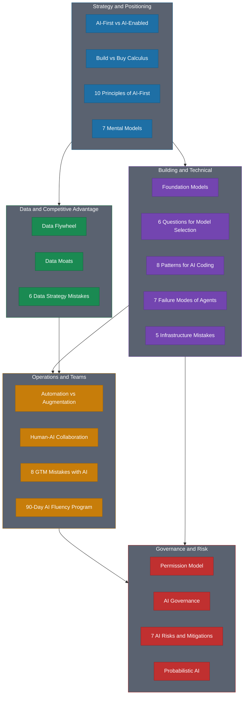

# Frameworks

> Actionable frameworks extracted from each chapter of *Blueprint for an AI-First Company*. Each framework is a standalone reference you can use immediately.

## All Frameworks

| Framework | Source Chapter | Use When... |
|-----------|--------------|-------------|
| [AI-First vs AI-Enabled](01-ai-first-vs-ai-enabled.md) | Ch 1: The AI-First Imperative | Determining whether your company should be built *on* AI or *with* AI |
| [7 Mental Models of AI-First](02-seven-mental-models-of-ai-first.md) | Ch 2: The AI-First Mindset | Adopting the thinking patterns that define AI-first leadership |
| [Probabilistic AI](03-probabilistic-ai.md) | Ch 2: The AI-First Mindset | Designing products and processes that embrace uncertainty |
| [Build vs Buy Calculus](04-build-vs-buy-calculus.md) | Ch 2: The AI-First Mindset | Deciding whether to buy, boost, or build AI capabilities |
| [Human-AI Collaboration](05-human-ai-collaboration.md) | Ch 2: The AI-First Mindset | Designing workflows where humans and AI are genuinely additive |
| [Foundation Models](06-foundation-models.md) | Ch 3: The AI Landscape | Understanding the model landscape and choosing between providers |
| [6 Questions Before Choosing a Model](07-six-questions-before-choosing-a-model.md) | Ch 3: The AI Landscape | Evaluating and selecting AI models for your use case |
| [5 Infrastructure Mistakes](08-five-infrastructure-mistakes.md) | Ch 4: Infrastructure | Auditing your AI infrastructure for common failure patterns |
| [8 Patterns for AI Coding](09-eight-patterns-for-ai-coding.md) | Ch 5: Building with AI | Writing effective prompts and working with AI coding tools |
| [7 Failure Modes of Agents](10-seven-failure-modes-of-agents.md) | Ch 6: Agent Architecture | Designing resilient AI agents and preventing common failures |
| [90-Day AI Fluency Program](11-ninety-day-ai-fluency-program.md) | Ch 8: Teams | Rolling out AI fluency training across your organization |
| [Data Flywheel](12-data-flywheel.md) | Ch 9: Data Strategy | Building self-reinforcing data loops that compound over time |
| [Data Moats](13-data-moats.md) | Ch 9: Data Strategy | Assessing whether your data creates defensible advantages |
| [6 Data Strategy Mistakes](14-six-data-strategy-mistakes.md) | Ch 9: Data Strategy | Avoiding mistakes that stall your data flywheel |
| [Automation vs Augmentation](15-automation-vs-augmentation.md) | Ch 10: Operations & GTM | Deciding where AI should automate vs augment human work |
| [8 GTM Mistakes with AI](16-eight-gtm-mistakes-with-ai.md) | Ch 10: Operations & GTM | Avoiding go-to-market mistakes when deploying AI |
| [Permission Model Framework](17-permission-model-framework.md) | Ch 11: Ethics & Governance | Setting appropriate autonomy levels for AI systems |
| [AI Governance Framework](18-ai-governance-framework.md) | Ch 11: Ethics & Governance | Building governance structures that enable rather than block |
| [7 AI Risks and Mitigations](19-seven-ai-risks-and-mitigations.md) | Ch 11: Ethics & Governance | Identifying and mitigating the top AI risks |
| [10 Principles of AI-First](20-ten-principles-of-ai-first.md) | Ch 12: Staying Ahead | Applying enduring principles as AI technology evolves |

## How to Use These Frameworks

Each framework follows a consistent structure:

- **Overview** — Why this framework matters and when to apply it
- **The Framework** — The complete framework with all items, examples, and data
- **How to Use This** — Practical guidance for immediate application
- **Related Frameworks** — Cross-references to connected frameworks
- **Deep Dive** — Link back to the full chapter for additional context

Start with the framework most relevant to your current challenge. Use the "Related Frameworks" links to explore connected concepts.

## By Topic

**Strategy & Positioning**
- [AI-First vs AI-Enabled](01-ai-first-vs-ai-enabled.md)
- [Build vs Buy Calculus](04-build-vs-buy-calculus.md)
- [10 Principles of AI-First](20-ten-principles-of-ai-first.md)

**Building & Technical**
- [Foundation Models](06-foundation-models.md)
- [6 Questions Before Choosing a Model](07-six-questions-before-choosing-a-model.md)
- [8 Patterns for AI Coding](09-eight-patterns-for-ai-coding.md)
- [7 Failure Modes of Agents](10-seven-failure-modes-of-agents.md)
- [5 Infrastructure Mistakes](08-five-infrastructure-mistakes.md)

**Data & Competitive Advantage**
- [Data Flywheel](12-data-flywheel.md)
- [Data Moats](13-data-moats.md)
- [6 Data Strategy Mistakes](14-six-data-strategy-mistakes.md)

**Operations & Teams**
- [Automation vs Augmentation](15-automation-vs-augmentation.md)
- [Human-AI Collaboration](05-human-ai-collaboration.md)
- [8 GTM Mistakes with AI](16-eight-gtm-mistakes-with-ai.md)
- [90-Day AI Fluency Program](11-ninety-day-ai-fluency-program.md)

**Governance & Risk**
- [Permission Model Framework](17-permission-model-framework.md)
- [AI Governance Framework](18-ai-governance-framework.md)
- [7 AI Risks and Mitigations](19-seven-ai-risks-and-mitigations.md)
- [7 Mental Models of AI-First](02-seven-mental-models-of-ai-first.md)
- [Probabilistic AI](03-probabilistic-ai.md)
