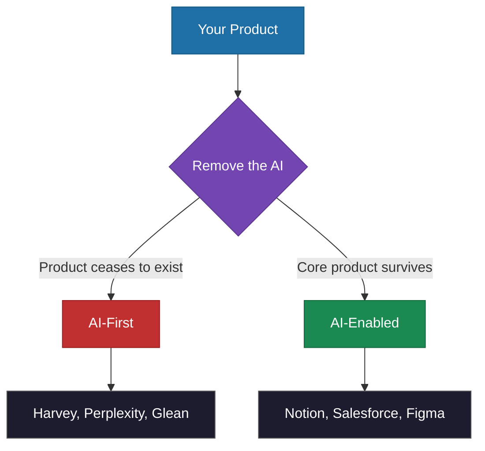

# AI-First vs AI-Enabled

> The foundational distinction that determines every downstream decision -- architecture, pricing, team structure, and whether you can pivot fast enough when the next model breakthrough hits.

*From [Chapter 1: The AI-First Imperative](../book/part-1-foundations/01-the-ai-first-imperative/README.md)*

## Overview

Most companies get AI strategy wrong from the start. They focus on "adding AI" instead of asking whether AI is the foundation or just a feature. This distinction shapes every strategic decision: hiring, architecture, fundraising, competitive positioning, and organizational structure. Confusing the two leads to misallocated resources and missed opportunities.

AI-First companies are built from the ground up with AI at the core of their value proposition. Without AI, the product wouldn't exist. AI-Enabled companies add AI capabilities to existing products or operations. AI enhances what they already do but isn't essential to their core value proposition. Both games can be won -- but you can't play both at once.

The architectural decisions made early tend to lock companies into their approach. Transitioning from AI-enabled to AI-first at scale has no proven public playbook. Starting AI-first lets you move fast. Retrofitting forces you to move carefully around structures that no longer serve the new reality.

## The Framework

### The Kill Test

The simplest way to know which camp you're in: **what happens if you remove the AI?**

- **Harvey:** Remove the AI, and Harvey doesn't exist. There's no legacy product underneath. PwC partners report their junior lawyers would "riot" if Harvey were taken away.
- **Notion:** Turn off Notion AI tomorrow, and you'd still have a functioning workspace for notes, docs, and wikis. The product existed since 2016. AI makes it better. AI doesn't make it *exist*.

### 5 Signs You're Looking at AI-First

**1. The Company Didn't Exist Before Modern AI**
Harvey (founded 2022), Glean (launched commercially 2020), Perplexity (started 2022), Mistral (launched 2023, $6B valuation within 18 months). These companies exist *because* of LLMs and transformer architectures. No legacy product to protect, no existing architecture to work around.

**2. Data Architecture Drives the Product**
Glean's Enterprise Knowledge Graph takes 12-18 months to fully mature for large customers. It learns organizational patterns, team structures, knowledge flows. The graph *is* the product. Without it, search doesn't work. This creates natural switching costs competitors would need years to overcome.

**3. AI Expertise Is Distributed, Not Siloed**
Midjourney launched in 2022 with just 11 employees and hit $200M in annual revenue by 2023. There's no separate "AI team" because the entire company is the AI team.

**4. Pricing Reflects AI as Core Value**
AI-first companies often use consumption-based or hybrid pricing. Glean charges $30/month per user and claims to save knowledge workers 2-4 hours per week -- nearly 14x ROI at a $100K fully-loaded annual cost. AI-enabled companies often price AI as an add-on (Notion charges $10 extra per member per month).

**5. Marketing Says "Built On" Not "Now With"**
- AI-First: "AI-native search experience from the ground up" (Perplexity)
- AI-Enabled: "Now the world's number one generative AI CRM" (Salesforce)

The first claims origin. The second claims addition.

### The Comparison

| Dimension | AI-First | AI-Enabled |
|-----------|----------|------------|
| **Kill Test** | Product ceases to exist | Core product survives |
| **Founded** | Post-modern AI (2020+) | Pre-AI, adding capabilities |
| **Data** | Architecture drives the product | Data supports features |
| **Team** | AI expertise distributed throughout | AI/ML as support function |
| **Pricing** | AI is the core value | AI is a premium add-on |
| **Moat** | Data flywheels and model advantages | Traditional moats (brand, network) |
| **Risk** | Model failure = business failure | Model failure = feature degradation |

### When AI-Enabled Is the Right Choice

AI-first isn't always the answer. Some contexts favor AI-enabled:
- Large incumbents with massive existing customer bases (Salesforce has built CRM since 1999)
- Highly regulated industries requiring interpretability
- Hardware-first companies where software is secondary
- Services where human judgment is the product

There's also a risk profile consideration: AI-first startups face existential risk if AI doesn't deliver promised value. AI-enabled companies hedge -- if AI fails, the core product remains.

### What Happens When You Pick Wrong

Retrofitting doesn't fail outright. It takes longer and costs more than anyone expects. Over 35% of enterprises cited high upfront expenses as a barrier to AI implementation in 2024, and the skills gap meant 41% faced deployment delays. Legacy systems weren't designed for AI workloads. Data sits fragmented across departments.

## How to Use This

Apply the Kill Test to your own product or any company you're evaluating. If removing AI leaves nothing, you're AI-first. If the core product survives, you're AI-enabled. Then check the five signs to confirm your assessment. Neither approach is inherently better, but you must be clear about which one you are -- the worst position is being unclear and under-investing in both. Build your company *on* AI or *with* AI, and choose deliberately.

## Related Frameworks

- [7 Mental Models of AI-First](7-mental-models-of-ai-first.md) -- The thinking models that define the AI-first mindset
- [Build vs Buy Calculus](build-vs-buy-calculus.md) -- How the AI-first vs AI-enabled distinction changes the build/buy decision
- [Data Flywheel](data-flywheel.md) -- The mechanism that creates AI-first competitive moats
- [Data Moats](data-moats.md) -- Why AI-first data advantages are hard to replicate
- [10 Principles of AI-First](10-principles-of-ai-first.md) -- The enduring principles for staying AI-first as technology evolves

## Deep Dive

Read the full chapter: [Chapter 1: The AI-First Imperative](../book/part-1-foundations/01-the-ai-first-imperative/README.md)
