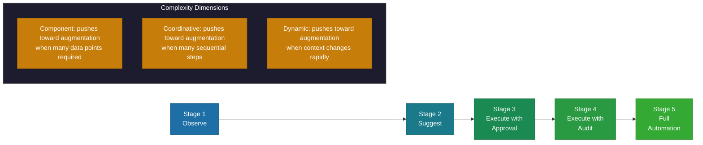

# Automation vs Augmentation

> A decision framework for determining where tasks fall on the automation-augmentation spectrum, using three dimensions of task complexity to find the right human-AI balance.

*From [Chapter 10: AI-Augmented Operations and GTM](../book/part-3-operating/10-ai-augmented-operations-and-gtm/README.md)*

## Overview

Most people frame AI in operations as a binary choice between full automation and human-only processes. The reality is more nuanced. The right question isn't "should we automate this?" but "where on the automation-augmentation spectrum does this task belong?" Academic research calls this the Automation-Augmentation Paradox: pure automation and pure human work both have failure modes. The leverage is in finding the right blend for each task.

Real business data reveals a consistent pattern that challenges the instinct to automate everything: hybrid human-AI systems outperform both fully automated and human-only alternatives across resolution rates (87% vs 74% vs 61%), customer satisfaction (8.7/10 vs 7.4/10), and first contact resolution (72% vs 53%). Hybrid approaches deliver 34% better ROI over 12 months despite 15-20% higher initial implementation costs. The Klarna lesson makes this concrete -- their AI excelled at routine inquiries but couldn't handle fraud claims, payment disputes, or delivery errors, and by mid-2025 they were rehiring human agents.

Use it to make the automation-vs-augmentation decision for every task in your operations, then follow the progression model to gradually increase automation as confidence builds.

## The Framework

### The Three Dimensions of Task Complexity

Three dimensions determine where on the spectrum a task belongs:

**1. Component Complexity** -- The number of distinct pieces of information required.
- Low: Password resets need few inputs
- High: Customer fraud investigations need many data points

**2. Coordinative Complexity** -- The number of steps involved.
- Low: Status checks are single-step
- High: Multi-department approval workflows have many sequential steps

**3. Dynamic Complexity** -- How much the information or steps change over time.
- Low: Payroll processing follows stable patterns
- High: Crisis response changes moment by moment

**The decision rule:** High component, coordinative, or dynamic complexity pushes tasks toward augmentation. Low complexity across all three dimensions makes full automation viable.

### Performance Comparison: Three Approaches

| Metric | Scripted Bot | Full AI | Hybrid Human-AI |
|--------|-------------|---------|-----------------|
| Resolution rate | 61% | 74% | 87% |
| Customer satisfaction | ~6/10 | 7.4/10 | 8.7/10 |
| First contact resolution | ~40% | 53% | 72% |
| 12-month ROI | Lowest cost, worst outcomes | Medium cost, medium outcomes | Higher initial cost, 34% better ROI |

Healthcare provides a compelling example: revenue cycle management teams using hybrid AI achieved 60% improvement in quality code capture and 40% reduction in charge entry lag. The AI handles pattern recognition. Humans handle judgment calls. Neither alone achieves those numbers.

### The Right Balance by Task Type

**Full automation works when:**
- Rule-based with predictable patterns
- Low information load, few data points
- Few sequential process steps
- Low variability, stable over time
- Mistakes are recoverable

**Examples:** Password resets, status checks, data validation, standard notifications.

**Augmentation wins when:**
- Requires judgment or contextual understanding
- High information load, synthesis across sources
- Interdependent, complex process steps
- High variability, context-dependent
- High stakes, severe error consequences

**Examples:** Complex problem-solving, relationship management, crisis response, nuanced negotiations.

**The messy middle** covers most real-world operations:
- Email responses: AI drafts, human reviews and sends
- Ticket categorization: AI suggests, human confirms
- Expense approval: AI flags anomalies, human decides
- Report generation: AI prepares, human interprets

### The Automation Progression Model

For the messy middle, use this five-stage progression:

1. **Observe** -- AI watches and learns patterns
2. **Suggest** -- AI recommends, human decides
3. **Execute with Approval** -- AI acts, human confirms
4. **Execute with Audit** -- AI acts, human reviews afterward
5. **Full Automation** -- AI acts independently

Confidence builds through each stage. Don't skip stages -- you need each one to calibrate boundaries and discover edge cases.

### Warning Signs of Over-Automation

Three patterns signal you have gone too far:

**1. Customer experience degradation.** Customers trapped in automated reply loops with no path to resolution. Deflection rate looks great, but NPS is cratering. One company hit 85% deflection and declared victory. Six months later, NPS dropped 15 points and churn was up 8%.

**2. Quality problems.** Excessive automation causes false positives and negatives. When humans check AI outputs infrequently, they miss more mistakes.

**3. Employee morale impacts.** Over-reliance on automation undermines agent morale. The reinforcing cycle: disengaged employees deliver worse service, making automation look more attractive, which disengages employees further.

A 2025 Qualtrics study found that AI-powered customer service fails at four times the rate of other AI tasks, with nearly one in five consumers seeing no benefits from AI customer service experiences. In the UK, 45% of customers say poor use of technology has made them avoid a business altogether.

### Building the Right System

Every automated process needs a designed escalation path. Answer: "What happens when automation can't handle it?"
- Seamless handoffs with full context
- Clear triggers based on confidence scores, sentiment, or explicit requests
- Smart routing to the right human on first escalation

Organizations adopting gradual rollouts report 15-30% efficiency gains during initial phases. Success requires allocating 20-30% of budgets to training and change management. Technology is the easy part. Human-AI collaboration is the hard part.

## How to Use This

Audit your current operations by listing every task and scoring it on the three complexity dimensions (component, coordinative, dynamic). Tasks scoring low on all three are automation candidates. Tasks scoring high on any dimension need augmentation. For tasks in the messy middle, start at stage one (Observe) of the progression model and advance only when each stage demonstrates reliability. Build escalation paths before you deploy, not after the first failure. Track both efficiency metrics and customer/employee satisfaction -- if efficiency goes up but satisfaction goes down, you have over-automated.

## Related Frameworks

- [Human-AI Collaboration](human-ai-collaboration.md) -- The collaboration patterns that make augmentation effective
- [Permission Model Framework](permission-model-framework.md) -- How permission levels map to automation progression stages
- [AI Governance Framework](ai-governance-framework.md) -- Governance oversight for automation decisions
- [8 GTM Mistakes with AI](8-gtm-mistakes-with-ai.md) -- Common go-to-market errors that stem from over-automation
- [AI-First vs AI-Enabled](ai-first-vs-ai-enabled.md) -- The strategic context for automation and augmentation decisions

## Deep Dive

Read the full chapter: [Chapter 10: AI-Augmented Operations and GTM](../book/part-3-operating/10-ai-augmented-operations-and-gtm/README.md)
