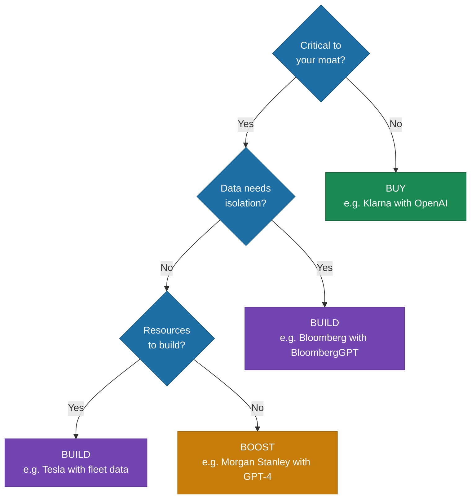

# The Build vs Buy Calculus

> A strategic framework for deciding whether to build, boost, or buy AI capabilities -- because 65% of total software costs occur after the original deployment.

*From [Chapter 2: The AI-First Mindset](../book/part-1-foundations/02-the-ai-first-mindset/README.md)*

## Overview

Most build vs buy frameworks treat this as a binary choice: build custom or purchase off-the-shelf. In AI, that framing misses the most important option. MIT Sloan researchers identified a more useful framework: Buy, Boost, or Build. The path you choose depends on three questions: How critical is this capability to your competitive advantage? How sensitive is the data involved? How fast do you need to move?

65% of total software costs occur after the original deployment. That number should reshape how you think about AI investments. The decision to build or buy isn't a one-time calculation -- it's a commitment to a cost curve that extends years into the future. And in AI, the traditional calculus sometimes inverts: with foundation models, you can prototype in days what would take months to procure, integrate, and customize from a vendor.

The market is already shifting. 76% of AI use cases are now purchased versus 47% in 2024. As foundation models improve, the bar for when building makes sense keeps rising. Stop asking "can we build this?" Start asking "should we?"

## The Framework

### Three Paths, Not Two

**Buy** -- Renting someone else's intelligence. Vendor AI solutions as-is, fast deployment, proven capabilities, limited differentiation.

**Build** -- Starting from scratch. Training your own models gives maximum control, maximum cost, maximum complexity.

**Boost** -- Taking rented intelligence and customizing it. Enhancing vendor models with your proprietary data through fine-tuning, RAG pipelines, and custom integrations. Speed from the base model plus differentiation from your data.

### The Decision Questions

1. **Is this capability critical to your competitive moat?** No -> Buy. Yes -> Continue.
2. **Does the data require isolation?** Yes -> Build. No -> Continue.
3. **Do you have the resources to build?** Yes -> Build. No -> Boost.

### Real-World Examples

**The Buy Path: Klarna's $40 Million Bet**
Klarna bought OpenAI's models and deployed them directly for customer service. First month results: 2.3 million conversations handled (66% of all customer service chats), resolution time dropped from 11 minutes to 2 minutes (81% reduction), equivalent work of 700 full-time agents, projected $40 million profit improvement in 2024. Customer service wasn't Klarna's competitive moat -- their advantage comes from buy-now-pay-later product, merchant relationships, and risk models. When AI isn't your moat, buy speed instead of building differentiation.

**The Boost Path: Morgan Stanley's Middle Ground**
Morgan Stanley took GPT-4 and trained it on 70,000+ proprietary research reports, analyst notes, and internal knowledge. Result: 98% of advisor teams actively use the tool. A Morgan Stanley executive described the outcome: "This technology makes you as smart as the smartest person in the organization." This path offers vendor-grade model quality plus your unique data advantage. The catch: you still depend on a vendor for the base model.

**The Build Path: Bloomberg's Strategic Bet**
Bloomberg spent $3.5-8 million training BloombergGPT, a 50-billion parameter model. Their ML team lead: "Using an API like OpenAI's isn't suitable for us: we have data we don't want to send out." Their competitive advantage *is* their proprietary financial data. The build process required a 9-person team and restarts due to bugs, but the model now serves clients paying $25,000+ annually. When your differentiation depends on data you can't share, building makes sense.

### Tradeoff Comparison

| Dimension | Buy | Boost | Build |
|-----------|-----|-------|-------|
| **Speed** | Days/Weeks | Weeks/Months | Months/Years |
| **Upfront Cost** | Low | Medium | High |
| **Ongoing Cost** | Vendor pricing power | Split vendor + maintenance | Lower, predictable |
| **Differentiation** | Low | Medium | High |
| **Control** | Limited | Moderate | Full |
| **Risk** | Vendor lock-in | Vendor dependency | Execution complexity |

### The Hidden Cost Curves

- **Buy costs** scale with vendor pricing power. You're locked into their roadmap, their pricing changes, their deprecation decisions.
- **Boost costs** split between vendor fees and your maintenance burden. You own the fine-tuning pipeline, the RAG infrastructure, the prompt engineering.
- **Build costs** front-load dramatically but give you full ownership. Annual maintenance for enterprise AI systems runs $5,000-$20,000 monthly, plus compliance costs of $10,000-$100,000 annually. High, but predictable and under your control.

### The Inversion

In AI, the traditional build vs buy calculus sometimes inverts. Old logic: building takes 18 months and $2M; buying takes 3 months and $200K. New logic: with foundation models, you can prototype in days what would take months to procure, integrate, and customize from a vendor. The inversion works when prompt engineering plus a thin integration layer can accomplish what once required months of ML engineering.

## How to Use This

Ask three questions for every AI capability decision: Is this capability core to your moat? Does the data require isolation? Do you have the resources to execute? This decision isn't permanent -- many companies start with buy, graduate to boost as they accumulate proprietary data, and occasionally build capabilities that become truly differentiating. Start where you can move fastest. Evolve as your data assets grow.

## Related Frameworks

- [AI-First vs AI-Enabled](ai-first-vs-ai-enabled.md) -- The foundational distinction that shapes the build vs buy decision
- [7 Mental Models of AI-First](7-mental-models-of-ai-first.md) -- Mental Model #6 (Build vs Buy Inversion) derives from this framework
- [Data Flywheel](data-flywheel.md) -- How the Boost path generates compounding data advantages
- [Data Moats](data-moats.md) -- Why the Build path creates defensible positions
- [Foundation Models](foundation-models.md) -- The landscape of models underlying all three paths
- [10 Principles of AI-First](10-principles-of-ai-first.md) -- Principles 2 and 6 address routing strategy and domain ownership

## Deep Dive

Read the full chapter: [Chapter 2: The AI-First Mindset](../book/part-1-foundations/02-the-ai-first-mindset/README.md)
