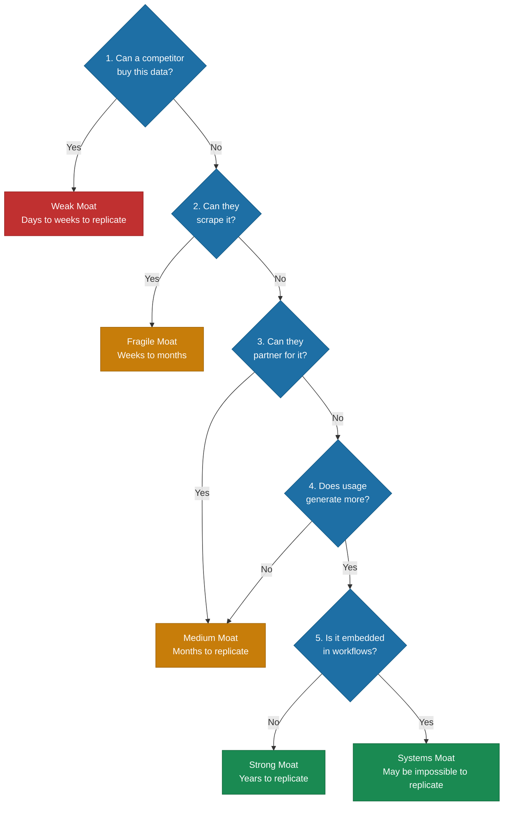

# Data Moats: What's Defensible vs. Replicable

> A framework for honestly assessing whether your data creates a durable competitive advantage or a commodity that competitors can replicate in weeks.

*From [Chapter 9: Data Strategy](../book/part-3-operating/09-data-strategy/README.md)*

## Overview

Most companies overestimate their data defenses. Data moats have dried up "faster than venture capital in a bear market." Foundation models have commoditized most proprietary datasets. Computer vision now costs $0.002 per image. Natural language processing is a basic function of any LLM. The translation industry's collapse---decades of linguistic databases approximated by foundation models---is now the pattern, not the exception.

The question isn't "do you have data?" It is "can a well-funded competitor get this data? And how long would it take?" The shift is clear: from dataset moats to systems moats. Static datasets, no matter how large or unique, are increasingly fragile. The defensible position comes from data generated through product usage that competitors can't replicate because they don't have the product distribution.

Both things can be true: data moats are weaker than they were, and data still matters enormously. The distinction is between data you possess and data your system generates through usage. One is a commodity. The other is a compounding advantage.

## The Framework

### The Moat Test

Every data asset you think creates competitive advantage should pass this test:

1. **Can a competitor buy this data?** If yes: **Weak Moat** (days to weeks to replicate).
2. **Can they scrape it?** If yes: **Fragile Moat** (weeks to months).
3. **Can they partner for it?** If yes: **Medium Moat** (months).
4. **Does usage generate more?** If no: Medium Moat. If yes, continue.
5. **Is it embedded in workflows?** If no: **Strong Moat** (years). If yes: **Systems Moat** (may be impossible to replicate).

### The 5 Conditions for Defensible Data

Data creates durable advantages when these five conditions converge:

**1. Continuous Refreshment.** Data that updates through usage beats data that sits in a warehouse. Harvey's legal AI doesn't just have legal documents. It has workflow data from how elite law firms actually use those documents. Every contract review, litigation strategy, and compliance query improves the model's understanding of legal patterns.

**2. High-Quality Domain Specificity.** Foundation models can approximate general tasks "well enough." They struggle with specialized edge cases that require deep domain understanding. Tesla automatically surfaces the 0.01% of edge cases from fleet data that actually train networks. That isn't just data volume. That is intelligent curation that compounds.

**3. Data Governance That Creates Procurement Advantage.** Harvey's architecture anticipates regulatory tightening: EU AI Act high-risk requirements, ABA 2024 supervision guidelines, UK SRA proportionality standards. The more AI is regulated, the more valuable compliance-native architecture becomes. Smaller competitors can't replicate this because procurement processes increasingly require governance capabilities.

**4. Deep Workflow Integration.** Glean became the knowledge layer across entire companies by integrating multiple data sources that individually may be replicable but collectively create overwhelming switching costs. Migration would mean rebuilding not just the AI layer but the entire interconnected infrastructure.

**5. Network Effects That Compound.** Perplexity's DAU/MAU ratio of 53% far exceeds industry benchmarks because each query improves answer accuracy for future queries. This creates a "modern PageRank" where user behavior trains the system, and better systems attract more users.

### Common Moat Misconceptions

- **Public datasets:** Anyone can acquire them. Foundation models already trained on the same data.
- **Industry-standard data:** Your competitors have similar access. It is table stakes, not advantage.
- **Purchased data:** Available to all buyers. Commoditized quickly.
- **One-time scrapes:** Point-in-time snapshot without refresh mechanism. Becomes stale.
- **Large but static datasets:** Size doesn't matter if the data doesn't improve with usage. IBM's Watson Health exemplifies the pattern: massive acquisition, minimal operational integration, eventual liquidation at salvage value.

### The New Moat Landscape

If traditional data moats are weakening, what creates defensible advantages?

**Workflow Integration Moats.** fileAI processes over 200 million files annually and has saved clients 320,000 hours and $6 million in processing costs since 2024. Switching would require re-engineering entire document processing pipelines, retraining models on new formats, and rebuilding integrations across Google Drive, Dropbox, and custom APIs. The moat isn't the AI. It is the embeddedness.

**Execution Velocity Moats.** Cursor grew from $1 million revenue in 2023 to $100 million in 2024, with projections of $200 million in 2025. They shipped a rebuilt Tab completion model that achieved 28% higher accept rates despite making 21% fewer suggestions. OpenAI's engineering teams adopted Cursor as their primary IDE and reduced deployment time by 30%. The moat is shipping speed.

**Systems of Intelligence Moats.** Harvey ($8 billion valuation) and Glean ($7.2 billion valuation) achieved $100M+ ARR with one-quarter the headcount of comparable SaaS companies. They built moats by becoming the integration layer across organizations rather than point solutions. The more systems integrated, the harder replication becomes.

### Honest Assessment Examples

| Company | Assessment | Why |
|---------|------------|-----|
| **Tesla** | Strong moat | Proprietary fleet data + automatic edge case detection + over-the-air deployment. Earns $7K per vehicle that becomes a data collector vs. Waymo spending $150K per vehicle. |
| **Harvey** | Strong moat | LexisNexis partnership for exclusive content + workflow integration + regulatory compliance architecture. |
| **Glean** | Moderate moat | Enterprise knowledge graph + integration depth. But vulnerable to foundation models approximating search "well enough." |
| **Notion** | Weak moat | User content doesn't create network effects. Distribution and switching costs, not data, are the defense. |

## How to Use This

Run every data asset your organization considers a competitive advantage through the Moat Test. Be honest about the results. Then evaluate whether you meet the five conditions for defensible data. If your moat is weak or fragile, shift strategy toward building workflow integration moats or execution velocity moats rather than trying to accumulate more static data. For startups: don't compete on dataset size---compete on data generation velocity through product design.

## Related Frameworks

- [Data Flywheel](data-flywheel.md) --- the mechanism that generates defensible data through usage
- [6 Data Strategy Mistakes](6-data-strategy-mistakes.md) --- mistakes that prevent moat formation
- [Build vs. Buy Calculus](build-vs-buy-calculus.md) --- infrastructure decisions that affect moat strategy
- [Foundation Models Landscape](foundation-models.md) --- the models that have commoditized traditional data moats

## Deep Dive

Read the full chapter: [Chapter 9: Data Strategy](../book/part-3-operating/09-data-strategy/README.md)
