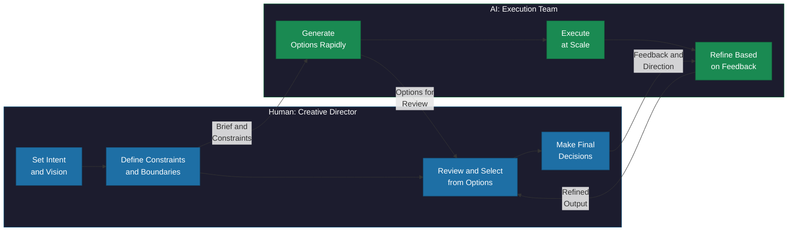

# Human-AI Collaboration

> A research-backed framework for designing effective human-AI partnerships, based on MIT's finding that collaboration only wins under specific conditions -- and how to create those conditions.

*From [Chapter 2: The AI-First Mindset](../book/part-1-foundations/02-the-ai-first-mindset/README.md)*

## Overview

Human-AI collaboration often doesn't work. MIT's Center for Collective Intelligence reviewed over 100 studies on human-AI teaming and found that, on average, human-AI combinations don't outperform the best human-only or AI-only systems. That finding, published in Nature Human Behaviour, challenges the assumption that throwing humans and AI together automatically produces something better than either alone.

This should make you pause before assuming "AI + human" is always the answer. But it should also make you curious: when does collaboration actually work? The research identifies three specific conditions where human-AI collaboration succeeds, along with two sources of complementarity that make it work. Understanding these conditions transforms collaboration from wishful thinking into engineering -- designing systems where human and AI contributions are genuinely additive.

The practical implication is the Creative Director Model: humans set intent, define constraints, review options, and make final decisions, while AI generates options, executes at scale, and refines based on feedback. This isn't a theoretical ideal. It is the emerging pattern at companies from Adobe to GitHub to Shopify, and the data shows it works -- when designed correctly.

## The Framework

### Three Conditions Where Collaboration Wins

The MIT research identifies three conditions where human-AI collaboration produces better outcomes than either alone:

**Condition 1: Tasks where humans outperform AI alone.** If AI already does the job better, adding human oversight introduces friction without improving outcomes. Many companies add human review steps purely for liability theater.

**Condition 2: Tasks involving content creation.** Generative tasks -- writing, design, ideation -- benefit from collaboration because they require judgment, taste, and context that AI struggles to replicate.

**Condition 3: Creation tasks specifically involving generative AI.** AI generates options rapidly; humans select and refine based on criteria the AI can't fully model.

**What is absent from this list:** Routine classification, data processing, pattern recognition at scale. For those tasks, collaboration often adds cost without adding value. Let the best performer work alone.

### Two Sources of Complementarity

Two types of asymmetry make collaboration genuinely additive:

**Information asymmetry.** Humans know context, history, relationships, unwritten rules. AI knows patterns across data humans couldn't process. When both matter, collaboration adds value.

**Capability asymmetry.** AI processes vast data quickly and maintains consistency. Humans exercise judgment in novel situations and take accountability.

GitHub Copilot illustrates both: it labels outputs as "suggestions," not answers. Acceptance rates vary -- grammar corrections get high acceptance, tone suggestions require consideration. The interface makes uncertainty visible. The result: 78% task completion rate (versus 70% without), with developers completing tasks 55% faster. The AI doesn't replace developer judgment about whether a suggestion fits. It accelerates where AI excels while leaving architectural decisions to humans.

### The Creative Director Model

Think of a film director working with a visual effects team. The director doesn't render each frame -- they set creative intent, review options, and make decisions. The VFX team executes at scale.

**Human role (Creative Director):**
- Set intent and vision
- Define constraints and boundaries
- Review and select from options
- Make final decisions

**AI role (Execution Team):**
- Generate options rapidly
- Execute at scale
- Refine based on feedback

Adobe describes designers becoming "creative directors for an incredibly fast, versatile, but literal-minded AI assistant." The literal-minded part matters. AI takes instructions precisely. It doesn't infer intent or push back on bad briefs. Humans must specify clearly or get precisely what they asked for, which may not be what they wanted.

### Partner Under Direction, Not Teammate

Carnegie Mellon's COHUMAIN framework offers a crucial correction: see AI as a partner that works under human direction -- capable of strengthening existing capabilities but not of replacing human judgment about what matters. Teammates negotiate priorities. Partners under direction execute within boundaries you set.

### The Efficiency Trap

Figma surveyed 2,500 product builders across seven countries and found that 84% of designers now collaborate with developers at least weekly -- AI has compressed the gap between concept and prototype. But fewer than half felt AI makes them better at their jobs. More efficient, yes. But not more effective.

**The distinction matters:** AI makes you faster at producing output, not better at producing outcomes. Speed without judgment compounds mistakes.

### The Augmentation Mindset

You aren't building AI to replace people. You are building AI to make people capable of things they couldn't do alone -- not faster at what they already did, but newly capable of what was previously impossible.

**Shopify's approach:** In April 2025, CEO Tobi Lutke issued a mandatory AI policy -- before requesting additional headcount, employees must demonstrate why AI can't handle the task. The goal wasn't fewer people; it was augmented people who accomplish more per capita.

**The prerequisite:** Research shows organizations best able to adopt AI are innovative, experimental, learning-oriented, supportive, and collaborative. Collaboration requires psychological safety -- the confidence that using AI won't threaten job security. Without that foundation, humans won't contribute their half of the complementarity equation.

**Replacement thinking** asks: "Will AI replace us?"
**Augmentation thinking** asks: "How do we design collaboration so both human and AI contribute what they are best at?"

Get that design right, and you build something neither could build alone.

## How to Use This

For each workflow where you are considering human-AI collaboration, first test it against the three conditions: does human involvement actually improve outcomes, or are you adding friction? For tasks that pass the test, identify which source of complementarity applies -- information asymmetry, capability asymmetry, or both. Then implement the Creative Director Model: define the human's role as intent-setter and decision-maker, and the AI's role as option-generator and executor. Make AI confidence visible in your interfaces so humans can calibrate their oversight. Finally, measure both efficiency and effectiveness -- speed gains without quality gains aren't collaboration wins.

## Related Frameworks

- [Automation vs Augmentation](automation-vs-augmentation.md) -- The operational framework for deciding where AI augments versus replaces
- [7 Mental Models of AI-First](7-mental-models-of-ai-first.md) -- The thinking models that underpin effective collaboration design
- [Permission Model Framework](permission-model-framework.md) -- How trust levels map to collaboration patterns
- [90-Day AI Fluency Program](90-day-ai-fluency-program.md) -- Training teams to collaborate effectively with AI
- [8 Patterns for AI Coding](8-patterns-for-ai-coding.md) -- Specific collaboration patterns for software development

## Deep Dive

Read the full chapter: [Chapter 2: The AI-First Mindset](../book/part-1-foundations/02-the-ai-first-mindset/README.md)
