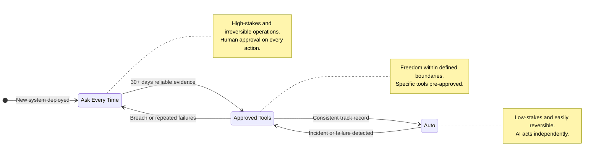

# The Permission Model Framework

> A risk-based framework for determining how much autonomy to grant AI systems, using three permission modes that match trust levels to operational stakes.

*From [Chapter 11: Ethics, Governance, and Risk](../book/part-4-sustaining/11-ethics-governance-and-risk/README.md)*

## Overview

AI autonomy isn't about capability. It's about what warrants unsupervised operation. That answer changes by context, by stakes, and by how much trust you've earned through evidence.

The Permission Model Framework provides a structured approach to AI autonomy decisions through three distinct permission modes: Auto, Approved-Tools, and Ask-Every-Time. Rather than treating AI autonomy as a binary on/off switch, this framework recognizes that different contexts demand different trust levels. AI incidents jumped 21% from 2024 to 2025 as companies expanded autonomy without expanding controls. The companies avoiding headlines aren't the ones that banned AI -- they're the ones that matched permission levels to actual risk.

The framework also establishes a progression model: every new AI system starts at the most restrictive level and earns greater autonomy through demonstrated reliability, not vendor claims or theoretical capabilities. When incidents occur, systems regress one level immediately until root causes are investigated and resolved.

## The Framework

### The Three Permission Modes

#### Mode 1: Auto (AI Acts Autonomously)

In Auto mode, AI operates independently without human approval. Klarna's customer service assistant handled 2.3 million conversations in its first month without requiring human sign-off on individual responses, dropping resolution time from 11 minutes to under 2 minutes.

**Auto mode works when you have three things:**
- **Low stakes** -- a mistake costs minutes, not millions
- **Easy reversibility** -- full rollback is straightforward
- **Established track record** -- demonstrated reliability in your environment

**Examples:** Document classification, read-only analytics, status checks.

**Key lesson from Klarna:** Even working autonomy has limits. By late 2024, they adjusted toward a human-hybrid balance after customer feedback about wanting access to real people. Auto mode requires validated boundaries, not passive acceptance.

As Walmart's CTO Hari Vasudev puts it: "Our approach to agentic AI is surgical. Agents work best when deployed for highly specific tasks, to produce outputs that can then be stitched together." Specificity enables autonomy. Broad mandates invite disaster.

#### Mode 2: Approved-Tools (Restricted Operations)

AI has freedom within explicitly defined boundaries -- a toolbox with specific instruments, nothing outside it. Salesforce's Agentforce illustrates: a banking agent can retrieve transactions and identify unauthorized charges autonomously, but issuing credits or notifying merchants requires human approval.

**Financial services threshold example:**

| Factor | Auto-Approve | Approved-Tools | Ask-Every-Time |
|--------|--------------|----------------|----------------|
| Financial impact | Under $5,000 | $5,000-$50,000 | Over $50,000 |
| Data sensitivity | Public data only | Internal, no PII | PII or protected classes |
| Reversibility | Full rollback in 24 hours | Reversible with approval | Irreversible |

Healthcare shows an asymmetric pattern: AI can approve standard procedure authorizations autonomously but can't deny coverage without physician review. When even Anthropic -- the company building Claude -- requires manual approval for all tool calls by default, noting "models are currently not safe enough to blanket trust choices," that's a signal worth heeding.

#### Mode 3: Ask-Every-Time (Human Approval Required)

High-stakes, irreversible, or novel operations require explicit human sign-off. One European bank's AI flagged 80,000 transactions as "high risk" -- only 0.3% proved genuinely suspicious. That 99.7% false positive rate is why humans stay in the loop: AI excels at pattern detection, context requires judgment.

The cost is latency. But for financial transactions, medical diagnoses, and public communications, latency buys accountability and compliance. AI-assisted breast cancer detection achieves 91% accuracy versus 74% for unassisted radiologists -- but physicians still authorize every diagnosis.

### Choosing the Right Mode: Four Questions

1. **What's the blast radius if this goes wrong?** Minimal impact operations can run in Auto. Moderate impact needs guardrails. Significant or irreversible impact requires human approval.

2. **How easily can you recover from mistakes?** Easy rollback enables autonomy. Impossible rollback demands oversight.

3. **What's your evidence base?** New AI systems start in Ask-Every-Time. You earn Auto mode through demonstrated reliability -- not vendor claims, not theoretical capabilities, but measured performance in your environment.

4. **What do regulators expect?** The EU AI Act classifies high-risk systems explicitly: credit decisions, healthcare diagnostics, employment screening, law enforcement. These require human oversight regardless of technical capability.

### The Mode Progression Model

Every new AI system follows this trust progression:

1. **Ask-Every-Time** (30+ days) -- Build evidence of reliability
2. **Approved-Tools** -- Expanded boundaries based on demonstrated performance
3. **Auto** -- Specific operations only, after consistent track record

**Critical rules:**
- Skipping levels means you haven't calibrated boundaries or discovered edge cases
- On incident: regress one level immediately, investigate root cause, re-earn through evidence
- Only 15% of IT leaders are deploying fully autonomous agents (Gartner, 2025) -- the industry is still learning where autonomy is safe

### The Documentation Imperative

Document your permission model before deployment. Answer these questions in writing:
- What mode does this system run in?
- Why did you choose that mode?
- What would trigger a mode change (up or down)?
- Who approves mode changes?

You will be asked -- by auditors, by regulators, by lawyers after an incident. "We thought it seemed fine" isn't a defensible answer. "Here's our documented risk assessment and the evidence that supported our decision" is.

## How to Use This

Start by auditing every AI system you currently operate against the three modes. Map each to Auto, Approved-Tools, or Ask-Every-Time based on the four selection questions. For systems already running with more autonomy than their risk profile warrants, develop a plan to add controls. For new deployments, begin in Ask-Every-Time and establish measurable criteria for graduating to each successive level. Document every permission decision and review quarterly as both your systems and the regulatory landscape evolve.

## Related Frameworks

- [AI Governance Framework](ai-governance-framework.md) -- The broader governance structure within which permission models operate
- [7 AI Risks and Mitigations](7-ai-risks-and-mitigations.md) -- Risk categories that inform permission mode selection
- [Automation vs Augmentation](automation-vs-augmentation.md) -- The spectrum of human-AI task allocation that permission modes enable
- [Human-AI Collaboration](human-ai-collaboration.md) -- Design patterns for effective human-AI teaming across permission levels
- [Probabilistic AI](probabilistic-ai.md) -- Why AI outputs are probabilistic and what that means for trust decisions

## Deep Dive

Read the full chapter: [Chapter 11: Ethics, Governance, and Risk](../book/part-4-sustaining/11-ethics-governance-and-risk/README.md)
